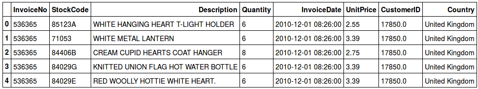

## 第9章 构建TensorFlow推荐系统

推荐系统是基于用户与系统的历史交互信息，给用户提供个性化建议一类算法。最著名的例子是，亚马逊和其他电商网站上“买了产品X的用户也买了产品Y”的推荐。 

在过去几年中，推荐系统显现出重要的意义：在线网站的推荐做的越好，钱就赚的越多，这个道理越来越明显。这也是为什么今天几乎所有的网站都有个性化推荐的模块。

在本章中，我们会看到如何使用TensorFlow构建推荐系统。

具体说来，我们会介绍以下几个话题：

- 推荐系统基础

- 推荐系统的矩阵分解
- 贝叶斯个性化排序
- 基于递归神经网络的高级推荐系统

在本章结束，读者会知道如何为训练推荐系统准备数据，如何使用TensorFlow构建自己的模型，以及如何对这些模型进行简单的评估。

### 推荐系统

**推荐系统（recommender system）**的任务是列出所有可能的选项，并根据具体用户的偏好进行排序。这个有序列表就是一个个性化的排序，或者更常见的，指的就是**推荐（recommendation）**。

例如，一个购物网站会设计一个推荐区域，用户可以看到相关物品并决定是否购买。售卖音乐会的门票的网站会推荐有意思的表演，在线音乐播放器会建议用户可能喜欢的歌曲。一个在线课程的网站，例如Coursera.org，会推荐与用户已完成课程类似的课程：


*网站上课程推荐*

推荐通常会基于历史数据：过去的交易历史，网页访问，以及用户的点击。因此，一个推荐系统会利用历史数据和机器学习来抽取用户的行为模式，并基于此给出最优推荐。

企业对于尽可能的做出最优推荐很感兴趣：这个任务经常会促使用户来参与改善体验。所以，它最终会提高收入。当我们给出的推荐用户以前却从来没有注意到，而这次他买了下来，这意味着我们不仅满足可用户，还卖出了以前不会卖掉的商品。

本章的对项目会介绍如何使用TensorFlow实现对个推荐系统。首先我们会介绍经典算法，然后继续尝试基于RNN和LSTM的复杂模型。对于每一个模型，我们会首先给出简要介绍，然后给出TensorFlow实现。

为了解释这些思想，我们使用来自UCI机器学习仓库的在线销售数据集。这个数据集可以从http://archive.ics.uci.edu/ml/datasets/online+retail下载。

数据集本身是一个Excel文件，有以下特点：

- `InvoiceNo`：发票号，用来唯一标示每一笔交易
- `StockCode`：购买物品的编号
- `Description`：产品名称
- `Quantity`：交易中物品的购买次数
- `UnitPrice`：物品单价
- `CustomerID`：客户编号
- `Country`：客户的国家名称

数据集包含25,900表交易，每笔交易大约包含20个物品。因此一共约有540,000个物品。所有交易由2010年12月到2011年12月的4,300名客户生成。

要下载数据集，我们可以使用浏览器下载保存，也可以使用`wget`：

```
wget
http://archive.ics.uci.edu/ml/machine-learning-databases/00352/Online%20Ret
ail.xlsx
```


对于这个项目，我们会使用下列Python程序包：

- `pandas`，用于读取数据
- `numpy`和`scipy`用于数值运算
- `tensorflow`，用于创建模型
- `implicit`，用于构建基准方案
- [可选]` tqdm`，用于监控过程
- [可选]`numba`用于加速计算


如果读者使用Anaconda，`numba`就已经装好了。否则，使用`pip install numba`获取程序包。要安装implicit`，也可以使用`pip`：

```
pip install implicit
```


完成数据集下载和程序包安装，我们就可以开始了。在下一节中，我们会回顾矩阵分解技术，然后准备数据集，最后使用TensorFlow进行实现。

### 推荐系统下的矩阵分解

在这一节中，我们会介绍推荐系统的传统技术。我们会看到，用TensorFlow实现这些技术都很简单，最终代码也很灵活，允许修改和优化。

我们会在这一节中使用在线销售数据集。我们首先定义要解决的问题，建立基线性能。然后实现经典的矩阵分解算法，并给予贝叶斯个性化排序做一些修改。

#### 数据集准备和基线

现在我们开始构建推荐系统。

首先，声明需要引入的库：

```python
import tensorflow as tf
import pandas as pd
import numpy as np
import scipy.sparse as sp
from tqdm import tqdm
```


读入数据集：

```python
df = pd.read_excel('Online Retail.xlsx')
```

读取 `xlsx`文件要花些时间。要为下次读入文件节省时间，我们可以把读入的文件复制到`pickle` 文件中：

```python
import pickle
with open('df_retail.bin', 'wb') as f_out:
    pickle.dump(df, f_out)
```


这个文件读起来要快很多，因此我们应该使用这个版本的数据：

```python
with open('df_retail.bin', 'rb') as f_in:
    df = pickle.load(f_in)
```


数据加载完成后，我们可以看一下数据。使用`head`函数进行查看：

```python
df.head()
```

我们可以看到下表：



进一步查看数据，我们可以注意到以下问题：

- 列名都是大写。这有点不自然，因此我们把它们改成小写。

- 一些交易是还款：这些数据并不是我们感兴趣的，因此应该过滤掉。

- 最后，一些交易来自于未知用户。我们可以指定一些公共ID，例如-1。而且，未知用户都被编码成

  `NaN`，这也是为什么`CustomerID`被编码成浮点型。我们需要把它们转换为整型。


这些问题可以通过一下代码解决：

```python
df.columns = df.columns.str.lower()
df = df[~df.invoiceno.astype('str').str.startswith('C')].reset_index(drop=True)
df.customerid = df.customerid.fillna(-1).astype('int32')
```


接着，我们把所有的产品ID（`stockcode`）编码成整数。一个方法是构建每一个编码到唯一索引号的映射：

```python
stockcode_values = df.stockcode.astype('str')

stockcodes = sorted(set(stockcode_values))
stockcodes = {c: i for (i, c) in enumerate(stockcodes)}

df.stockcode = stockcode_values.map(stockcodes).astype('int32')
```


编码完成后，我们可以把数据集分成训练集，验证集合测试集。由于我们已经有了电商交易数据，最好的办法是根据时间划分。因此我们使用：

- **训练集**：2011.10.09以前的数据（大约10个月，378,500行）

- **验证集**：2011.10.09和2011.11.09之间的数据（大约1个月，64,500行）

- **测试集**：2011.11.09之后的数据（大约1个月89,000行）

过滤数据框：

```python
df_train = df[df.invoicedate < '2011-10-09']
df_val = df[(df.invoicedate >= '2011-10-09') &
            (df.invoicedate <= '2011-11-09') ]
df_test = df[df.invoicedate >= '2011-11-09']
```


在这一节中，我们会考虑下列（简化的）推荐场景：

1. 用户来到网站。

2. 给出5个推荐。

3. 用户评估推荐列表，可能购买其中的几样，然后继续一般购买行为。

我们需要为第二个场景构建模型。我们使用训练数据，然后用验证集模拟第二个和第三个步骤。要验证我们的推荐质量如何，我们可以统计用户购买的推荐物品的数量。

我们的评估方案是成功推荐的数量（用户购买的商品量）除以全部推荐数量，也就是准确率——机器学习模型常用的评估性能的方法。

这是一种非常简单的评估性能的方法，有许多不同的实现方案。其它可能的方案有**平均精度均值（MAP，Mean Average Precision）**, **归一化折损累积增益（NDCG，Normalized Discounted Cumulative Gain）**等。 简单起见，我们在这一章中不使用这些方法。

开始机器学习算法之前，首先建立基准表现。例如，我们可以计算每一个物品被购买了多少次，取最常购买的前5个物品，然后推荐给所有用户：

使用pandas很容易实现：


```python
top = df_train.stockcode.value_counts().head(5).index.values
```


这行代码给出一个整数数组——`stockcode`编码：


```python
array([3527, 3506, 1347, 2730, 180])
```

现在我们使用这个数组，给所有用户做推荐。重复`top`数组，次数与验证集中的交易数一样，然后使用这个数组作为推荐，计算准确率评估推荐质量。

我们使用numpy中的`tile`函数进行重复：


```python
num_groups = len(df_val.invoiceno.drop_duplicates())
baseline = np.tile(top, num_groups).reshape(-1, 5)
```


 `tile`函数的输入是一个数组，重复`num_group`次。重塑之后，最终数组如下：

```python
  array([[3527, 3506, 1347, 2730, 180],
         [3527, 3506, 1347, 2730, 180],
         [3527, 3506, 1347, 2730, 180],
         ...,
         [3527, 3506, 1347, 2730, 180],
         [3527, 3506, 1347, 2730, 180],
         [3527, 3506, 1347, 2730, 180]])
```


现在我们可以计算推荐的准确率。

然后，还有一个困难。物品存储的方式使得每组正确分类物品的个数难以计算。使用pandas的`groupby` 函数可以解决这个问题：

- 按照`invoiceno`（也是我们的交易ID）分组

- 为每一次交易做推荐

- 记录每组中正确预测的数量

- 计算整体准确率

但是，这个方法很慢，很低效。它也许在这个项目中可用，但是当数据集变大时，它就成问题了。，

变慢的原因来自于pandas中`groupby`的实现方式：它会迭代地执行排序，而我们并不需要这个功能。我们可以通过改善数据排序的方式来提升速度：我们知道数据框中的元素都是按顺序存储的。也就是说，如果一次交易从某一行`i`开始，那么会在第`i + k`行结束，其中`k`是交易中物品数量。换句话说，所有`i`和`i + k`之间的行都属于同一个`invoiceid`。

因此我们需要知道每一次交易开始和结束的信息。我们可以专门维护一个长度为`n + 1`的数组，其中`n`是数据集中的组数（交易数）。

设这个数组为`indptr`。对于每一次交易`t`：

- `indptr[t]`返回数据框中交易开始的行数

- `indptr[t + 1]`返回交易结束的行数

> 表示边长分组的方法，受到CSR（行压缩存储，Compressed Row Storage，或Compressed
> Sparse Row）算法的启发。它用于表示内存中的稀疏矩阵。读者可以从Netlib文档中获取更多信息—http://netlib.org/linalg/html_templates/node91.html，也可以从scipy中看到这个名字—它是`scipy.sparse`程序包中表示矩阵的一种方法：https://docs.scipy.org/doc/scipy-0.14.0/reference/generated/scipy.sparse.csr_matrix.html。

使用Python创建这些数组并不难：我们只需要知道当前交易在哪里结束，以及下一次交易从哪里开始。所以在每一个行索引中，我们可以比较当前索引和上一个索引，如果二者不同，则记录这个索引。这一步骤可以使用pandas中的`shift`方法实现：

```python
  def group_indptr(df):
        indptr, = np.where(df.invoiceno != df.invoiceno.shift())
        indptr = np.append(indptr, len(df)).astype('int32')
        return indptr
```

我们获取验证集的指针数组： 

```python
 val_indptr = group_indptr(df_val)
```


我们可以定义`precision` 函数：

```python
  from numba import njit
    
  @njit
  def precision(group_indptr, true_items, predicted_items):
        tp = 0
        
        n, m = predicted_items.shape
        
        for i in range(n):
            group_start = group_indptr[i]
            group_end = group_indptr[i + 1]
            group_true_items = true_items[group_start:group_end]
            
            for item in group_true_items:
                for j in range(m):
                    if item == predicted_items[i, j]:
                        tp = tp + 1
                        continue
      return tp / (n * m)
```


其中的逻辑很直接：对于每一次交易，我们都记录有多少物品被正确预测。正确预测的总量存储在`tp`。最后，用`tp`除以预测总量，即预测矩阵的规模，也就是交易次数乘以5。 

需要注意numba中的`@njit`装饰器。这个装饰器告诉numba代码需要优化。当第一次调用这个函数的时候，numba会分析代码，使用**准时化（just-in-time，JIT）**编译器把函数翻译成本地代码。函数编译好后，它的运行速度会比C语言代码相比提升几个数量级。
> Numba的`@jit`和`@njit` 装饰器提供了非常简单的提升代码速度的方法。通常，只用在函数中放置`@jit`装饰器已经足够看到速度提升。如果函数的运算时间较长，numba是改善性能的好方法。

现在我们可以检测基准表现的准确率：

```python
 val_items = df_val.stockcode.values
 precision(val_indptr, val_items, baseline)
```


执行上述代码可以得到0.064。也就是说，6.4%的情况作出了正确推荐。这意味着，用户只在6.4%的情况下结束了推荐物品的购买。

现在，我们初步查看了数据并建立了基准表现，接着我们可以继续学习更负责的技术，例如矩阵分解。

#### 矩阵分解

​        2006年，DVD租赁公司Netflix组织了著名的Netflix竞赛。竞赛的目的是改进他们的推荐系统。为此，公司公开了电影评分的大型数据集。从多方面讲，这个竞赛很出名。首先，奖金池高达100万美元，这也是赛事出名的主要原因。其次，由于奖金和数据集的诱惑，许多研究人员都在上面花费了不少精力。这也推动了推荐系统的前沿研究。

也正是Netflix的竞赛，证明了基于矩阵分解的推荐系统很强大，并且可以扩展到大规模的训练集上，同时实现和部署也并不困难。

 Koren及其合作人员的文章《Matrix factorization techniques for recommender systems》（2009）很好的总结了一些主要观察结果，本章也给出。

假设我们拿到了用户$u$对电影$i$的评分$r_{ui}$ 。我们可以通过下列方式建模：

$$\hat{r}_{ui}=\mu+b_i+b_u+q^T_i p_u$$ 

我们把评分分成了4个因素：

- $$\mu$$是全局偏置

- $$b_i$$是物品的偏置（就是Netflix中电影分类的偏置）

- $$b_u$$是用户的偏置

- $$q^T_i p_u$$是用户向量和物品向量的内积

最后一个因素，用户向量和物品向量的内积，是矩阵分解叫法的来源。

设所有的用户向量是$q_u$，存放在矩阵$U$的每一行中。我们有$n_u\times k$的矩阵，其中$n_u$是用户数量，$k$是向量维度。类似的，我们可以获取物品向量$p_i$，放在矩阵$I$的每一行中。这个矩阵是$n_i\times k$的，其中$n_i$是物品数量，$k$还是向量维度。维度$k$是模型的参数，支持我们控制信息压缩的多少。$k$越小，原始评分矩阵的信息保留的越少。

最后，我们得到所有的评分，并存在矩阵$R$中。这个矩阵是$n_u \times n_i$的。这个矩阵可以分解为：

$$R \approx U^TI$$

不考虑偏置部分，这个就是我们在之前的公式中计算$\hat{r}_{ui}$的结果。

要让预测的评分$\hat{r}_{ui}$与观察到的评分$r_{ui}$尽可能的接近，我们需要最小化二者之间的误差平方和。因此，我们的训练目标函数如下：

$$minimize\sum(r_{ui}-\hat{r}_{ui})^2+\lambda(\lVert p_u \rVert ^2 +\lVert q_i \rVert ^2 )$$

评分矩阵的分解方法有时也叫作**SVD**，因为这种方法受经典的奇异值分解方法启发，其也优化误差平方和。但是，经典的SVD方法容易在训练集上过拟合，这也是为什么我们在目标函数上加上一个正则项。

定义好要优化的问题后，文章又讨论了两种解决方法：

- **随机梯度下降（Stochastic Gradient Descent ，SGD）**

- **交替最小二乘法（Alternating Least Squares，ALS）**

下面，我们会亲自使用TensorFlow实现SGD方法，然后与`implict`库中ALS方法的结果作比较。

这个项目的数据集与Netflix竞赛的数据集不同。这很关键。因为我们不知道用户不喜欢什么。我们只观察到用户喜欢什么。这也是为什么我们会接着讨论解决此类问题的原因。

 ####隐式反馈数据集

在Netflix竞赛的例子中，数据依赖于用户给出的显式反馈。用户登录网站，明确的以1分到5分的形式告诉系统他们对电影的喜欢程度。

事实上，让用户做到这些很难。然而，仅仅访问和与网站做交互，已经产生了大量的有用信息，支持进一步对兴趣进行推断。所有的点击，网页访问，历史购买记录可以展示用户的偏好。这一类数据叫做**隐式数据（implicit）**，即用户不会显式的告诉我们喜欢什么，相反，他们会间接的通过使用系统传递这个信息。通过收集这些交互信息，我们可以获取隐式反馈数据集。

项目中使用的在线零售数据集就是这类数据集。它告诉我们用户之前买过什么，但是不会告诉我们用户不喜欢什么。我们不知道用户是不是真的不喜欢某个物品才不买它，而不是不知道物品的存在，才没有买它。

幸运的是，我们做了小小的改动，依然可以在隐式数据集上使用矩阵分解技术。我们不再使用显式评分，而改让矩阵存储0和1的值，记录用户是否和物品有交互。另外，我们也可以对0和1的取值表达一定的置信度，这通常可以通过统计用户去物品交互的次数来实现。交互的次数越多，我们的置信度越高。

所以，在这个例子中，有购买行为的用户在矩阵中会对应1。其他的位置都是0。进而，我们可以当做是一个二分类问题，使用TensorFlow中的SGD模型学习用户兴趣和物品矩阵。

开始之前，我们首先建立另一个基准模型，它要比之前的模型强大。我们使用`implicit`库，以便使用ALS。
>Hu的2008年的文章《Collaborative Filtering for Implicit Feedback Datasets》 给出了ALS在隐式反馈数据集使用的介绍。再本章中，我们不会关注ALS，但是如果读者对ALS的实现，例如`implicit`很感兴趣，这篇文章非常推荐。成书之时，这篇文章可以在http://yifanhu.net/PUB/cf.pdf下载。

首先，我们需要准备`implicit` 期望格式的数据，因此我们需要构建用户-物品矩阵。我们要把用户和物品ID进行转换，以便把每一个用户映射Wie矩阵X的行，每一个物品映射为矩阵X的列。

我们已经把物品（`stockcode`列）转换为整数。同样，也需要对用户ID（`customerid`列）进行操作：

```python
  df_train_user = df_train[df_train.customerid != -1].reset_index(drop=True)
    
  customers = sorted(set(df_train_user.customerid))
  customers = {c: i for (i, c) in enumerate(customers)}
    
  df_train_user.customerid = df_train_user.customerid.map(customers)
```


 需要注意，在第一行代码中，我们仅仅过滤保留了已知用户，这些用户会子啊后面的模型训练汇总用到。我们也会在验证集中执行同样的过程：


```python
 df_val.customerid = df_val.customerid.apply(lambda c: customers.get(c, -1))
```

接着，我们使用整数编码构建矩阵X:

```python
  uid = df_train_user.customerid.values.astype('int32')
  iid = df_train_user.stockcode.values.astype('int32')
  ones = np.ones_like(uid, dtype='uint8')
    
  X_train = sp.csr_matrix((ones, (uid, iid)))
```


`sp.csr_matrix` 是`scipy.sparse` 包中的函数。它以行列索引，以及每一个索引对的值作为输入，构建一个压缩行存储（Compressed Storage Row）格式的矩阵。
> 使用稀疏矩阵是减少数据矩阵空间消耗的有效方法。在推荐系统中，有许多用户和物品。构建矩阵的时候，我们把所有与用户没有交互的物品设置为0。保存所有的0值是很浪费空间的，所以稀疏矩阵只给非零数据提供了存储空间。读者可以通过`scipy.sparse`的文档获得更多的信息：https://docs.scipy.org/doc/scipy/reference/sparse.html。

使用`implicit` 分解矩阵X，学习用户和物品向量：

```python
  from implicit.als import AlternatingLeastSquares
    
  item_user = X_train.T.tocsr()
  als = AlternatingLeastSquares(factors=128, regularization=0.000001)
  als.fit(item_user)
```


要使用ALS，需要使用`AlternatingLeastSquares`类。它需要两个参数：

- `factors`：用户和物品向量的维度，即之前的k

- `regularization`：L2正则化参数，以避免过拟合

然后我们调用`fit`函数，来学习向量。一旦训练结束，这些向量很容易获取：

```python
  als_U = als.user_factors
  als_I = als.item_factors
```

得到$U$ 和$I$矩阵后，我们就可以做推荐了。我们只用计算每个矩阵两个行之间的内积就可以。后面马上可以看到。

矩阵分解方法有一个问题：它不能处理新用户。要解决这个问题，我们只需要把这个方法和基线方法结合在一起：用基线方法给新的未知用户做推荐，用矩阵分解给已知用户做推荐。

因此，首先选取验证集中已知用户的ID：

```python
  uid_val = df_val.drop_duplicates(subset='invoiceno').customerid.values
  known_mask = uid_val != -1
  uid_val = uid_val[known_mask]
```


我们只会对这些用户做推荐。然后，复制基线方案，替换ALS下给已知用户做的推荐。 

```python
  imp_baseline = baseline.copy()
    
  pred_all = als_U[uid_val].dot(als_I.T)
  top_val = (-pred_all).argsort(axis=1)[:, :5]
  imp_baseline[known_mask] = top_val

  prevision(val_indptr, val_items, imp_baseline)
```

我们得到验证集中每个用户ID的向量，然后乘以所有的物品向量。对于每一个用户，选取分数最高的5个物品。

输出结果是13.9%。这个结果比之前基准结果6%好了不少。同时，这个结果应该很难超越了。但是接下来，我们还是愿意尝试一下。

### 基于SGD的矩阵分解

现在我们可以使用TensorFlow实现矩阵分解了，看看是否可以改进`implicit`的基准表现。用TensorFlow实现ALS并不容易：它更适合于基于梯度的方法，例如SGD。这也是我们把ALS做专门实现的原因。

这里我们实现之前章节中的公式：  

$$\hat{r}_{ui}=\mu+b_i+b_u+q_i^Tp_u$$ 。

回忆一下目标函数：

$$minimize\sum(r_{ui}-\hat{r}_{ui})^2+\lambda(\lVert p_u \rVert ^2 +\lVert q_i \rVert ^2 )$$

注意，在这个目标函数中，我们依然使用误差平方和，这已经不再适合我们的二分类问题。使用TensorFlow，这些都不是问题，我们可以很容易的调整优化目标。

在我们的的模型中，我们会使用对数损失。它比误差平方和更适合二分类问题。

$p$ 和 $q$向量分别构成了$U$和$I$ 矩阵。我们要做的就是学习$U$和$I$ 矩阵。我们可以把完整的$U$和$I$ 矩阵存在TensorFlow的`Variable`中，并使用词嵌入层查找合适的$p$和$q$向量。

假设我们定义了一个函数用了声明词嵌入层： 

```python
  def embed(inputs, size, dim, name=None):
        std = np.sqrt(2 / dim)
        emb = tf.Variable(tf.random_uniform([size, dim], -std, std), name=name)
        lookup = tf.nn.embedding_lookup(emb, inputs)
        return lookup
```

这个函数创建了给定维度的矩阵，并使用随机数值初始化，最后使用查找层把用户或物品的索引转换为向量。

这个函数是模型图的一部分： 

```python
# parameters of the model
num_users = uid.max() + 1
num_items = iid.max() + 1

num_factors = 128
lambda_user = 0.0000001
lambda_item = 0.0000001
K = 5
lr = 0.005

graph = tf.Graph()
graph.seed = 1

with graph.as_default():
    # this is the input to the model
    place_user = tf.placeholder(tf.int32, shape=(None, 1))
    place_item = tf.placeholder(tf.int32, shape=(None, 1))
    place_y = tf.placeholder(tf.float32, shape=(None, 1))
    
    # user features
    user_factors = embed(place_user, num_users, num_factors,
                         "user_factors")
    user_bias = embed(place_user, num_users, 1, "user_bias")
    user_bias = tf.reshape(user_bias, [-1, 1])
    
    # item features
    item_factors = embed(place_item, num_items, num_factors,
                         "item_factors")
    item_bias = embed(place_item, num_items, 1, "item_bias")
    item_bias = tf.reshape(item_bias, [-1, 1])
    global_bias = tf.Variable(0.0, name='global_bias')
    
    # prediction is dot product followed by a sigmoid
    pred = tf.reduce_sum(user_factors * item_factors, axis=2)
    pred = tf.sigmoid(global_bias + user_bias + item_bias + pred)
    reg = lambda_user * tf.reduce_sum(user_factors * user_factors) + \
          lambda_item * tf.reduce_sum(item_factors * item_factors)
        
    # we have a classification model, so minimize logloss
    loss = tf.losses.log_loss(place_y, pred)
    loss_total = loss + reg
    opt = tf.train.AdamOptimizer(learning_rate=lr)
    step = opt.minimize(loss_total)
    init = tf.global_variables_initializer()
```


这个模型有三个输入：

- `place_user`: 用户ID

- `place_item`: 物品ID
- `place_y`: 每个（用户，物品）对的标签

然后定义：

- `user_factors`：用户矩阵$U$
- `user_bias`：每个用户的偏置$b_u$
- `item_factors`：物品矩阵$I$
- `item_bias`：每个物品的偏置$b_i$
- `global_bias`：全局偏置$\mu$

我们把这个偏置都放在一起，并对用户和物品向量使用点乘。这就是我们的预测结果，可以传递sigmoid函数得到相应的概率。

最后，我们把目标函数定义为所有数据点损失和正则化损失的和，并使用Adam算法进行目标函数最小化。
模型有以下参数：

- `num_users`和`num_items`：用户（物品）数。它们分别给出了$U$和$I$ 矩阵的行数。

- `num_factors`：用户和物品潜在特征的数量。它给出了$U$和$I$ 矩阵的列数。

- `lambda_user`和`lambda_item`：正则化参数。

- `lr`：优化算法的学习率。

- `K`：每个正样本对应的负样本的数量（具体解释在后续章节中）。


现在开始训练模型。首先我们需要把输入分成几个批次。使用下列函数：

```python
def prepare_batches(seq, step):
    n = len(seq)
    res = []
    for i in range(0, n, step):
        res.append(seq[i:i+step])
    return res
```


这个函数会把一个数组变成给定大小的数组列表。

回忆一下基于隐式反馈的数据集。其中正样本的例子，也就是交互真实发生的次数，与负样本的例子（没有发生交互的次数）相比数量很少。我们应该怎么办？方法很简单：我们使用**负采样（negative sampling）**。其原理是至采集小部分负样本数据。典型的做法是，对于每一个正样本数据，我们都采集`K`个负样本，`K`是可调节的参数。这就是我们的想法。

开始训练模型：

```python
session = tf.Session(config=None, graph=graph)
session.run(init)

np.random.seed(0)

for i in range(10):
    train_idx_shuffle = np.arange(uid.shape[0])
    np.random.shuffle(train_idx_shuffle)
    batches = prepare_batches(train_idx_shuffle, 5000)
    

    progress = tqdm(total=len(batches))
    for idx in batches:
        pos_samples = len(idx)
        neg_samples = pos_samples * K
        label = np.concatenate([
            np.ones(pos_samples, dtype='float32'),
            np.zeros(neg_samples, dtype='float32')]).reshape(-1, 1)
        
        # negative sampling
        neg_users = np.random.randint(low=0, high=num_users,
                                      size=neg_samples, dtype='int32')
        neg_items = np.random.randint(low=0, high=num_items,
                                      size=neg_samples, dtype='int32')
        
        batch_uid = np.concatenate([uid[idx], neg_users]).reshape(-1, 1)
        batch_iid = np.concatenate([iid[idx], neg_items]).reshape(-1, 1)
        
        feed_dict = {
            place_user: batch_uid,
            place_item: batch_iid,
            place_y: label,
        }
        _, l = session.run([step, loss], feed_dict)
        progress.update(1)
        progress.set_description('%.3f' % l)
        progress.close()
        
        val_precision = calculate_validation_precision(graph, session, uid_val)
        print('epoch %02d: precision: %.3f' % (i+1, val_precision))
```

模型训练10轮，每一轮我们都随机重洗数据，并划分成每5000个正样本一个批次。对于每一批，我们生成`K * 5000`个负样本（本例中`K`=5），并把正负样本放在一个数组中。最后，运行模型，使用`tqdm`监控每一次更新步骤的训练损失。`tqdm`库提供了非常优秀的监控训练过程的方法。

下面是使用Jupyter notebook的`tqdm`插件的输出：


每一轮结束时，我们会计算准确率，监控模型在既定推荐场景上的表现。`calculate_validation_precision`函数可以实现这个功能。它与之前`implicit`中的实现方式类似：

* 首先抽取矩阵和偏置
* 然后放在一起，获取每一个（用户，物品）对的得分
* 最后，对得分排序，取得分最高的5个推荐

在这个例子中，我们不需要全局偏置和用户偏置：因为即算加上它们也不会改变每个用户对应的物品排序。这个函数的实现如下：

```python
def get_variable(graph, session, name):
    v = graph.get_operation_by_name(name)
    v = v.values()[0]
    v = v.eval(session=session)
    return v

def calculate_validation_precision(graph, session, uid):
    U = get_variable(graph, session, 'user_factors')
    I = get_variable(graph, session, 'item_factors')
    bi = get_variable(graph, session, 'item_bias').reshape(-1)
    
    pred_all = U[uid_val].dot(I.T) + bi
    top_val = (-pred_all).argsort(axis=1)[:, :5]
    
    imp_baseline = baseline.copy()
    imp_baseline[known_mask] = top_val
    
    return precision(val_indptr, val_items, imp_baseline)
```

我们得到如下输出：

```
epoch 01: precision: 0.064
epoch 02: precision: 0.086
epoch 03: precision: 0.106
epoch 04: precision: 0.127
epoch 05: precision: 0.138
epoch 06: precision: 0.145
epoch 07: precision: 0.150
epoch 08: precision: 0.149
epoch 09: precision: 0.151
epoch 10: precision: 0.152
```

通过6轮训练，模型就超过了之前的基准表现。10轮之后，模型准确率达到15.2%。

矩阵分解技术通常可以为推荐系统提供强大的基准表现。通过简单的调整，这个技术还可以产出更好的结果。不用优化二分类问题的损失函数，我们还可以使用其他面向排序问题的损失函数。在下一节中，我们会学习这一类损失函数，并看看如果作出相应的调整。

###贝叶斯个性化排序

我们使用矩阵分解的方法来为每一个用户做个性化排序。然而，要解决这个问题，我们使用了二分类问题的优化标准——对数损失。这个函数效果不错，通过对它的优化可以产生很好的排序模型。那么，如果使用专门的损失函数来训练排序模型会怎么样呢？

我们当然可以用一个目标函数来直接优化排序。在2012年Rendle等人的文章《BPR: Bayesian Personalized Ranking from Implicit Feedback》中，作者提出了优化标准，即**BPR-Opt**。

以前，我们会把每一个物品都分开处理，与其他物品并没有关系。也就是说，我们总是会尝试预测一个物品的得分，或物品$i$以多大概率吸引到用户$u$。这样的排序模型通常叫做“点排序”：它们使用传统的监督式学习方法，例如回归或者分类来学习得分，然后根据得分进行排序。这就是在之前的章节中所讲到的。

BPR-Opt方法则不同。它关注物品对。如果我们知道用户$u$已经买了物品$i$ ，但是从来没有买过物品$j$，那么$u$很有可能对$i$更感兴趣。所以当我们训练模型的时候，分数$\hat{x}_{ui}$应该比分数$\hat{x}_{uj}$要高。换句话说，打分模型应该满足$\hat{x}_{ui}-\hat{x}_{uj}>0$。

因此，要训练这个算法，我们需要三元组（用户，正物品样本，负物品样本）。对于这样的三元组$(u,i,j)$我们可以定义基于物品对的分数差异，如下：

$$\hat{x}_{uij}=\hat{x}_{ui}-\hat{x}_{uj}$$

其中$\hat{x}_{ui}$和$\hat{x}_{uj}$分别是$(u,i)$和$(u,j)$的分数。

在训练过程中，我们要调整模型参数，保证物品$i$最终要比物品$j$的排序要高。我们可以通过优化下列目标函数来实现：

$$minimize-\sum ln\sigma(\hat{x}_{uij})+\lambda \parallel W \parallel ^2$$

其中$\hat{x}_{uij}$是差异，$\sigma$是sigmoid函数，$W$是模型的所有参数。

把之前的代码稍作简单改变就可以优化这个损失函数。计算$(u,i)$和$(u,j)$分数的方法是一样的：我们使用偏置和用户与物品向量之间的内积。然后计算分数之间的差异，并输入给新的目标函数。

实现上的差别也并不大：

- 对于BPR-Opt，我们不用`place_y`，而是使用`place_item_pos`和`place_item_neg`来表示正物品和负物品。

- 我们不再需要用户偏置和全局偏置：然我们计算差异的时候，这些偏置会互相抵消。而且，它们对于排序并不重要。之前，我们在计算验证集上的预测时也注意到了这个事实。


另外一个小的实现上的差别是，由于我们有两个物品输入，并且公用embedding层，所以我需要对embedding层进行稍微改变，完成新的定义和创建。因此，我们修改`embed`函数，并且分别创建变量和查找层：

```python
def init_variable(size, dim, name=None):
    std = np.sqrt(2 / dim)
    return tf.Variable(tf.random_uniform([size, dim], -std, std),
                       name=name)

def embed(inputs, size, dim, name=None):
    emb = init_variable(size, dim, name)
    return tf.nn.embedding_lookup(emb, inputs)
```


最终，代码如下：

```python
num_factors = 128
lambda_user = 0.0000001
lambda_item = 0.0000001
lambda_bias = 0.0000001
lr = 0.0005

graph = tf.Graph()
graph.seed = 1

with graph.as_default():
    place_user = tf.placeholder(tf.int32, shape=(None, 1))
    place_item_pos = tf.placeholder(tf.int32, shape=(None, 1))
    place_item_neg = tf.placeholder(tf.int32, shape=(None, 1))  
    # no place_y
    
    user_factors = embed(place_user, num_users, num_factors,
                         "user_factors")
    # no user bias anymore as well as no global bias
    item_factors = init_variable(num_items, num_factors,
                                 "item_factors")
    item_factors_pos = tf.nn.embedding_lookup(item_factors, place_item_pos)
    item_factors_neg = tf.nn.embedding_lookup(item_factors, place_item_neg)
    
    item_bias = init_variable(num_items, 1, "item_bias")
    item_bias_pos = tf.nn.embedding_lookup(item_bias, place_item_pos)
    item_bias_pos = tf.reshape(item_bias_pos, [-1, 1])
    item_bias_neg = tf.nn.embedding_lookup(item_bias, place_item_neg)
    item_bias_neg = tf.reshape(item_bias_neg, [-1, 1])
    
    # predictions for each item are same as previously
    # but no user bias and global bias
    pred_pos = item_bias_pos + tf.reduce_sum(user_factors * item_factors_pos, axis=2)
    pred_neg = item_bias_neg + tf.reduce_sum(user_factors * item_factors_neg, axis=2)
    
    pred_diff = pred_pos—pred_neg
    
    loss_bpr =—tf.reduce_mean(tf.log(tf.sigmoid(pred_diff)))
    loss_reg = lambda_user * tf.reduce_sum(user_factors * user_factors) +\
        lambda_item * tf.reduce_sum(item_factors_pos * item_factors_pos)+\
        lambda_item * tf.reduce_sum(item_factors_neg * item_factors_neg)+\
        lambda_bias * tf.reduce_sum(item_bias_pos) + \
        lambda_bias * tf.reduce_sum(item_bias_neg)
    
    loss_total = loss_bpr + loss_reg
    
    opt = tf.train.AdamOptimizer(learning_rate=lr)
    step = opt.minimize(loss_total)
    
    init = tf.global_variables_initializer()
```

训练模型的方法也有些许不同。BPR-Opt文章的作者建议使用bootstrap采样，而不是常规的全体数据采样，也就是在每一步中，训练集都对三元组（用户，正物品样本，负物品样本）进行均匀采样。

幸运的是，建议的采样要比全体数据采样要更容易实现：

```python
session = tf.Session(config=None, graph=graph)
session.run(init)

size_total = uid.shape[0]
size_sample = 15000

np.random.seed(0)

for i in range(75):
    for k in range(30):
        idx = np.random.randint(low=0, high=size_total, size=size_sample)
        batch_uid = uid[idx].reshape(-1, 1)
        batch_iid_pos = iid[idx].reshape(-1, 1)
        batch_iid_neg = np.random.randint(
            low=0, high=num_items, size=(size_sample, 1), dtype='int32')
        
        feed_dict = {
            place_user: batch_uid,
            place_item_pos: batch_iid_pos,
            place_item_neg: batch_iid_neg,
        }
        _, l = session.run([step, loss_bpr], feed_dict)
        
        val_precision = calculate_validation_precision(graph, session, uid_val)
        print('epoch %02d: precision: %.3f' % (i+1, val_precision))
```

经过70次迭代后，算法可以达到大约15.4%的准确率。然而这和之前的模型（15.2%的准确率）比并不突出。这种方法确实提出了一种直接优化排序的可能。更重要的是，我们可以看到调整现有方法，以优化物品对目标函数而不是点排序损失，也很容易。 

在下一节中，我们会进一步看到递归神经网络如何使用序列建模用户行为，以及如何在推荐系统中使用它。

###面向推荐系统的RNN

A recurrent neural networks (RNN) is a special kind of neural network for modeling
sequences, and it is quite successful in a number applications. One such application is
sequence generation. In the article The Unreasonable Effectiveness of Recurrent Neural
Networks, Andrej Karpathy writes about multiple examples where RNNs show very
impressive results, including generation of Shakespeare, Wikipedia articles, XML, Latex,
and even C code!

[ 237 ]
Since they have proven useful in a few applications already, the natural question to ask is
whether we can apply RNNs to some other domains. What about recommender systems,
for example? This is the question the authors of the recurrent neural networks Based
Subreddit Recommender System report have asked themselves (see https:/ / cole- maclean.
github. io/ blog/ RNN- Based- Subreddit- Recommender- System/ ). The answer is yes, we can
use RNNs for that too!
In this section, we will try to answer this question as well. For this part we consider a
slightly different recommendation scenario than previously:
1. The user enters the website.
2. We present five recommendations.
3. After each purchase, we update the recommendations.

This scenario needs a different way of evaluating the results. Each time the user buys
something, we can check whether this item was among the suggested ones or not. If it was,
then our recommendation is considered successful. So we can calculate how many
  successful recommendations we have made. This way of evaluating performance is called
  Top-5 accuracy and it is often used for evaluating classification models with a large number
  of target classes.
  Historically RNNs are used for language models, that is, for predicting what will be the
  most likely next word given in the sentence so far. And, of course, there is already an
  implementation of such a language model in the TensorFlow model repository located at
  https:/ / github. com/ tensorflow/ models (in the tutorials/rnn/ptb/ folder). Some of
  the code samples in the remaining of this chapter are heavily inspired by this example.
  So let us get started.

####数据准备和基准

  Like previously, we need to represent the items and users as integers. This time, however,
  we need to have a special placeholder value for unknown users. Additionally, we need a
  special placeholder for items to represent "no item" at the beginning of each transaction. We
  will talk more about it later in this section, but for now, we need to implement the encoding
  such that the 0 index is reserved for special purposes

  Previously we were using a dictionary, but this time let us implement a special


```python
 class, LabelEncoder, for this purpose:
        class LabelEncoder:
            def fit(self, seq):
                self.vocab = sorted(set(seq))
                self.idx = {c: i + 1 for i, c in enumerate(self.vocab)}
                
            def transform(self, seq):
                n = len(seq)
                result = np.zeros(n, dtype='int32')
                for i in range(n):
                    result[i] = self.idx.get(seq[i], 0)
                    return result
                
            def fit_transform(self, seq):
                self.fit(seq)
                return self.transform(seq)
            
            def vocab_size(self):
                return len(self.vocab) + 1
```


  The implementation is straightforward and it largely repeats the code we used previously,
  but this time it is wrapped in a class, and also reserves 0 for special needs—for example, for
  elements that are missing in the training data.
  Let us use this encoder to convert the items to integers:

```python
 item_enc = LabelEncoder()
 df.stockcode = item_enc.fit_transform(df.stockcode.astype('str'))
 df.stockcode = df.stockcode.astype('int32')
```


  Then we perform the same train-validation-test split: first 10 months we use for training,
  one for validation and the last one—for testing.
  Next, we encode the user ids:


```python
user_enc = LabelEncoder()
user_enc.fit(df_train[df_train.customerid != -1].customerid)

df_train.customerid = user_enc.transfrom(df_train.customerid)
df_val.customerid = user_enc.transfrom(df_val.customerid)
```

  [ 239 ]
  Like previously, we use the most frequently bought items for the baseline. However, this
  time the scenario is different, which is why we also adjust the baseline slightly. In
  particular, if one of the recommended items is bought by the user, we remove it from the
  future recommendations.
  Here is how we can implement it:


```python
from collections import Counter
    
top_train = Counter(df_train.stockcode)

def baseline(uid, indptr, items, top, k=5):
    n_groups = len(uid)
    n_items = len(items)
    
    pred_all = np.zeros((n_items, k), dtype=np.int32)
    
    for g in range(n_groups):
        t = top.copy()
        
        start = indptr[g]
        end = indptr[g+1]
        for i in range(start, end):
            pred = [k for (k, c) in t.most_common(5)]
            pred_all[i] = pred
            
            actual = items[i]
            if actual in t:
                del t[actual]
                
    return pred_all
```


  In the preceding code, indptr is the array of pointers—the same one that we used for
  implementing the precision function previously.
  So now we apply this to the validation data and produce the results:

```python
iid_val = df_val.stockcode.values
pred_baseline = baseline(uid_val, indptr_val, iid_val, top_train, k=5)
```


  The baseline looks as follows:

```python
  array([[3528, 3507, 1348, 2731, 181],
         [3528, 3507, 1348, 2731, 181],
         [3528, 3507, 1348, 2731, 181],
         ...,
         [1348, 2731, 181, 454, 1314],
         [1348, 2731, 181, 454, 1314],
         [1348, 2731, 181, 454, 1314]], dtype=int32
```

  Now let us implement the top-k accuracy metric. We again use the @njit decorator from
  numba to speed this function up:


```python
@njit
def accuracy_k(y_true, y_pred):
    n, k = y_pred.shape
    acc = 0
    for i in range(n):
        for j in range(k):
            if y_pred[i, j] == y_true[i]:
                acc = acc + 1
                break
    return acc / n
```


  To evaluate the performance of the baseline, just invoke with the true labels and the
  predictions:


```python
 accuracy_k(iid_val, pred_baseline)
```


  It prints 0.012, that is, only in 1.2% cases we make a successful recommendation. Looks
  like there is a lot of room for improvement!
  The next step is breaking the long array of items into separate transactions. We again can
  reuse the pointer array, which tells us where each transaction starts and where it ends:

```python
def pack_items(users, items_indptr, items_vals):
    n = len(items_indptr)—1
    
    result = []
    for i in range(n):
        start = items_indptr[i]
        end = items_indptr[i+1]
        result.append(items_vals[start:end])
        
    return result
```


  Now we can unwrap the transactions and put them into a separate dataframe:


```python
train_items = pack_items(indptr_train, indptr_train,
                         df_train.stockcode.values)

df_train_wrap = pd.DataFrame()
df_train_wrap['customerid'] = uid_train
df_train_wrap['items'] = train_items
```

  To have a look at what we have at the end, use the head function:


```python
df_train_wrap.head()
```


  This shows the following:

|      |      |      |
| ---- | ---- | ---- |
| 0    |      |      |
| 1    |      |      |
| 2    |      |      |
| 3    |      |      |
| 4    |      |      |

  These sequences have varying lengths, and this is a problem for RNNs. So, we need to
  convert them into fixed-length sequences, which we can easily feed to the model later.
  In case the original sequence is too short, we need to pad it with zeros. If the sequence is too
  long, we need to cut it or split it into multiple sequences.
  Lastly, we also need to represent the state when the user has entered the website but has not
  bought anything yet. We can do this by inserting the dummy zero item—an item with index
  0, which we reserved for special purposes, just like this one. In addition to that, we can also
  use this dummy item to pad the sequences that are too small.
  We also need to prepare the labels for the RNN. Suppose we have the following sequence:
  We want to produce a sequence of fixed length 5. With padding in the beginning, the
  sequence we use for training will look as follows:
  Here we pad the original sequence with zero at the beginning and do not include the last
  element—the last element will only be included in the target sequence. So the target
  sequence—the output we want to predict—should look as follows:

  [ 242 ]
  It may look confusing at the beginning, but the idea is simple. We want to construct the
  sequences in such a way that for the position i in X, the position i in Y contains the element
  we want to predict. For the preceding example we want to learn the following rules:

- both are at the position 0 in X and Y
- —both are at the position 1 in X and Y
- and so on

Now imagine we have a smaller sequence of length 2, which we need to pad to a sequence
  of length 5:
  In this case, we again pad the input sequence with 0 in the beginning, and also with some
  zeros at the end:
  .
  We transform the target sequence Y similarly:
  .
  If the input is too long, for example , we can cut it into multiple
  sequences:
  To perform such a transformation, we write a function pad_seq. It adds the needed
  amount of zeros at the beginning and at the end of the sequence. Then we pad_seq in
  another function - prepare_training_data—the function that creates the matrices X and
  Y for each sequence:


```python
def pad_seq(data, num_steps):
    data = np.pad(data, pad_width=(1, 0), mode='constant')
    n = len(data)
    
    if n <= num_steps:
        pad_right = num_steps—n + 1
        data = np.pad(data, pad_width=(0, pad_right), mode='constant')
    return data

def prepare_train_data(data, num_steps):
    data = pad_seq(data, num_steps)
    
    X = []
    Y = []
    
    for i in range(num_steps, len(data)):
        start = i—num_steps
        X.append(data[start:i])
        Y.append(data[start+1:i+1])
        
    return X, Y
```


What is left to do is invoking the `prepare_training_data` function for each sequence in
the training history, and then put the results together in `X_train` and `Y_train` matrices:

```python
train_items = df_train_wrap['items']

X_train = []
Y_train = []

for i in range(len(train_items)):
    X, Y = prepare_train_data(train_items[i], 5)
    X_train.extend(X)
    Y_train.extend(Y)
    
X_train = np.array(X_train, dtype='int32')
Y_train = np.array(Y_train, dtype='int32')
```


At this point, we have finished data preparation. Now we are ready to finally create an
RNN model that can process this data.

###使用TensorFlow搭建RNN推荐系统

The data preparation is done and now we take the produced matrices X_train and
Y_train and use them for training a model. But of course, we need to create the model
first. In this chapter, we will use a recurrent neural network with LSTM cells (Long Short-
Term Memory). LSTM cells are better than plain RNN cells because they can capture longterm
dependencies better.
A great resource to learn more about LSTMs is the blog post
"Understanding LSTM Networks" by Christopher Olah, which is available
at https:/ / colah. github. io/ posts/ 2015- 08- Understanding- LSTMs/ . In
this chapter, we do not go into theoretical details about how LSTM and
RNN work and only look at using them in TensorFow.
Let us start with defining a special configuration class that holds all the important training
parameters:

```python
class Config:
    num_steps = 5
    
    num_items = item_enc.vocab_size()
    num_users = user_enc.vocab_size()
    
    init_scale = 0.1
    learning_rate = 1.0
    max_grad_norm = 5
    num_layers = 2
    hidden_size = 200
    embedding_size = 200
    batch_size = 20
    
config = Config()
```


Here the `Config` class defines the following parameters:
- `num_steps`—This is the size of the fixed-length sequences
- `num_items`—The number of items in our training data (+1 for the dummy 0 item)
- `num_items`—The number of items in our training data (+1 for the dummy 0 item)
- `num_users`—The number of users (again +1 for the dummy 0 user)
- `init_scale`—Scale of the weights parameters, needed for the initialization
- `learning_rate`—The rate at which we update the weights
- `max_grad_norm`—The maximally allowed norm of the gradient, if the gradient
exceeds this value, we clip it
- `num_layers`—The number of LSTM layers in the network

- `hidden_size`—The size of the hidden dense layer that converts the output of
LSTM to output probabilities
- `embedding_size`—The dimensionality of the item embeddings
- `batch_size`—The number of sequences we feed into the net in a single training step

Now we finally implement the model. We start off by defining two useful helper
functions—we will use them for adding the RNN part to our model:

```python
def lstm_cell(hidden_size, is_training):
    return rnn.BasicLSTMCell(hidden_size, forget_bias=0.0,
                             state_is_tuple=True, reuse=not is_training)

def rnn_model(inputs, hidden_size, num_layers, batch_size, num_steps,
              is_training):
    cells = [lstm_cell(hidden_size, is_training) for i in range(num_layers)]
    cell = rnn.MultiRNNCell(cells, state_is_tuple=True)
    initial_state = cell.zero_state(batch_size, tf.float32)
    inputs = tf.unstack(inputs, num=num_steps, axis=1)
    outputs, final_state = rnn.static_rnn(cell, inputs,
                                          initial_state=initial_state)
    output = tf.reshape(tf.concat(outputs, 1), [-1, hidden_size])
    return output, initial_state, final_state
```


Now we can use the `rnn_model` function to create our model:

```python
def model(config, is_training):
    batch_size = config.batch_size
    num_steps = config.num_steps
    embedding_size = config.embedding_size
    hidden_size = config.hidden_size
    num_items = config.num_items
    
    place_x = tf.placeholder(shape=[batch_size, num_steps], dtype=tf.int32)
    place_y = tf.placeholder(shape=[batch_size, num_steps], dtype=tf.int32)
    embedding = tf.get_variable("items", [num_items, embedding_size],
                                dtype=tf.float32)
    
    inputs = tf.nn.embedding_lookup(embedding, place_x)
    
    output, initial_state, final_state = \
    rnn_model(inputs, hidden_size, config.num_layers, batch_size,
              num_steps, is_training)
    W = tf.get_variable("W", [hidden_size, num_items], dtype=tf.float32)
    b = tf.get_variable("b", [num_items], dtype=tf.float32)
    logits = tf.nn.xw_plus_b(output, W, b)
    logits = tf.reshape(logits, [batch_size, num_steps, num_items])
    
    loss = tf.losses.sparse_softmax_cross_entropy(place_y, logits)
    total_loss = tf.reduce_mean(loss)
    
    tvars = tf.trainable_variables()
    gradient = tf.gradients(total_loss, tvars)
    clipped, _ = tf.clip_by_global_norm(gradient, config.max_grad_norm)
    optimizer = tf.train.GradientDescentOptimizer(config.learning_rate)
    
    global_step = tf.train.get_or_create_global_step()
    train_op = optimizer.apply_gradients(zip(clipped, tvars),
                                         global_step=global_step)
    
    out = {}
    out['place_x'] = place_x
    out['place_y'] = place_y
    out['logits'] = logits
    out['initial_state'] = initial_state
    out['total_loss'] = total_loss
    
    return out
```

In this model there are multiple parts, which is described as follows:

1. First, we specify the inputs. Like previously, these are IDs, which later we convert
  to vectors by using the embeddings layer.
2. Second, we add the RNN layer followed by a dense layer. The LSTM layer learns
  the temporary patters in purchase behavior, and the dense layer converts this
  information into a probability distribution over all possible items.
3. Third, since our model is multi-class classification model, we optimize the
  categorical cross-entropy loss.
4. Finally, LSTMs are known to have problems with exploding gradients, which is
  why we perform gradient clipping when performing the optimization.
  
The function returns all the important variables in a dictionary—so, later on, we will be able
to use them when training and validating the results.
  The reason this time we create a function, and not just global variables like previously, is to
  be able to change the parameters between training and testing phases. During training, the
  batch_size and num_steps variables could take any value, and, in fact, they are tunable
  parameters of the model. On the contrary, during testing, these parameters could take only
  one possible value: 1. The reason is that when the user buys something, it is always one
  item at a time, and not several, so num_steps is one. The batch_size is also one for the
  same reason.
  For this reason, we create two configs: one for training, and one for validation:

```python
  config = Config()
  config_val = Config()
  config_val.batch_size = 1
  config_val.num_steps = 1
```


  Now let us define the computational graph for the model. Since we want to learn the
  parameters during training, but then use them in a separate model with different
  parameters during testing, we need to make the learned parameters shareable. These
  parameters include embeddings, LSTM, and the weights of the dense layer. To make both
  models share the parameters, we use a variable scope with `reuse=True`:


```python
graph = tf.Graph()
graph.seed = 1
with graph.as_default():
    initializer = tf.random_uniform_initializer(-config.init_scale,
                                                config.init_scale)
    
    with tf.name_scope("Train"):
        with tf.variable_scope("Model", reuse=None, initializer=initializer):
            train_model = model(config, is_training=True)
            
    with tf.name_scope("Valid"):
        with tf.variable_scope("Model", reuse=True, initializer=initializer):
            val_model = model(config_val, is_training=False)
            
    init = tf.global_variables_initializer()
```

  The graph is ready. Now we can train the model, and for this purpose, we create
  a `run_epoch` helper function:


```python
def run_epoch(session, model, X, Y, batch_size):
  fetches = {
      "total_loss": model['total_loss'],
      "final_state": model['final_state'],
      "eval_op": model['train_op']}
  num_steps = X.shape[1]
  all_idx = np.arange(X.shape[0])
  np.random.shuffle(all_idx)
  batches = prepare_batches(all_idx, batch_size)

  initial_state = session.run(model['initial_state'])
  current_state = initial_state

  progress = tqdm(total=len(batches))
  for idx in batches:
    if len(idx) < batch_sze:
        continue
    feed_dict = {}
    for i, (c, h) in enumerate(model['initial_state']):
        feed_dict[c] = current_state[i].c
        feed_dict[h] = current_state[i].h
        
    feed_dict[model['place_x']] = X[idx]
    feed_dict[model['place_y']] = Y[idx]
    
    vals = session.run(fetches, feed_dict)
    loss = vals["total_loss"]
    
    current_state = vals["final_state"]
    progress.update(1)
    progress.set_description('%.3f' % loss)
    
 progress.close()
```


  The initial part of the function should already be familiar to us: it first creates a dictionary of
  variables that we are interested to get from the model and also shuffle the dataset.

  [ 249 ]
  The next part is different though: since this time we have an RNN model (LSTM cell, to be
  exact), we need to keep its state across runs. To do it we first get the initial state—which
  should be all zeros—and then make sure the model gets exactly these values. After each
  step, we record the final step of the LSTM and re-enter it to the model. This way the model
  can learn typical behavior patterns.
  Again, like previously, we use tqdm to monitor progress, and we display both how many
  steps we have already taken during the epoch and the current training loss.
  Let us train this model for one epoch:


```python
session = tf.Session(config=None, graph=graph)
session.run(init)

np.random.seed(0)
run_epoch(session, train_model, X_train, Y_train, batch_size=config.batch_size)
```


  One epoch is enough for the model to learn some patterns, so now we can see whether it
  was actually able to do it. For that we first write another helper function, which will
  emulate our recommendation scenario:


```python
def generate_prediction(uid, indptr, items, model, k):
    n_groups = len(uid)
    n_items = len(items)
    
    pred_all = np.zeros((n_items, k), dtype=np.int32)
    initial_state = session.run(model['initial_state'])
    
    fetches = {
        "logits": model['logits'],
        "final_state": model['final_state'],
    }
    
    for g in tqdm(range(n_groups)):
        start = indptr[g]
        end = indptr[g+1]
        current_state = initial_state
        
        feed_dict = {}
        
        for i, (c, h) in enumerate(model['initial_state']):
            feed_dict[c] = current_state[i].c
            feed_dict[h] = current_state[i].h
            
        prev = np.array([[0]], dtype=np.int32)
        
        for i in range(start, end):
            feed_dict[model['place_x']] = prev
            
            actual = items[i]
            prev[0, 0] = actual
            
            values = session.run(fetches, feed_dict)
            current_state = values["final_state"]
            
            logits = values['logits'].reshape(-1)
            pred = np.argpartition(-logits, k)[:k]
            pred_all[i] = pred
  
return pred_all
```

  What we do here is the following:
1. First, we initialize the prediction matrix, its size like in the baseline, is the number
  of items in the validation set times the number of recommendations.
2. Then we run the model for each transaction in the dataset.
3. Each time we start with the dummy zero item and the empty zero LSTM state.
4. Then one by one we predict the next possible item and put the actual item the
  user bought as the previous item—which we will feed into the model on the next
  step.
5. Finally, we take the output of the dense layer and get top-k most likely
  predictions as our recommendation for this particular step.

Let us execute this function and look at its performance:

```python
  pred_lstm = generate_prediction(uid_val, indptr_val, iid_val, val_model,
                                  k=5)
  accuracy_k(iid_val, pred_lstm)
```


  We see the output 7.1%, which is seven times better than the baseline.
  This is a very basic model, and there is definitely a lot of room for improvement: we can
  tune the learning rate and train for a few more epochs with gradually decreasing learning
  rate. We can change the batch_size, num_steps, as well as all other parameters. We also
  do not use any regularization—neither weight decay nor dropout. Adding it should be
  helpful.

  [ 251 ]
  But most importantly, we did not use any user information here: the recommendations
  were based solely on the patterns of items. We should be able to get additional
  improvement by including the user context. After all, the recommender systems should be
  personalized, that is, tailored for a particular user.
  Right now our X_train matrix contains only items. We should include another input, for
  example U_train, which contains the user IDs:


```python
X_train = []
U_train = []
Y_train = []

for t in df_train_wrap.itertuples():
    X, Y = prepare_train_data(t.items, config.num_steps)
    U_train.extend([t.customerid] * len(X))
    X_train.extend(X)
    Y_train.extend(Y)
    
X_train = np.array(X_train, dtype='int32')
Y_train = np.array(Y_train, dtype='int32')
U_train = np.array(U_train, dtype='int32')
```


  Let us change the model now. The easiest way to incorporate user features is to stack
  together user vectors with item vectors and put the stacked matrix to LSTM. It is quite easy
  to implement, we just need to modify a few lines of the code:


```python
def user_model(config, is_training):
    batch_size = config.batch_size
    num_steps = config.num_steps
    embedding_size = config.embedding_size
    hidden_size = config.hidden_size
    num_items = config.num_items
    num_users = config.num_users
    
    place_x = tf.placeholder(shape=[batch_size, num_steps], dtype=tf.int32)
    place_u = tf.placeholder(shape=[batch_size, 1], dtype=tf.int32)
    place_y = tf.placeholder(shape=[batch_size, num_steps], dtype=tf.int32)
    
    item_embedding = tf.get_variable("items", [num_items, embedding_size],
                                     dtype=tf.float32)
    item_inputs = tf.nn.embedding_lookup(item_embedding, place_x)
    
    user_embedding = tf.get_variable("users", [num_items, embedding_size],
                                     dtype=tf.float32)
    u_repeat = tf.tile(place_u, [1, num_steps])
    user_inputs = tf.nn.embedding_lookup(user_embedding, u_repeat)
    inputs = tf.concat([user_inputs, item_inputs], axis=2)
    
    output, initial_state, final_state = \
    rnn_model(inputs, hidden_size, config.num_layers, batch_size,
              num_steps, is_training)
    
    W = tf.get_variable("W", [hidden_size, num_items], dtype=tf.float32)
    b = tf.get_variable("b", [num_items], dtype=tf.float32)
    
    logits = tf.nn.xw_plus_b(output, W, b)
    logits = tf.reshape(logits, [batch_size, num_steps, num_items])
    
    loss = tf.losses.sparse_softmax_cross_entropy(place_y, logits)
    total_loss = tf.reduce_mean(loss)
    
    tvars = tf.trainable_variables()
    gradient = tf.gradients(total_loss, tvars)
    clipped, _ = tf.clip_by_global_norm(gradient, config.max_grad_norm)
    optimizer = tf.train.GradientDescentOptimizer(config.learning_rate)
    
    global_step = tf.train.get_or_create_global_step()
    train_op = optimizer.apply_gradients(zip(clipped, tvars),
                                         global_step=global_step)
    
    out = {}
    out['place_x'] = place_x
    out['place_u'] = place_u
    out['place_y'] = place_y
    
    out['logits'] = logits
    out['initial_state'] = initial_state
    out['final_state'] = final_state
    
    out['total_loss'] = total_loss
    out['train_op'] = train_op
 return out
```

  [ 253 ]
  The changes between the new implementation and the previous model are shown in bold.
  In particular, the differences are the following:

-   We add `place_u`—The placeholder that takes the user ID as input

-   Rename embeddings to `item_embeddings`—not to confuse them with

  `user_embeddings`, which we added a few lines after that

-   Finally, we concatenate user features with item features

  The rest of the model code stays unchanged!
  Initialization is similar to the previous model:
  

```python
graph = tf.Graph()
graph.seed = 1
with graph.as_default():
    initializer = tf.random_uniform_initializer(-config.init_scale,
                                                config.init_scale)
    with tf.name_scope("Train"):
        with tf.variable_scope("Model", reuse=None,
                               initializer=initializer):
            train_model = user_model(config, is_training=True)
            
        with tf.name_scope("Valid"):
            with tf.variable_scope("Model", reuse=True,
                                   initializer=initializer):
                
                val_model = user_model(config_val, is_training=False)
                init = tf.global_variables_initializer()
                
  session = tf.Session(config=None, graph=graph)
  session.run(init)
```


  The only difference here is that we invoke a different function when creating the model. The
  code for training one epoch of the model is very similar to the previous one. The only things
  that we change are the extra parameters of the function, which we add into the feed_dict
  inside:

```python
def user_model_epoch(session, model, X, U, Y, batch_size):
    fetches = {
        "total_loss": model['total_loss'],
        "final_state": model['final_state'],
        "eval_op": model['train_op']
    }
    num_steps = X.shape[1]
    all_idx = np.arange(X.shape[0])
    np.random.shuffle(all_idx)
    batches = prepare_batches(all_idx, batch_size)
    initial_state = session.run(model['initial_state'])
    current_state = initial_state
    progress = tqdm(total=len(batches))
    for idx in batches:
        if len(idx) < batch_size:
            continue
            
        feed_dict = {}
        for i, (c, h) in enumerate(model['initial_state']):
            feed_dict[c] = current_state[i].c
            feed_dict[h] = current_state[i].h
                
        feed_dict[model['place_x']] = X[idx]
        feed_dict[model['place_y']] = Y[idx]
        feed_dict[model['place_u']] = U[idx].reshape(-1, 1)
        
        vals = session.run(fetches, feed_dict)
        loss = vals["total_loss"]
        current_state = vals["final_state"]
        
        progress.update(1) 
        progress.set_description('%.3f' % loss)
    progress.close()
```

  Let us train this new model for one epoch:


```python
session = tf.Session(config=None, graph=graph)
session.run(init)

np.random.seed(0)

user_model_epoch(session, train_model, X_train, U_train, Y_train,
                 batch_size=config.batch_size)
```


  The way we use the model is also almost the same as previous:


```python
def generate_prediction_user_model(uid, indptr, items, model, k):
    n_groups = len(uid)
    n_items = len(items)
    
    pred_all = np.zeros((n_items, k), dtype=np.int32)
    initial_state = session.run(model['initial_state'])
    fetches = {
        "logits": model['logits'],
        "final_state": model['final_state'],
    }
    
    for g in tqdm(range(n_groups)):
        start = indptr[g]
        end = indptr[g+1]
        u = uid[g]
        current_state = initial_state
        
        feed_dict = {}
        feed_dict[model['place_u']] = np.array([[u]], dtype=np.int32)
        
        for i, (c, h) in enumerate(model['initial_state']):
            feed_dict[c] = current_state[i].c
            feed_dict[h] = current_state[i].h
        
        prev = np.array([[0]], dtype=np.int32)
        
        for i in range(start, end):
            feed_dict[model['place_x']] = prev
            
            actual = items[i]
            prev[0, 0] = actual
            
            values = session.run(fetches, feed_dict)
            current_state = values["final_state"]
            
            logits = values['logits'].reshape(-1)
            pred = np.argpartition(-logits, k)[:k]
            pred_all[i] = pred
    return pred_all
```

  Finally, we run this function to generate the predictions for the validation set, and calculate
  the accuracy of these recommendations:

```python
  pred_lstm = generate_prediction_user_model(uid_val, indptr_val, iid_val,
                                             val_model, k=5)
  accuracy_k(iid_val, pred_lstm)
```


  The output we see is 0.252, which is 25%. We naturally expect it to be better, but the
  improvement was quite drastic: almost four times better than the previous model, and 25
  better than the naive baseline. Here we skip the model check on the hold-out test set, but
  you can (and generally should) do it yourself to make sure the model does not overfit.

  ###小结
  In this chapter, we covered recommender systems. We first looked at some background
  theory, implemented simple methods with TensorFlow, and then discussed some
  improvements such as the application of BPR-Opt to recommendations. These models are
  important to know and very useful to have when implementing the actual recommender
  systems.
  In the second section, we tried to apply the novel techniques for building recommender
  systems based on Recurrent Neural Nets and LSTMs. We looked at the user's purchase
  history as a sequence and were able to use sequence models to make successful
  recommendations.
  In the next chapter, we will cover Reinforcement Learning. This is one of the areas where
  the recent advances of Deep Learning have significantly changed the state-of-the-art: the
  models now are able to beat humans in many games. We will look at the advanced models
  that caused the change and we will also learn how to use TensorFlow to implement real AI.