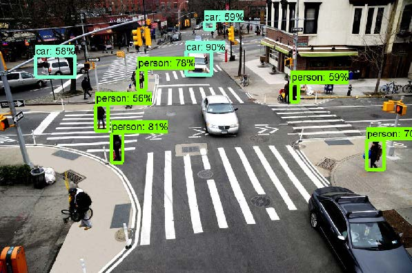

## 第1章  用卷积网络识别交通标志


作为本书的第一个项目，我们首先尝试用一个简单的模型解决交通标志识别问题.在这个问题上深度学习的表现非常好。简而言之，给定一副交通标志的彩色图像，我们的模型可以识别出它是什么信号。我们的介绍如下：

* 数据集是如何构成的
* 应该使用哪种深度网络
* 如何对数据集中的图像进行预处理
* 如何训练，预测和关注性能

### 数据集

由于要尝试用图像预测交通标志，因此我们需要使用为此而建立的数据集。幸运的是，德国 Neuroinformatik研究所的研究者建立了一个包含约40,000张不同图像的数据集，涵盖43种交通标志。我们用到的数据集是**德国交通标志识别基准（German Traffic Sign Recognition Benchmark， GTSRB）**竞赛的一个子集。该竞赛试图对为实现同一目标而建立的多个模型的性能打分。尽管数据集比较古老——来自2011年，但是对于我们的项目来说，它是一个很好的数据集。

数据集下载地址：http://benchmark.ini.rub.de/Dataset/GTSRB_Final_Training_Images.zip。

> 在运行代码之前，先下载文件并解压到代码所在的目录下。解压后，我们得到一个名为GTSRB的包含数据集的文件夹。作为作者，感谢为这一开源数据集做出贡献的人。另外，可以参考 http://cs231n.github.io/convolutional-networks， 以便了解更多关于CNN的知识。

让我们看一下例子。

“限速20千米/小时”:


“直行或右转”：


“弯道”：


正如所见，标志的亮度并不统一（有些很暗而有些很亮），尺寸不同，视角不同，背景不同，并且可能包含其他交通标志。

数据集的组织方式如下：所有标签相同的图像在同一文件夹中。例如，在 GTSRB/Final_Training/Images/00040/这一文件夹下，所有的图像的标签都是40，而 GTSRB/Final_Training/Images/00005/中的图像的标签为5。注意，所有图像都是PPM格式，这是一种无损压缩格式，拥有很多开源的编码/解码器。

### CNN网络

在本项目中，我们使用一个具有如下结构的非常简单的网络：


在这一结构中，我们仍然有以下选择：

* 二维卷积层中滤波器的个数和核大小
* 池化层中核的大小
* 全连接层中的单元数
* 批大小，优化算法，学习步骤（最终的衰减率），每个层的激活函数，和迭代的数量


### 图像预处理

模型的第一步操作是读入图像并进行标准化。事实上，我们不能在图像尺寸不统一的情况下进行后续工作。因此，第一步，我们要加载图像并且将其变形为指定的尺寸（32x32)。除此之外，我们需要对标签进行独热编码，得到一个43维的矩阵，矩阵中的每一维只有一个元素有效；与此同时，我们把图像的颜色空间从RGB转为灰度图。观察图像可以发现，我们所需要的信息不是在标志的颜色中，而是在形状和设计中。

接着，打开一个jupyter notebook，编写代码。首先，我们设置一些全局变量，包括类的数量（43）和变形后的图像的尺寸：


```python
N_CLASSES = 43
RESIZED_IMAGE = (32, 32)
```

然后，我们定义一个函数，用来读取给定目录下的所有图像，把它们转化为给定形状，转为灰度图，并对标签做独热编码。因此，我们需要使用一个名为`dataset`的元组：


```python
import matplotlib.pyplot as plt
import glob
from skimage.color 
import rgb2lab from skimage.transform 
import resize from collections 
import namedtuple
import numpy as np np.random.seed(101) %matplotlib inline
Dataset = namedtuple('Dataset', ['X', 'y']) 
def to_tf_format(imgs):
    return np.stack([img[:, :, np.newaxis] for img in imgs],
axis=0).astype(np.float32) 
def read_dataset_ppm(rootpath, n_labels, resize_to): 
    images = [] labels = [] for c in range(n_labels):    
        full_path = rootpath + '/' + format(c, '05d') + '/'    
        for img_name in glob.glob(full_path + "*.ppm"):      
            img = plt.imread(img_name).astype(np.float32)
            img = rgb2lab(img / 255.0)[:,:,0]      
            if resize_to:        
                img = resize(img, resize_to, mode='reflect')             
                label = np.zeros((n_labels, ), dtype=np.float32)
                label[c] = 1.0                
             images.append(img.astype(np.float32))
            labels.append(label)
return Dataset(X = to_tf_format(images).astype(np.float32),
               y = np.matrix(labels).astype(np.float32))
dataset = read_dataset_ppm('GTSRB/Final_Training/Images', N_CLASSES,RESIZED_IMAGE) 
print(dataset.X.shape) print(dataset.y.shape)
```

`skimage`模块使得图像的读取、转化、变形操作非常容易。我们在实现中决定对原始的颜色空间（RGB）进行转化，只保留亮度分量。另一个好的变换是YUV，只有Y通道会作为灰度图保存。

运行代码的结果如下：

```python
(39209, 32, 32, 1)
(39209, 43)
```

注意输出格式：待观测的矩阵X维度为4。第一维代表索引位置（近40000），其他三维表示图像信息（32\*32\*1的灰度图）。这是用TensorFlow处理图像的默认形状（详见代码中`_tf_format`函数）。

对于标签矩阵，行是待观测目标的索引，列是标签的独热编码。

为了更好地理解观测矩阵，我们打印第一个样本的特征向量和标签：

```python
plt.imshow(dataset.X[0, :, :, :].reshape(RESIZED_IMAGE)) #sample
print(dataset.y[0, :]) #label
```


```
 [[1. 0. 0. 0. 0. 0. 0. 0. 0. 0. 0. 0. 0. 0. 0. 0. 0. 0. 0. 0. 0. 0. 0. 0.

0. 0. 0. 0. 0. 0. 0. 0. 0. 0. 0. 0. 0. 0. 0. 0. 0. 0.]]
```


打印最后一个样本：

```python
plt.imshow(dataset.X[-1, :, :, :].reshape(RESIZED_IMAGE)) #sample
print(dataset.y[-1, :]) #label
```

```
[[0. 0. 0. 0. 0. 0. 0. 0. 0. 0. 0. 0. 0. 0. 0. 0. 0. 0. 0. 0. 0. 0. 0. 0.

0. 0. 0. 0. 0. 0. 0. 0. 0. 0. 0. 0. 0. 0. 0. 0. 0. 1.]]
```

可以发现，图像的特征向量维度为32*32。标签只在第一个位置值为1。

这是我们建立模型需要的两部分信息。请格外注意形状，因为在用深度学习处理图像的过程中它们很关键。与经典机器学习矩阵相比，这里X的维度为4。

预处理的最后一步是训练集/测试集的分割。我们希望在数据集的一个子集上训练模型，并在其补集，即测试集上测试性能。为此，我们需要用`sklearn`提供的功能。

```python
from sklearn.model_selection import train_test_split 
idx_train, idx_test = train_test_split(range(dataset.X.shape[0]),  
                                       test_size=0.25, random_state=101)
X_train = dataset.X[idx_train, :, :, :]
X_test = dataset.X[idx_test, :, :, :]
y_train = dataset.y[idx_train, :] y_test = dataset.y[idx_test, :]
print(X_train.shape) print(y_train.shape) 
print(X_test.shape) print(y_test.shape)
```

在这个例子中，我们用数据集中75%的样本训练，用余下25%的样本测试。下面是当前代码的实际输出：

```python
(29406, 32, 32, 1)
(29406, 43)
(9803, 32, 32, 1)
(9803, 43)
```

### 训练模型并进行预测

首先，我们需要一个由训练数据生成分批处理的函数。事实上，在每次训练迭代中，我们需要插入来自训练集的分批处理样本。这里，我们需要创建一个函数，用于获取样本，标签，分批处理样本并返回分批处理生成器。

而且，为了引入训练数据的变化性，我们在函数中加入新的参数，即重洗数据以产生不同分批样本的概率。每个分批处理有不同的数据会使模型学习输入-输出的连接并且不记忆序列。

```python
def minibatcher(X, y, batch_size, shuffle): 
   assert X.shape[0] == y.shape[0] n_samples = X.shape[0] 
   if shuffle:  
      idx = np.random.permutation(n_samples) 
   else:   
      idx = list(range(n_samples)) 
      for k in range(int(np.ceil(n_samples/batch_size))):    
      from_idx = k*batch_size    
      to_idx = (k+1)*batch_size    
      yield X[idx[from_idx:to_idx], :, :, :], y[idx[from_idx:to_idx], :]
```

为了测试这一函数，打印分批处理为10000时分批处理的形状：

```python
for mb in minibatcher(X_train, y_train, 10000, True): 
    print(mb[0].shape, mb[1].shape)
```
打印结果如下：

```python
(10000, 32, 32, 1) (10000, 43)
(10000, 32, 32, 1) (10000, 43)
(9406, 32, 32, 1) (9406, 43)
```

不出所料，训练集中的29406个样本被分成了两个10000，和一个9406。当然，标签矩阵中元素的数量也是这些。

终于可以建立模型了。首先，需要确定网络的模块。我们可以从创建全连接层开始，（作为参数）加入可变数量的单元，且不加入激活层。我们采用Xavier方法对系数（权重）进行初始化，偏置设为0。输出是输入经过权重，相加，考虑偏置后的组合。需要注意的是权重的维度是动态定义的，可以在网络的任何地方使用。

```python                                        
import TensorFlow as tf 
def fc_no_activation_layer(in_tensors, n_units): 
    w = tf.get_variable('fc_W', 
                        [in_tensors.get_shape()[1], n_units],
                        tf.float32,
                        tf.contrib.layers.xavier_initializer())
    b = tf.get_variable('fc_B',
                        [n_units, ], 
                        tf.float32,
                        tf.constant_initializer(0.0)) 
    return tf.matmul(in_tensors, w) + b
```

下面创建带激活的全连接层。特别地，这里的激活函数采用leaky ReLU。我们用如下方法来实现：

```python
def fc_layer(in_tensors, n_units): 
    return tf.nn.leaky_relu(fc_no_activation_layer(in_tensors, n_units))
```
最后，创建一个卷积层，参数包含输入数据，核尺寸，滤波器（或神经元）个数。我们将采用与全连接层相同的激活函数。在此，输出层需要通过leaky ReLU激活：

 ```python
def conv_layer(in_tensors, kernel_size, n_units): 
    w = tf.get_variable('conv_W',
					[kernel_size, kernel_size, in_tensors.get_shape()[3], n_units],           
                      tf.float32,
                      tf.contrib.layers.xavier_initializer())
    b = tf.get_variable('conv_B',
                       [n_units, ],
                       tf.float32,
                       tf.constant_initializer(0.0))
    return tf.nn.leaky_relu(tf.nn.conv2d(in_tensors, w, [1, 1, 1, 1], 'SAME') + b)
 ```

现在建立池化层`maxpool_layer`。这里，窗口的尺寸和步长都是平方级的。

```python
def maxpool_layer(in_tensors, sampling): 
    return tf.nn.max_pool(in_tensors, [1, sampling, sampling, 1], [1, sampling, sampling, 1], 'SAME')
```

最后要做的是定义dropout，用来标准化网络。dropout的创建相当简单。只需要记住，它在训练时会用到，预测时不会使用。因此，我们需要一个额外的操作去定义是否进行dropout：

```python
def dropout(in_tensors, keep_proba, is_training): 
    return tf.cond(is_training, lambda: tf.nn.dropout(in_tensors, keep_proba), lambda: in_tensors)
```
最后，需要按照上述定义把各功能结合起来并创建模型。我们建立的模型包含以下几层：

1. 二维卷积，5*5，32个滤波器
2. 二维卷积，5*5，64个滤波器
3. 展平
4. 全连接层，1024个单元
5. 40%的dropout
6. 全连接层（无激活函数）
7. 多元逻辑回归的softmax输出

代码如下：

```python
def model(in_tensors, is_training): 
    # First layer: 5x5 2d-conv, 32 filters, 2x maxpool, 20% drouput 
    with tf.variable_scope('l1'): 
        l1 = maxpool_layer(conv_layer(in_tensors, 5, 32), 2)
        l1_out = dropout(l1, 0.8, is_training) 
    # Second layer: 5x5 2d-conv, 64 filters, 2x maxpool, 20% drouput 
    with tf.variable_scope('l2'):
        l2 = maxpool_layer(conv_layer(l1_out, 5, 64), 2)
        l2_out = dropout(l2, 0.8, is_training) 
    with tf.variable_scope('flatten'):    
        l2_out_flat = tf.layers.flatten(l2_out) 
        # Fully collected layer, 1024 neurons, 40% dropout 
    with tf.variable_scope('l3'):
        l3 = fc_layer(l2_out_flat, 1024)    
        l3_out = dropout(l3, 0.6, is_training)
    # Output
    with tf.variable_scope('out'):   
         out_tensors = fc_no_activation_layer(l3_out, N_CLASSES) 
    return out_tensors
```

现在，我们需要定义函数来训练模型并测试性能。注意，下面所有的代码都属于训练模型的函数，为了便于解释被拆成小块。

函数的参数包括训练集、测试集及对应的标签，学习率，迭代次数，批大小。首先，需要定义TensorFlow占位符：每个分批处理，一个分批处理的标签，是否进行训练（主要用于dropout层）：

```python
from sklearn.metrics import classification_report, confusion_matrix 
def train_model(X_train, y_train, X_test, y_test, learning_rate, max_epochs, batch_size): 
    in_X_tensors_batch = tf.placeholder(tf.float32, shape = (None, 
    RESIZED_IMAGE[0], RESIZED_IMAGE[1], 1))
    in_y_tensors_batch = tf.placeholder(tf.float32, shape = (None, N_CLASSES)) 
    is_training =tf.placeholder(tf.bool)
```

下面，定义输出，度量分数，优化器。这里，我们采用`AdamOptimizer`和多元逻辑回归`softmax(logits)`下的交叉熵作为损失函数：

```python
logits = model(in_X_tensors_batch, is_training)
out_y_pred = tf.nn.softmax(logits)
loss_score = tf.nn.softmax_cross_entropy_with_logits(logits=logits, labels=in_y_tensors_batch) 
loss = tf.reduce_mean(loss_score) 
optimizer = tf.train.AdamOptimizer(learning_rate).minimize(loss)

```

最后，使用分批处理的模型训练代码如下：

```python
with tf.Session() as session:    
   session.run(tf.global_variables_initializer())    
   for epoch in range(max_epochs):    
      print("Epoch=", epoch)    
      tf_score = []   
      for mb in minibatcher(X_train, y_train, batch_size, shuffle = True):    
         tf_output = session.run([optimizer, loss],
                                 feed_dict = {in_X_tensors_batch : mb[0],  
                                 in_y_tensors_batch : b[1], is_training : True})
         tf_score.append(tf_output[1])
      print(" train_loss_score=", np.mean(tf_score))
```

训练之后，需要在测试集上测试模型。这里，我们用整个测试集测试，而不是分批处理。由于我们不使用dropout，对应的参数需要设为false:
```python
   print("TEST SET PERFORMANCE")
   y_test_pred, test_loss = session.run([out_y_pred, loss],                                         
                                        feed_dict = {in_X_tensors_batch :
                                        X_test,in_y_tensors_batch : y_test, is_training : False})
```
最后，打印分类结果并画出混淆矩阵来观察误分类的情况：
```python
   print(" test_loss_score=", test_loss)
   y_test_pred_classified = np.argmax(y_test_pred, axis=1).astype(np.int32)    
   y_test_true_classified = np.argmax(y_test, axis=1).astype(np.int32)
   print(classification_report(y_test_true_classified, y_test_pred_classified))
   cm = confusion_matrix(y_test_true_classified, y_test_pred_classified)
   plt.imshow(cm, interpolation='nearest', cmap=plt.cm.Blues)
   plt.colorbar()    
   plt.tight_layout()    
   plt.show()
   #log2的版本，强调错误的分类
   plt.imshow(np.log2(cm + 1), interpolation='nearest',cmap=plt.get_cmap("tab20"))
   plt.colorbar()    
   plt.tight_layout()    
   plt.show() tf.reset_default_graph()
```

最后，我们运行带有一些参数的函数。这里，学习率是0.001，批大小256，迭代10次：

```python
train_model(X_train, y_train, X_test, y_test, 0.001, 10, 256)
```

输出如下：


```python
Epoch= 0
train_loss_score= 3.4909246
Epoch= 1
train_loss_score= 0.5096467
Epoch= 2
train_loss_score= 0.26641673
Epoch= 3
train_loss_score= 0.1706828
Epoch= 4
train_loss_score= 0.12737551
Epoch= 5
train_loss_score= 0.09745725
Epoch= 6
train_loss_score= 0.07730477
Epoch= 7
train_loss_score= 0.06734192
Epoch= 8
train_loss_score= 0.06815668
Epoch= 9
train_loss_score= 0.060291935
TEST SET PERFORMANCE test_loss_score= 0.04581982
```

每个类结果如下：

```shell
    精度  召回率 f1-score   样本数          
0   1.00     0.96     0.98       67
1	0.99     0.99      0.99      539
2	0.99     1.00     0.99       558
3	0.99     0.98     0.98       364
4	0.99     0.99     0.99       487
5	0.98     0.98     0.98       479
6	1.00    0.99     1.00       105
7	1.00     0.98     0.99       364
8	0.99     0.99     0.99       340
9	0.99     0.99     0.99       384
10	0.99     1.00     1.00       513
11	0.99     0.98     0.99       334
12	0.99     1.00     1.00       545
13	1.00     1.00     1.00       537
14	1.00     1.00     1.00       213
15	0.98     0.99     0.98       164
16	1.00     0.99     0.99       98
17	0.99     0.99     0.99       281
18	1.00     0.98     0.99       286
19	1.00     1.00     1.00       56
20	0.99     0.97     0.98       78
21	0.97     1.00     0.98       95
22	1.00     1.00     1.00       97
23	1.00     0.97     0.98       123
24	1.00     0.96     0.98       77
25	0.99     1.00     0.99      401
26	0.98     0.96     0.97       135
27	0.94     0.98     0.96       60
28	1.00     0.97     0.98       123
29	1.00     0.97     0.99       69
30	0.88     0.99    0.93       115
31	1.00     1.00     1.00       178
32	0.98     0.96     0.97       55
33	0.99     1.00     1.00       177
34	0.99     0.99     0.99       103
35	1.00      1.00     1.00       277
36	0.99     1.00     0.99       78
37	0.98     1.00     0.99       63
38	1.00     1.00     1.00       540
39	1.00     1.00     1.00       60
40	1.00     0.98     0.99       85
41	1.00     1.00     1.00       47         
42  0.98     1.00     0.99       53 
avg/total 0.99 0.99   0.99     9803
```
可以看到，我们在测试集上达到了99%的准确率。此外，召回率和f1值也为99%。由于测试集的损失与最后一次迭代的损失相似，说明模型稳定，没有过拟合或欠拟合。

混淆矩阵如下：


下面是`log2`版本的进度截屏：


### 后续问题

* 尝试添加或去掉卷积层或全连接层。这些改变会导致性能怎样变化？

* 这个简单的项目表明了dropout的必要性。改变dropout的比例，观察输出的过拟合和欠拟合情况。

* 现在，拍一张你所在城市的交通标志图，在现实生活中测试一下训练好的模型！


### 小结

在这一章中，我们看到了怎样用卷积神经网络识别交通标志。在下一章中，我们会用CNN完成更加复杂的任务。


## 第2章 用物体探测接口注释图像

近年来，随着深度学习的发展，计算机视觉取得了巨大的飞跃，使计算机在视觉场景的理解上有了更高的水平。视觉任务中深度学习的潜力是巨大的：计算机视觉具有感知和理解周围环境的能力，从而在可移动领域（例如，自动驾驶汽车可以通过车上的相机探测出物体是行人，动物，还是机动车并做出行动指令）以及日常生活中的人机交互领域（例如，可以使机器人感知周围环境并做出反应）打开了人工智能大门。

在第1章中，我们介绍了ConvNets以及工作原理。在这一章里，我们会介绍一个简单的项目，借助因特网或者自己电脑的网络摄像头采集的图片，使用计算机理解相机和手机中的图片。项目的目的是找出图片中物体的类型和精确的位置。

为了实现上述的分类和定位，我们引入TensorFlow的物体探测API，这是google的TensorFlow模型项目中的一部分，TensorFlow可以预训练一系列神经网络并封装窄自定义的应用中。

在这一章，我们主要讨论以下几个问题：

* 在项目中使用恰当数据的优势
* TensorFlow物体探测接口简介
* 如何为后续应用储存图像
* 如何使用`moviepy`处理视频
* 如何从网站中实时获取图像

### 微软常见物体数据集

在计算机视觉方面，深度学习经常被用于解决分类问题，如ImageNet（也有其他数据集，例如PASCAL VOC，详见http://host.robots.ox.ac.uk/pascal/VOC/voc2012 ），以及适合解决问题的卷积网络（如Xception，GG16，VGG19，ResNet50，InceptionV3，以及MobileNet，这些网络在著名的`keras`程序包中都有引用，参见https://keras.io/applications/）。

尽管基于ImageNet数据集的深度学习技术已经登峰造极，这种网络在面对真实世界的应用时还是存在很多困难。事实上，在实际应用中，我们不得不处理与ImageNet的样本差别巨大的数据。在Imagenet中，样本按照图像中唯一清晰的元素进行明确分类。理想情况下，待分类的物体处于图像中央位置，并且不被遮挡。而在实际图像中，大量物体服从随机分布。所有这些物体互不相同，进而会造成数据集的混乱。除此之外，由于可能被其它物体遮盖，常见的物体也不能准确而且直接地被察觉到。

读者可以参照下列文献中的图例。

图1：ImageNet中的图像样本，它们按照层级结构组织，允许采用一般或更精确的分类。

来源：DENG，Jia等人的文章《ImageNet: A large-scale hierarchical image database》，接收在Computer Vision and Pattern Recognition, 2009.CVPR 2009.IEEE Conference on.IEEE, 2009.p.248-255。

实际情况下，含有多个物体的图像有时很难和背景噪音区分。读者通常无法仅仅通过图像含有的拥有最高置信度的简单标签来创建有意义的项目。

在实际应用中，读者需要有能力完成以下工作：

* 物体识别，识别物体并分类，同一类中通常包含多种不同的物体。
* 图像定位，找出图像中特定物体的位置。
* 图像分割，每个像素点都具有标签，表示该点是物体还是背景，以便可以从背景中分离出感兴趣的区域。

    正如LIN, Tsung-Yi等人的文章《Microsoft coco: common objects in context》（其接收在European conference on computer vision.Springer, Cham, 2014.p.740-755，文章见https://arxiv.org/abs/1405.0312）中所提到的， 训练卷积网络的必要性在于能够在微软常见物体数据集（MSCOCO）上创建能够实现上述部分或全部目标的上下文。该数据集包含91类对象，采用分层排序的方式，其中82类包含5000个以上有标签的实例。数据集共含有2500000个描述对象，它们分布在32800张图像中。

下面是MSCOCO数据集中可辨识的类：

```json
{1: 'person', 2: 'bicycle', 3: 'car', 4: 'motorcycle', 5: 'airplane', 6: 'bus', 7: 'train', 8: 'truck', 9: 'boat', 10: 'traffic light', 11: 'fire hydrant', 13: 'stop sign', 14: 'parking meter', 15: 'bench', 16: 'bird', 17: 'cat', 18: 'dog', 19: 'horse', 20: 'sheep', 21: 'cow', 22: 'elephant', 23: 'bear', 24: 'zebra', 25: 'giraffe', 27: 'backpack', 28: 'umbrella', 31:
'handbag', 32: 'tie', 33: 'suitcase', 34: 'frisbee', 35: 'skis', 36:
'snowboard', 37: 'sports ball', 38: 'kite', 39: 'baseball bat', 40:
'baseball glove', 41: 'skateboard', 42: 'surfboard', 43: 'tennis racket', 44: 'bottle', 46: 'wine glass', 47: 'cup', 48: 'fork', 49: 'knife', 50:
'spoon', 51: 'bowl', 52: 'banana', 53: 'apple', 54: 'sandwich', 55:
'orange', 56: 'broccoli', 57: 'carrot', 58: 'hot dog', 59: 'pizza', 60:
'donut', 61: 'cake', 62: 'chair', 63: 'couch', 64: 'potted plant', 65:
'bed', 67: 'dining table', 70: 'toilet', 72: 'tv', 73: 'laptop', 74:
'mouse', 75: 'remote', 76: 'keyboard', 77: 'cell phone', 78: 'microwave', 79: 'oven', 80: 'toaster', 81: 'sink', 82: 'refrigerator', 84: 'book', 85:
'clock', 86: 'vase', 87: 'scissors', 88: 'teddy bear', 89: 'hair drier',
90: 'toothbrush'}
```
尽管`ImageNet`数据集展示了分布在 14197122图像中的1000类目标（具体描述见https://gist.github.com/yrevar/942d3a0ac09ec9e5eb3a ），然而MSCOCO可以在较小数量的图像上展示目标物体的特殊特征（数据集通过亚马逊的mechanical turk收集，这是一种代价更高的方法，但也被ImageNet共享）。在这样的前提下，MS COCO图像可以被认为是`上下文关系和非图标对象视图`的优良例子，因为对象被安排在现实的位置和环境中。这一点可以从上述MSCOCO论文的相应例子得到证实:


图2：图标和非图标图像示例。来源：LIN, Tsung-Yi, et al.Microsoft coco: common objects in context.In: European conference on computer vision.Springer, Cham, 2014.p.740-755.

 此外，MSCOCO的图像注释非常丰富，提供了图像中物体的等高线坐标。等高线可以很容易地转换成边框，这些边框限定了物体所在的图像位置。这是一种粗糙的定位方法，而不是原始的基于像素分割的训练方法。

下图中，我们通过定义图像中的显著区域并创建这些区域的文本描述，仔细划分了拥挤的行。在机器学习中，这种方式可以转化为给图像中的每个像素分配标签，并尝试预测分割类（根据对应的文本描述）。历史上，相关工作直到2012年才随着ImageNet图像处理而完成，深度学习也被证明是一种更有效的解决方案。

> 2012是计算机视觉的一个里程碑，因为深度学习第一次提供了比之前任何传统技术更好的结果（KRIZHEVSKY, Alex; SUTSKEVER, Ilya; HINTON, Geoffrey.E, Imagenet classification with deep convolutional neural networks. In：Advances in neural information processing systems.2012.p.1097-1105， https://papers.nips.cc/paper/4824-imagenet-classification-with-deep-convolutional-neural-networks.pdf)。

图像分割尤其适用于如下各种任务：

* 突出图像中的重要对象，例如医学疾病检测领域的应用
* 在图像中定位物体，以便机器人能够拾取或操纵它们
* 帮助自动驾驶汽车了解路况或无人机了解路况并完成导航
* 通过自动提取图像的部分区域或去除图像背景来编辑图像 

这种描述非常昂贵（这限制了MSCOCO中的实例数量），因为它必须完全手动完成，并且对精度有要求。有一些工具可以通过分割图像进行注释。读者可以在https://stackoverflow.com/questions/8317787/imagelabelling-and-annotation-tool中看到全部列表。如果读者想要自己通过分割来注释图像，那么我们推荐以下两个工具：

* LabelImg：https://github.com/tzutalin/labelImg
* FastAnnotationTool：https://github.com/christopher5106/FastAnnotationTool

所有这些工具也可以通过边框完成更简单的注释。它们可以帮助读者根据MSCOCO按照自己的分类重新训练一个模型（我们将在本章末尾再次介绍这一点）：


				MSCOCO训练所用图像的像素级分割

### TensorFlow物体探测接口

作为提升研究社区能力的一种方式，谷歌研究科学家和软件工程师经常开发最先进的模型并且促进开源。正如2016年10月谷歌研究博客https://research.googleblog.com/2017/06/supercharge-your-computer-vision-models.html 中所描述的，谷歌的内部物体探测系统在COCO探测挑战中拿到了冠军。这一比赛主要解决的是寻找图像中对象物体（估计物体在图像中某一位置的概率）和它们的边框（细节参见https://arxiv.org/abs/1611.10012 ）的问题。谷歌的解决方案不仅促成了大量论文，并且投入到了谷歌产品（如Nest摄像头https://nest.com/cameras/nest-aware/，图片搜索ttps://www.blog.google/products/search/now-image-search-can-jump-start-yoursearch-style/， and 以及谷歌街景https://research.googleblog.com/2017/05/updatinggoogle-maps-with-deep-learning.html ），更是在TensorFlow之上建立了大量的开源框架。

上述框架经常提供一些有用的功能。下面是五个不同的预训练模型（构成所谓的预训练模型动物园）：

* Single Shot Multibox Detector (SSD) with MobileNets
* SSD with Inception V2
* Region-Based Fully Convolutional Networks (R-FCN) with Resnet 101
* Faster R-CNN with Resnet 101
* Faster R-CNN with Inception Resnet v2


 模型在检测精度和检测过程的执行速度上都在不断提高。MobileNets, Inception和Resnet指的是不同类型的卷积神经网络结构。（MoblieNets，顾名思义，是用于优化移动电话的网络，结构尺寸小，执行速度快）。前面的章节中我们已经讨论过卷积神经网络的结构，读者可以参考上述框架了解更多相关见解。如果需要更多资料，读者可以在Joice Xu的博客中重温各个主题，博客地址：https://towardsdatascience.com/an-intuitive-guide-to-deepnetwork-architectures-65fdc477db41。

**Single Shot Multibox Detector (SSD), Region-Based Fully convolutional networks (RFCN)**和**Faster Region-based convolutional neural networks (Faster R-CNN)**是用来检测图像中多个物体的新模型。在下面的介绍中，我们会解释它们的工作原理。

  读者可以根据具体应用选择最合适的模型（需要进行一些实验），或对多个模型进行集成以便得到更好的结果（正如谷歌研究员为了赢得COCO比赛的所采取的策略）。


### R-CNN，R-FCN和SSD模型的基本知识

即使读者清楚地知道卷积神经网络如何处理图像分类，但是如何使用神经网络通过定义边界框（一个矩形包围对象本身）将多个物体定位成一个图像，也可能不太明显。读者可以想到的第一个最简单的解决方案可能是滑动窗口，并在每个窗口上应用卷积神经网络。但是对于大多数现实世界的应用来说，这可能涉及非常昂贵的计算（就像给自动驾驶的汽车提供视觉处理，读者确实希望它能识别出障碍物并在碰撞之前停下）。

读者可以参考博客https://www.pyimagesearch.com/2015/03/23/sliding-windowsfor-object-detection-with-python-and-opencv/，以便更好地了解用如何滑动窗口进行物体探测。博客中给出了将其与图像金字塔结合的有效例子。

虽然滑动窗口相当直观，但其复杂性和计算冗余（在不同尺度的图像上穷举和处理）带来了诸多限制，另一种可能的`区域候选`算法也随即产生。这种算法采用图像分割（即根据不同区域颜色的差异将图像分为不同的部分）以枚举图像中可能存在的边框。算法的具体细节参见Satya allik的工作https://www.learnopencv.com/selective-search-for-object-detection-cpppython/。

区域候选算法的关键是提供有限数量的边框，其数量远小于滑动窗口的数量。这使得它们可以应用到第一版R-CNN以及基于区域的卷积神经网络。工作原理如下：

1. 在图像中，用区域候选算法找到几百到几千个感兴趣区域
2. 用卷积神经网络处理感兴趣区域，以便创建每个区域的特征
3. 采用支持向量机及线性回归模型，用特征对区域进行分类，使计算得到的边框更加精确

由R-CNN快速进化而得到的Faster R-CNN使事情变得更简单，因为：

1. 它用CNN迅速处理图像，转化图像并应用到区域决策。这使得CNN需要处理的区域从数千降到一个。
2. 采用多元逻辑回归和线性分类器而非支持向量机，这样使得CNN可以扩展，而不是简单地将数据传入不同模型。

本质上，通过使用Faster R-CNN，我们再次创建了一个以特殊的过滤和选择层，区域决策层为特征的基于非神经网络算法的分类器。Faster R-CNN甚至改变了这些层，用区域决策神经网络取而代之。这使得模型更加复杂，但也比以往任何方法都更快、效果更好。

无论如何，R-FCN比R-CNN更快，因为它是全卷积网络，在卷积层之后不需要全连接层，从输入到输出是通过卷积连接的端对端的网络。这使得网络更快（比最后一层是全连接层的CNN的权值数量少）。然而，这种速度上的提升时需要代价的，它们不再表征图像的不变性（卷积神经网络可以识别物体的分类，无论它是否经过旋转）。Faster R-CNN通过位置敏感得分图来弥补这一缺陷，这是一种检查FCN处理的原始图像的区域是否对应于要分类的区域的方法。 简而言之，不需要比较类，而是比较类的一部分。举例来说，他们不把狗分类，而是分为狗的左上部分，狗的右下部分等等。 这种方法可以确定图像中是否有狗，不管图中包含狗的哪一部分。显然，这种快速的方法是以较低的精度为代价的，因为位置敏感得分地图不能补充原始的卷积神经网络提取的所有特征。

最后，我们来看一下SSD （Single Shot Detector）。它的速度更快，因为在处理图像的过程中，同时预测边框位置及其分类。SSD没有区域候选阶段，其边框的计算量很大。尽管它减少了重叠边框，但是它仍然是目前为止所提到的网络中需要处理最多边框的模型。SSD速度快的原因在于在寻找边框的同时进行分类，即同时完成所有任务。虽然方式执类似，但是它依然具有最快的速度。

> 如果读者需要了解上述模型的更多细节，可以参考Joice Xu的论文：https://towardsdatascience.com/deep_learning_for_object_detection_a_comprehensive_review-73930816d8d9。

总体来说，为了选择网络，我们必须综合考虑卷积神经网络的结构及其分类能力和复杂度，以及不同的检测模型。以最短的时间发现物体并对其进行分类，是它们共同作用的结果。

> 如果读者渴望更多地了解我们解释的模型，读者可以参考《Speed/accuracy trade-offs for modern convolutional object detectors》.Huang J, Rathod V, Sun C, Zhu M, Korattikara A, Fathi A, Fischer I, Wojna Z, Song Y, Guadarrama S, Murphy K, CVPR 2017，网址是http://openaccess.thecvf.com/content_cvpr_2017/papers/Huang_SpeedAccuracy_Trade_Offs_for_CVPR_2017_paper.pdf。然而，我们建议读者自己动手实践，评价它们的性能是否足够好，执行的时间是否合理。这是一个权衡的问题，读者必须为自己的应用做出最好的决定。

### 展示我们的项目计划

基于TensorFlow提供的强大工具，我们计划利用其API，创建一个类，这样可以以可见方式和在外部文件中注释图像。注释的意思是：

* 指出图像中的物体（如同在MSCOCO上训练模型所识别的那样）
* 返回目标识别中的置信水平（我们只考虑最小概率阈值以上的物体。基于《Speed/accuracy trade-offs for modern convolutional object detectors》，将其设置为0.25）
* 输出每个图像的边框两个相对顶点的坐标
* 将上述所有信息存储为JSON格式的文件
* 如有需要，在原始图像上对边框进行可视化

为了实现这些目标，我们需要：

1. 下载一个训练好的模型（`-protobuf`以支持`.pb`格式）并放入内存，作为TensorFlow一个会话
2. 重新编写TensorFlow提供的帮助代码，以便于更容易地将标签、类别和可视化工具加载到一个易于导入到脚本的类中。
3. 准备一个简单的脚本来演示它的使用，输入数据来自摄像头捕获的单个图像、视频和视频。

我们的项目从搭建一个合适的平台开始。

### 为项目搭建合适的环境

我们强烈建议安装Anaconda的conda并为项目创建一个单独的环境。如果读者系统中的`conda`可用，则可以进行以下操作：

```shell
conda create -n TensorFlow_api python=3.5 numpy pillow activate TensorFlow_api
```

激活环境后，读者通过`pip install`命令或`conda install`命令指向其他库（menpo，conda-forge），安装一些其他的程序包：

```
pip install TensorFlow-gpu
conda install -c menpo opencv
conda install -c conda-forge imageio
pip install tqdm, moviepy
```

如果读者希望用别的方式运行这个项目，可以考虑需要安装`numpy`、`pillow`、`TensorFlow`、`OpenCV`、`imageio`、`tqdm`和`moviepy`包，以便成功运行。

我们还需要为项目创建目录，并且保存在TensorFlow物体探测接口项目（https://github.com/TensorFlow/models/tree/master/research/object_detection）的`object_detection`路径下。

读者可以用`git`命令简单地获取整个TensorFlow模型项目并有选择性的下拉该目录。如果读者的git版本是1.7.9（2012年2月）或以上则可以进行下面的操作：

```
mkdir api_project
cd api_project
git init
git remote add -f origin https://github.com/TensorFlow/models.git
```
这些命令可以获取TensorFlow模型项目中的所有物体，但不会进行校验。执行以下命令：

```
git config core.sparseCheckout true
echo "research/object_detection/*" >>.git/info/sparse-checkout
git pull origin master
```
我们可以获得经过校验的`object_detection`目录的全部内容，并且保证文件系统中没有其他目录或文件。

注意，项目需要访问`object_detection`目录。因此，必须保证项目脚本存储在同一目录下。为了在其他项目中也能够使用此脚本，读者需要使用绝对路径来访问它。

### protobuf编译

TensorFlow物体探测接口采用`protobufs`，即协议缓冲——谷歌的数据交换格式（https://github.com/google/protobuf），以方便配置模型及训练参数。在使用框架前，必须对该库进行编译。如果读者使用Unix（Linux或Mac）或Windows操作系统，编译需要不同的步骤。

#### Winsdows安装

首先，在https://github.com/google/protobuf/上找到`releasesprotoc-3.2.0-win32.zip`并解压到项目文件夹。现在，读者应该有了一个新的`protoc-3.4.0-win32`文件夹，包含`readme.txt`和两个目录：`bin`和`include`。文件夹包含协议缓冲编译程序的预编译二进制版本（`protoc`）。 读者需要做的是把`protoc-3.4.0-win32`加入系统路径。

把路径加入系统变量后，执行以下命令：
```
protoc-3.4.0-win32/bin/protoc.exe object_detection/protos/*.proto --python_out=.
```
这样,Tensoflow物体探测接口就可以在电脑上运行了。

#### Unix安装

  对于Unix环境，安装过程可以使用shell命令，具体的操作见：
https://github.com/TensorFlow/models/blob/master/research/object_detection/g3doc/installation.md。

### 准备项目代码

 我们可以通过加载必要的包来运行我们的`TensorFlow_detection.py`项目脚本：
```python
    import os
    import numpy as np
    import TensorFlow as tf
    import six.moves.urllib as urllib
    import tarfile
    from PIL import Image
    from tqdm import tqdm
    from time import gmtime, strftime
    import json
    import cv2
```
为了能够处理视频，除`OpenCV3`之外，我们还需要`moviepy`包。`moviepy`包是一个开源项目，可以从http://zulko.github.io/moviepy/下载并免费使用，许可证来自MIT。正如它的主页中描述的，`moviepy`是一个可以进行视频编辑（可以剪切，合并，插入标题）、视频合成（非线性编辑）、视频处理或加入特效的工具。

这个包可以处理大多数常见的格式，包括GIF格式。它需要`FFmped`转换器（https://www.ffmpeg.org/）以便正确操作，因此在首次使用时它会启动失败，然后下载`FFmpeg`作为使用`imageio`中插件:
```python
try:
    from moviepy.editor import VideoFileClip
except:

   # If FFmpeg (https://www.ffmpeg.org/) is not found
   # on the computer, it will be downloaded from Internet
   # (an Internet connect is needed)
    import imageio
    imageio.plugins.ffmpeg.download()
    from moviepy.editor import VideoFileClip
```
最后，我们需要TensorFlow项目接口中`object_detection`下的两个有用的函数：
```python
    from object_detection.utils import label_map_util
    from object_detection.utils import visualization_utils as vis_util
```
我们定义了`DetectionObj`类和它的`init`步骤。初始化只针对一个参数和模型名（最初的设置只可以接受性能较差但速度更快、更轻量的模型，例如SSD MobileNet），但一些内部参数可以改变，以适合类的使用：

* `self.TARGET_PATH`指出了进行注释并保存的目录。

* `self.THRESHOLD`修正由注释过程引起的概率阈值。事实上，任何模型都会输出每幅图形的低概率检测。概率过低的检测通常是错误的。因此，我们需要确定一个阈值，以便忽略这些并不可能的检测结果。经验告诉我们，0.25是一个很好的阈值，可以在几乎完全遮挡或视觉杂波的情况下来寻找不确定的目标。

```python
class DetectionObj(object):
    """
    DetectionObj is a class suitable to leverage
    Google TensorFlow detection API for image annotation from
    different sources: files, images acquired by own's webcam,
    videos.
    """
    def__init__(self, model='ssd_mobilenet_v1_coco_11_06_2017'):
        """
        The instructions to be run when the class isinstantiated
        """

       # Path where the Python script is being run
       self.CURRENT_PATH = os.getcwd()

       # Path where to save the annotations (it can be modified)
       self.TARGET_PATH = self.CURRENT_PATH

       # Selection of pre-trained detection models
       # from the TensorFlow Model Zoo
       self.MODELS = ["ssd_mobilenet_v1_coco_11_06_2017",
                        "ssd_inception_v2_coco_11_06_2017",
                        "rfcn_resnet101_coco_11_06_2017",
                           "faster_rcnn_resnet101_coco_11_06_2017",
                        "faster_rcnn_inception_resnet_v2_atrous_\
                        coco_11_06_2017"]

       # Setting a threshold for detecting an object by the models
       self.THRESHOLD = 0.25 # Most used threshold in practice

       # Checking if the desired pre-trained detection model is available
       if model in self.MODELS:
            self.MODEL_NAME = model
        else:

            Otherwise revert to a default model

            print("Model not available, reverted to default",
                    self.MODELS[0])
            self.MODEL_NAME = self.MODELS[0]

        # The file name of the TensorFlow frozen model

        self.CKPT_FILE = os.path.join(self.CURRENT_PATH,'object_detection',
        self.MODEL_NAME,'frozen_inference_graph.pb')

        # Attempting loading the detection model,
        # if not available on disk, it will be
        # downloaded from Internet
        # (an Internet connection is required)

        try:
            self.DETECTION_GRAPH = self.load_frozen_model()
        except:
            print ('Couldn\'t find', self.MODEL_NAME)
            self.download_frozen_model()
            self.DETECTION_GRAPH = self.load_frozen_model()

        # Loading the labels of the classes recognized by the detection model
        self.NUM_CLASSES = 90
        path_to_labels = os.path.join(self.CURRENT_PATH,
                       'object_detection', 'data',
                        'mscoco_label_map.pbtxt')
        label_mapping = \
            label_map_util.load_labelmap(path_to_labels)
        extracted_categories = \
            label_map_util.convert_label_map_to_categories(
            label_mapping, max_num_classes=self.NUM_CLASSES,
            use_display_name=True)
        self.LABELS = {item['id']: item['name'] \
                    for item in extracted_categories}
        self.CATEGORY_INDEX = label_map_util.create_category_index\
                    (extracted_categories)

       # Starting the TensorFlow session
       self.TF_SESSION = tf.Session(graph=self.DETECTION_GRAPH)
```
`self.LABLES`变量非常易于调用，它包含一个对文本表示进行数字编码的字典。此外，`init`程序会加载并打开TensorFlow会话，并为`self.TF_SESSION`准备好环境。

`load_frozen_model`和`download_frozen_model`这两个函数会帮助`init`从磁盘中加载选中的冻结模型。如果模型不可访问，它们会从网上下载tar格式的模型并且解压到合适的目录（即`object_detection`目录）下：
```python
    def load_frozen_model(self):
            """
         Loading frozen detection model in ckpt
            file from disk to memory

        """
        detection_graph = tf.Graph()
        with detection_graph.as_default():
            od_graph_def =  tf.GraphDef()

        with tf.gfile.GFile(self.CKPT_FILE, 'rb') as fid:
            serialized_graph = fid.read()
            od_graph_def.ParseFromString(serialized_graph)
            tf.import_graph_def(od_graph_def, name='')

       return detection_graph
```
函数`download_frozen_model`使用了`tqdm`包，从而使新模型的互联网下载过程可视化。一些模型相当大（超过600MB），下载可能需要很长时间。提供流程的可见反馈和预估剩余时间可以让我们对操作过程更有信心：
```python
def download_frozen_model(self):
    """
    Downloading frozen detection model from Internet
    when not available on disk
    """
    def my_hook(t):
        """
        Wrapping tqdm instance in order to monitor URLopener
        """
        last_b = [0]
    def inner(b=1, bsize=1, tsize=None):
        if tsize is not None:
            t.total = tsize
        t.update((b_last_b[0]) * bsize)
        last_b[0] = b
    return inner

# Opening the url where to find the model

model_filename = self.MODEL_NAME + '.tar.gz'
download_url = \
    'http://download.TensorFlow.org/models/object_detection/'
opener = urllib.request.URLopener()

# Downloading the model with tqdm estimations of completion

print('Downloading...')
with tqdm() as t:
    opener.retrieve(download_url + model_filename,
                    model_filename, reporthook=my_hook(t))

# Extracting the model from the downloaded tar file

print ('Extracting...')
tar_file = tarfile.open(model_filename)
for file in tar_file.getmembers():
    file_name = os.path.basename(file.name)
    if 'frozen_inference_graph.pb' in file_name:
        tar_file.extract(file,
                    os.path.join(self.CURRENT_PATH,
                    'object_detection'))
```
下面的两个函数，`load_image_from_disk`和`load_image_into_numpy_array` 是可用必须的。它们可以从磁盘中选择图像并转化为适合任何TensorFlow模型的numpy数组：
```python
    def load_image_from_disk(self, image_path):
        return Image.open(image_path)
    def load_image_into_numpy_array(self, image):
    try:
        (im_width, im_height) = image.size
    return np.array(image.getdata()).reshape((im_height, im_width, 3)).astype(np.uint8)
    except:

       # If the previous procedure fails, we expect the
       # image is already a Numpy ndarray

       return image
```
`detect`函数是分类功能的核心。该函数接收图像列表。布尔标记`annotate_on_image`，可以控制脚本在给定的图像上可视化边框和注释。

这个函数可以逐个处理不同尺寸的图像。但是一次只能处理一个。因此，它读取每张图像并通过增加一个新的维度来扩展数组的维度。这一过程是必要的，因为模型希望数组的大小满足：图像的数量 \* 高度 \* 宽度 \* 深度。

注意，我们可以将所有待预测的批处理图像打包成一个矩阵。如果所有图像的高度和深度都相同，这样可以很好地工作，处理起来很快。但是，我们的项目不满足这样的假设，因此需要逐个处理图像。

我们会按照名称取张量（`detection_boxes`, `detection_scores`, `detection_classes`, `num_detections`）。这些就是期望的模型输出。同时，我们把输入传递给输入张量`image_tensor`，它会对图像进行标准化以适合模型中每一层的处理。

结果存到一个列表中。如有需要，图像会带着检测边框一并展示：
```python
     def detect(self, images, annotate_on_image=True):
        """
        Processing a list of images, feeding it
        into the detection model and getting from it scores,
        bounding boxes and predicted classes present
        in the images
        """

        if type(images) is not list:
                 images = [images]

        results = list()

        for image in images:
                # the array based representation of the image will
                # be used later in order to prepare the resulting
                # image with boxes and labels on it.
                image_np = self.load_image_into_numpy_array(image)
                # Expand dimensions since the model expects images
                # to have shape: [1, None, None, 3]
                image_np_expanded = np.expand_dims(image_np, axis=0)
                image_tensor = \
                        self.DETECTION_GRAPH.get_tensor_by_name(
                            'image_tensor:0')
                # Each box represents a part of the image where a
                # particular object was detected.
                boxes = self.DETECTION_GRAPH.get_tensor_by_name(
                            'detection_boxes:0')
                # Each score represent how level of confidence
                # for each of the objects.Score could be shown

       # on the result image, together with the class label.

        scores = self.DETECTION_GRAPH.get_tensor_by_name(
                        'detection_scores:0')

        classes = self.DETECTION_GRAPH.get_tensor_by_name(
                        'detection_classes:0')
                num_detections = \
                     self.DETECTION_GRAPH.get_tensor_by_name(
                        'num_detections:0')
         # Actual detection happens here
         (boxes, scores, classes, num_detections) = \
                     self.TF_SESSION.run(
                     [boxes, scores, classes, num_detections],
                     feed_dict={image_tensor: image_np_expanded})
        if annotate_on_image:

            new_image = self.detection_on_image(
                           image_np, boxes, scores, classes)
            results.append((new_image, boxes,
                           scores, classes, num_detections))

        else:

            results.append((image_np, boxes,
                                        scores, classes, num_detections))

        return results
```
函数`detection_on_image`的作用是处理`detect`函数的结果并返回一张包含边框的新图像，并通过`visualize_image`函数展示在屏幕上（读者可以调整延迟参数，它对应着脚本处理另一图像之前，当前图像在屏幕上停留的秒数）。
```python
    def detection_on_image(self, image_np, boxes, scores,
                            classes):
        """
        Put detection boxes on the images over
        the detected classes
        """
        vis_util.visualize_boxes_and_labels_on_image_array(
            image_np,             np.squeeze(boxes),
            np.squeeze(classes).astype(np.int32),
            np.squeeze(scores),
            self.CATEGORY_INDEX,
            use_normalized_coordinates=True,
            line_thickness=8)
        return image_np

```
函数`visualize_image`提供了一些可以修改的参数，以便适应我们在项目中的特殊需求。首先，`image_size`提供了屏幕上展示图像的尺寸。因此，过大或过小的图像都可以调整，以便和要求的尺寸相近。延迟参数`latency`，定义了每幅图像展示在屏幕上的秒数，这样可以锁定物体检测过程，直到处理下一幅图像。最后，`bluish_correction`是图像为**BGR**（这一格式颜色通道按**蓝-绿-红**的顺序组织，这是OpenCV库中的一种标准，详见https://stackoverflow.com/questions/14556545/why-opencv-usingbgr-colour-space-instead-of-rgb）而非**RGB**（**红-绿-蓝**）格式时提供的校正。模型需要的是RGB格式。
```python
       def visualize_image(self, image_np, image_size=(400, 300), 
                           latency=3, bluish_correction=True):
           height, width, depth = image_np.shape
           reshaper = height/float(image_size[0])
                width = int(width/reshaper)

           height = int(height/reshaper)
           id_img = 'preview_' + str(np.sum(image_np))
                cv2.startWindowThread()
                cv2.namedWindow(id_img, cv2.WINDOW_NORMAL)

           cv2.resizeWindow(id_img, width, height)

           if bluish_correction:
                        RGB_img = cv2.cvtColor(image_np, cv2.COLOR_BGR2RGB)
                        cv2.imshow(id_img, RGB_img)

           else:

               cv2.imshow(id_img, image_np)
               cv2.waitKey(latency*1000)
```
注释通过`serialize_annotations`函数写入磁盘。该函数为每幅图像创建一个JSON文件，数据包括检测的类，边框的顶点和检测的置信度。例如，这是狗的照片上的检测结果：
```python
     "{"scores": [0.9092628359794617], "classes": ["dog"], "boxes": [[0.025611668825149536, 0.22220897674560547, 0.9930437803268433, 0.7734537720680237]]}"
```
JSON文件指出了检测的类——一只狗，置信度的水平（约0.91的置信度）以及边框的顶点，并且给出了高度和宽度在原图中的百分比（相对值，不是绝对的像素点）：
```python
       def serialize_annotations(self, boxes, scores, classes, filename='data.json'):
            """
            Saving annotations to disk, to a JSON file
            """
            threshold = self.THRESHOLD
            valid = [position for position, score in enumerate( scores[0]) if score >threshold]

       if len(valid) > 0:

            valid_scores = scores[0][valid].tolist()

            valid_boxes  = boxes[0][valid].tolist()

            valid_class = [self.LABELS[int(a_class)] for a_class in classes[0][valid]]

           with open(filename, 'w') as outfile:

                json_data = {'classes': valid_class,
                             'boxes':valid_boxes,
                             'scores': valid_scores}
                json.dump(json_data, outfile)
```
函数`get_time`可以很方便地将真实时间转化为字符串并存在文件名：
```python
    def get_time(self):
        """
        Returning a string reporting the actual date and time
        """

        return strftime("%Y-%m-%d_%Hh%Mm%Ss", gmtime())
```
最后，我们准备三个检测渠道，分别处理图像，视频和网络摄像头。处理图像的渠道把每幅图像加载到一个列表中。视频渠道使`moviepy`中的`VideoFileClip`模型在简单通过`detect`函数之后，完成大量操作并被封装在`annotate_photogram`函数中。最后，网络摄像头渠道的快照依赖于简单的基于OpenCV'的VideoCapture函数`capture_webcam`，记录从网络摄像头返回的最后一些快照（操作考虑到了网络摄像头适应环境光线水平所需的必要时间）：

```python
       def annotate_photogram(self, photogram):
        """
            Annotating a video's photogram with bounding boxes
            over detected classes
        """
            new_photogram, boxes, scores, classes, num_detections =self.detect(photogram)[0]

            return new_photogram
```
`capture_webcam`函数利用`cv2.VideoCapture` （http://docs.opencv.org/3.0-beta/modules/videoio/doc/reading_and_writing_video.html） 获取网络摄像头的图像。由于摄像头需要首先适应拍照环境的光线，在将照片输入目标检测程序前，程序会丢弃开始的一些照片。这样，网络摄像头总有时间调节灯光设置：
```python
    def capture_webcam(self):
        """
        Capturing an image from the integrated webcam
        """
        def get_image(device):
            """
            Internal function to capture a single image             
            from the camera and return it in PIL format
            """
            retval, im = device.read()
            return im
        # Setting the integrated webcam         
        camera_port = 0
        # Number of frames to discard as the camera
        # adjusts to the surrounding lights         
        ramp_frames = 30
        # Initializing the webcam by cv2.VideoCapture         
        camera = cv2.VideoCapture(camera_port)
        # Ramping the camera_all these frames will be
        # discarded as the camera adjust to the right light levels
        print("Setting the webcam")
        for i in range(ramp_frames):
          _ = get_image(camera)
        # Taking the snapshot
        print("Now taking a snapshot...", end='')
        camera_capture = get_image(camera)
        print('Done')
        # releasing the camera and making it reusable
        del (camera)
        return camera_capture
```
`file_pipeline`函数包括从存储图像到加载图像所需的所有步骤，并对它们进行可视化/注释：
1. 从磁盘载入图像
2. 对于加载好的图像进行物体检测
3. 将每幅图像的注释结果写入JSON文件
4. 如果布尔参数`visualize`需要，在电脑屏幕上展示图像和边框
```python
    def file_pipeline(self, images, visualize=True):
        """
        A pipeline for processing and annotating lists of
        images to load from disk         """

        if type(images) is not list:
                images = [images]

        for filename in images:

        single_image = self.load_image_from_disk(filename)

        for new_image, boxes, scores, classes, num_detections in self.detect(single_image):

           self.serialize_annotations(boxes, scores, classes,

           filename=filename + ".json")

           if visualize:

               self.visualize_image(new_image)
```
`video_pipeline`会组织所有步骤，完成使用边框注释视频，并存入磁盘：
```python
    def video_pipeline(self, video, audio=False):
        """
        A pipeline to process a video on disk and annotating it         
        by bounding box.The output is a new annotated video.
        """
        clip = VideoFileClip(video)
        new_video = video.split('/')
        new_video[-1] = "annotated_" + new_video[-1]
        new_video = '/'.join(new_video)
        print("Saving annotated video to", new_video)
        video_annotation = clip.fl_image(self.annotate_photogram)
        video_annotation.write_videofile(new_video, audio=audio)
```

`webcam_pipeline`函数会组织所有步骤，注释网络摄像头的图像：

1. 从网络摄像头捕获图像
2. 将捕获的图像存入磁盘（`cv2.imwrite`，具有基于目标文件名编写不同图像格式的优点。详见http://docs.opencv.org/3.0_beta/modules/imgcodecs/doc/reading_and_writing_images.html）
3. 对图像进行物体探测
4. 把注释保存到JSON文件
5. 展示图像和边框
```python
    def webcam_pipeline(self):
        """
        A pipeline to process an image acquired by the internal webcam
        and annotate it, saving a JSON file to disk
        """
        webcam_image = self.capture_webcam()
        filename = "webcam_" + self.get_time()
        saving_path = os.path.join(self.CURRENT_PATH, filename + ".jpg")
        cv2.imwrite(saving_path, webcam_image)

        new_image, boxes, scores, classes, num_detections =
        self.detect(webcam_image)[0]

        json_obj = {'classes': classes, 'boxes':boxes, 'scores':scores}
        self.serialize_annotations(boxes, scores, classes, filename=filename+".json")

        self.visualize_image(new_image, bluish_correction=False)
```


### 一些简单应用

作为代码配置的最后一部分，我们只演示三个简单的脚本，分别使用我们项目中三种不同的数据源：文件、视频、网络摄像头。

我们的第一个测试脚本目标是从本地文件夹（当在其他文件夹操作时，导入操作不会生效，除非把整个项目文件夹加入Python路径）导入`DetectionObj`并注释以及可视化三幅图像。

> 为了在读者的脚本中在Python路径中加入目录，在需要访问目录的脚本之前读者需要调用`sys.path.insert`命令：
```python
    import sys
    sys.path.insert(0,'/path/to/directory')
```

然后我们激活类，声明使用SSD MobileNet v1模型。之后，我们必须将每幅图像的路径放入列表并传递给`file_pipeline`方法：
```python
    from TensorFlow_detection import DetectionObj

    if__name__ == "__main__":

       detection = DetectionObj(model='ssd_mobilenet_v1_coco_11_06_2017')
        images = ["./sample_images/intersection.jpg",
                "./sample_images/busy_street.jpg",
                "./sample_images/doge.jpg"]
        detection.file_pipeline(images)
```

在我们收到检测结果之后，得到的输出放在交叉路口图像上，最终返回另一个图像，其包含具有足够置信度的物体的边框。



SSDMobileNet v1在交叉路口照片上的物体检测


运行脚本之后，三张图像和它们的注释会展示在屏幕上（每一幅图展示三秒）。而一个新的JSON文件会被存入磁盘（存储在目标路径，如果我们没有修改环境变量`TARGET_CLASS`，那么会存储在本地目录）。

经过可视化，我们可以看到与物体相关的边框，它们的置信度大于0.5。然而，可以看到，在这种情况下，一个交叉路口的注释图像（在前面的图中描绘）中，并不是所有的汽车和行人都能被模型所发现。

通过检查JSON文件，我们可以发现还有其他汽车和行人被模型发现，尽管它们的置信度较低。在文件中，我们会看到所有检测到的目标都至少具有0.25的置信度，这是很多目标检测研究中常用的一个阈值（读者可以通过修改变量`THRESHOLD`来改变它）。

这里读者可以看到JSON文件中产生的分数。只有8个检测到的物体得分高于阈值0.5，其它16个得分较低：

```python
    "scores": [0.9099398255348206, 0.8124723434448242, 0.7853631973266602,
    0.709653913974762, 0.5999227166175842, 0.5942907929420471,
    0.5858771800994873, 0.5656214952468872, 0.49047672748565674,
    0.4781857430934906, 0.4467884600162506, 0.4043623208999634,
    0.40048354864120483, 0.38961756229400635, 0.35605812072753906,
    0.3488095998764038, 0.3194449841976166, 0.3000411093235016,
    0.294520765542984, 0.2912806570529938, 0.2889115810394287,
    0.2781482934951782, 0.2767323851585388, 0.2747304439544678]
```
同时，我们可以发现检测到的物体对应的类。很多置信度较低的汽车被检测到。事实上它们有可能是图中的其它车，也可能是误判。配合检测API的使用，读者可能需要调整阈值或使用其它模型。只有当它被不同的模型以较高阈值重复检测到时才保留，认为这是需要检测的物体：

```python
   "classes": ["car", "person", "person", "person", "person", "car", "car",
    "person", "person", "person", "person", "person", "person", "person", "car", "car", "person", "person",
   "car", "car", "person", "car", "car", "car"]
```
对视频的检测采用同样的脚本。这一次，读者只需要指出合适的方法——`video_pipeline`，视频的路径，并设置生成的视频是否需要有音频（默认音频被过滤）。脚本自己可以完成任务，并把修改和注释的视频保存在与原始视频相同的目录下（读者可以很快找到它，它在原有文件名前加上了`annotated_` ）：
```python
   from TensorFlow_detection import DetectionObj
   if__name__ == "__main__":
        detection = DetectionObj(model='ssd_mobilenet_v1_coco_11_06_2017')
       detection.video_pipeline(video="./sample_videos/ducks.mp4", audio=False)
```
最后读者可以将这个方法用于摄像头，使用`webcam_pipeline`函数：
```python
from TensorFlow_detection import DetectionObj
if__name__ == "__main__":
    detection = DetectionObj(model='ssd_mobilenet_v1_coco_11_06_2017')
    detection.webcam_pipeline()
```
这个脚本会激活摄像头，适应光线，选择快照，将快照和注释保存到当前目录下的JSON文件中，并最终将快照和检测物体的边框展示在屏幕上。

### 网络摄像头实时监测

目前的`webcam_pipeline`并不是实时的物体检测系统，因为它只是获取快照并应用检测程序来处理单张图像。这是必要的限制，因为处理网络摄像头数据流需要密集的I/O交换。具体来说，主要问题在于从网络摄像头到Python解释器的图像队列，会锁定Python直到传输完成。Adrian Rosebrock在他的图像研究网站上 提出了一个基于线程的简单解决方案，读者可以在网站http://www.pyimagesearch.com/2015/12/21/increasing_webcam_fps_withpython-and_opencv/上了解更多。

他的想法非常简单。在Python中，由于**全局解释器锁 （global interpreter lock，GIL）**的存在，同一时间只能执行一个线程。如果存在某些阻止I/O操作的线程（例如下载文件或从网络摄像头获取图像），所有剩余的命令会因此而延迟，导致程序本身执行非常缓慢。为此可以产生一个很好的解决方案，即将阻塞的I/O操作转移到另一个线程。这样的线程共享一部分内存，程序线程可以继续执行它的指令和查询I/O线程，以便检查它是否已经完成了操作。 因此，如果将图像从网络摄像头转移到内存是一个阻塞操作，让另一个线程处理I/O可能是一种解决方法。主程序会查询I/O线程，从只包含最近接收的图像的缓冲区选择图像并在屏幕上进行展示。
```python
from TensorFlow_detection import DetectionObj
from threading import Thread
import cv2
def resize(image, new_width=None, new_height=None):
    """
    Resize an image based on a new width or new height
    keeping the original ratio
    """
    height, width, depth = image.shape
    if new_width:
        new_height = int((new_width/float(width)) * height)
    elif new_height:
        new_width = int((new_height/float(height)) * width)
    else:
        return image
    return cv2.resize(image, (new_width, new_height), \
        interpolation=cv2.INTER_AREA)
class webcamStream:
    def__init__(self):
        # Initialize webcam
        self.stream = cv2.VideoCapture(0)
        # Starting TensorFlow API with SSD Mobilenet
        self.detection = DetectionObj(model=\
                        'ssd_mobilenet_v1_coco_11_06_2017')
        # Start capturing video so the Webca, will tune itself
        _, self.frame = self.stream.read()
        # Set the stop flag to False
        self.stop = False
        #
        Thread(target=self.refresh, args=()).start()
    def refresh(self):
        # Looping until an explicit stop is sent
        # from outside the function
        while True:
            if self.stop:
                return
        _, self.frame = self.stream.read()
    def get(self):
        # returning the annotated image
        return self.detection.annotate_photogram(self.frame)
    def halt(self):
        # setting the halt flag
        self.stop = True
if__name__ == "__main__":
    stream = webcamStream()
    while True:
        # Grabbing the frame from the threaded video stream
        # and resize it to have a maximum width of 400 pixels
        frame = resize(stream.get(), new_width=400)
        cv2.imshow("webcam", frame)
        # If the space bar is hit, the program will stop
        if cv2.waitKey(1) & 0xFF == ord(" "):
            # First stopping the streaming thread
            stream.halt()
            # Then halting the while loop
            break
```
上面的代码使用`webcamStream`类来解决这一问题。借助TensorFlow接口（使用`ssd_mobilenet_v1_coco_11_06_2017`），它为网络摄像头I/O实例化了一个线程，允许Python主程序总能拥有最新接收到的图像。处理后的图像会通过`OpenCV`函数全部绘制在屏幕上，敲击空格键可以终止程序。


### 致谢

项目的所有相关内容起源于下面的论文：《Speed/accuracy trade-offs for modern convolutional object detectors》（https://arxiv.org/abs/1611.10012 ），源自：Huang J, Rathod V, Sun C, Zhu M, Korattikara A, Fathi A, Fischer I, Wojna Z, Song Y, Guadarrama S, Murphy K, CVPR 2017。

最后，我们需要感谢TensorFlow物体探测接口的所有开发者：Jonathan Huang, Vivek Rathod, Derek Chow, Chen Sun, Menglong Zhu, Matthew Tang, Anoop Korattikara, Alireza Fathi, Ian Fischer, Zbigniew Wojna, Yang Song, Sergio Guadarrama, Jasper Uijlings, Viacheslav Kovalevskyi, Kevin Murphy.，感谢他们实现了如此伟大的接口并且对所有人免费开源。

我们也要感谢 Dat Tran，他在MIT许可项目的媒体上发表了两篇关于如何使用TaySoFoad对象检测API进行实时识别，甚至是定制化识别的文章（https://towardsdatascience.com/building_a_real_time_object_recognition_app_with_TensorFlow_and_opencvb7a2b4ebdc32 及 https://towardsdatascience.com/how_to_train_your_own_objectdetector-with_TensorFlows_object_detector_api_bec72ecfe1d9）。

### 小结

这个项目可以帮助我们迅速开展行之有效的而且毫无障碍的图像分类。它可以帮助我们更多地了解卷积网络在解决实际问题中起到的作用，也可以让我们更加关注问题本身（可能是更大规模的应用），并且注释图像，以便用选定的类中的图像训练更多的卷积网络。

在这一项目中，读者可以学到图像处理过程中很多常用的技巧。首先，读者现在已经知道怎样处理不同类型的视觉输入，例如图像、视频、摄像头捕捉。读者也已经知道，怎样加载一个冻结的模型并使其工作，怎样使用TensorFlow模型。

另一方面，读者肯定会在以后遇到一些困难。这可能会激励我们整合代码，使其发挥更大的作用。首先，我们讨论的模型很快会被更新、更高效的模型所取代（读者可以查看下面的链接以获取可用的模型：https://github.com/TensorFlow/models/blob/master/object_detection/g3doc/detection_model_zoo.md ），同时，读者需要合并新模型或创造自己的模型（参见https://github.com/TensorFlow/models/blob/master/object_detection/g3doc/defining_your_own_model.md ）。此外，读者需要结合模型以达到自己项目所需要的准确率（论文《Speed/accuracy trade-offs for modern convolutional object detectors》揭示了google研究员如何完成这一目标）。最后，读者需要调节卷积网络去识别新的类（相关资料见https://github.com/TensorFlow/models/blob/master/object_detection/g3doc/using_your_own_dataset.md ，这是一个长期的工程）。

在下一章里，我们将研究图像中最先进的物体检测。我们会设计一个项目，该项目将引导读者对提交的图像做出完整的描述说明，而不仅仅是简单的标签和边框。

## 第3章 为图像生成描述

描述生成是深度学习领域中最重要的应用之一，近年来得到了广泛的关注。图像描述模型涉及视觉信息和自然语言处理的结合。  

在本章中，我们将了解：  

* 描述生成领域的最新进展
* 描述生成是如何工作的
* 描述生成模型的实现

### 什么是描述生成？  

描述生成是用自然语言来描述图像。在以前的研究中，描述生成模型使用物体检测模型以及生成文本的模板。随着深度学习的发展，这些模型已经被卷积神经网络和递归神经网络的结合所取代。  

一个例子如下：  


有几个数据集可以帮助我们训练图像描述模型。  

### 探索图像描述数据集  

有许多数据集可用于描述图像的任务。数据集通常是由向几个人显示一幅图像并要求每个人写一个关于该图像的句子得到的。通过该方法，同一图像可以得到多个描述。多个描述选项有助于更好地泛化。这个问题的难点在于模型性能的排序，对于每一代模型，最好由人类评估描述质量。对于这项任务来说，自动评估是较为困难的。首先研究一下`Flickr8`数据集。  

### 下载数据集  

`Flickr8`是从Flickr收集的，不允许用于商业用途。地址是https://forms.illinois.edu/sec/1713398 。图像描述可以从以下网址下载http://nlp.cs.illinois.edu/HockenmaierGroup/8k-pictures.html 。我们需要分别下载文本和图像。可通过填写页面上表格获得访问权限：

电子邮件将与下载链接一起发送。下载并解压缩后，文件应该如下所示：
```
Flickr8k_text 
CrowdFlowerAnnotations.txt 
Flickr_8k.devImages.txt 
ExpertAnnotations.txt 
Flickr_8k.testImages.txt 
Flickr8k.lemma.token.txt 
Flickr_8k.trainImages.txt 
Flickr8k.token.txt readme.txt 
```
下面是数据集中的一些示例：  


上图对应的描述是：  

```
A man in street racer armor is examining the tire of another racer's motor bike 
The two racers drove the white bike down the road 
Two motorists are riding along on their vehicle that is oddly designed and colored 
Two people are in a small race car driving by a green hill 
Two people in racing uniforms in a street car
```

下面是示例2：  


上图对应的描述是：  

```
A man in a black hoodie and jeans skateboards down a railing 
A man skateboards down a steep railing next to some steps 
A person is sliding down a brick rail on a snowboard 
A person walks down the brick railing near a set of steps 
A snowboarder rides down a handrail without snow
```

如上所示，一个图像对应多个描述。这也表示了图像描述任务的难度。  

### 将单词转换为词嵌入  

为了生成描述，英语单词必须转换为词嵌入。词嵌入是文字或图像的矢量或数字表示。如果将单词转换为向量形式，就可以使用这些向量执行算术运算，这是很有用的。  

这种嵌入可以通过两种方法学习，如下图所示：  


**CBOW**方法通过给定周围单词来预测目标单词以学习词嵌入。**Skip-gram**方法使用目标单词对单词的周围词进行预测，这与**CBOW**方法相反。根据上下文，可以对目标词进行训练，如下图所示：


 一旦训练结束，词嵌入的可视化如下：

  

这种类型的嵌入可以用来执行词的向量运算。本章中词嵌入的概念会非常有用。  

### 图像描述方法

描述图像有几种方法。以前的方法是根据图像中存在的对象和属性构造句子。之后利用**递归神经网络（recurrent neural network, RNN）**生成句子。目前最精确的方法是基于注意力机制的描述方法。我们在本节中将详细探讨这些技术和结果。 

#### 条件随机场

研究者们首先尝试了一种利用**条件随机场（conditional random field, CRF）**构造句子的方法。该方法利用图像中检测到的对象和属性来构造句子。这一过程所涉及的步骤如下：


*工作流示例（来源：http://www.tamaraberg.com/papers/generation_cvpr11.pdf）。*

CRF造出流畅句子的能力有限，生成的句子质量不高，如以下截图所示：


尽管对象和属性正确，但是这里显示的句子太结构化了。

> Kulkarni等人在论文（http://www.tamaraberg.com/Papers/Generationcvpr11.pdf） 中提出了一种从图像中找出对象和属性并利用条件随机场（CRF）的生成文本方法。

### 基于卷积神经网络的递归神经网络

将递归神经网络与卷积神经网络特征相结合来生成句子，这使模型的端到端训练成为可能。以下是该模型的体系结构：


*LSTM模型(来源：https://arxiv.org/pdf/1411.4555.pdf)。*

使用了多层LSTM来产生所需的结果。下图显示了该模型的一部分结果：


这些结果优于CRF。这说明了LSTM在生成句子方面的强大能力。

> 参考文献：Vinyals等人，在论文（https://arxiv.org/pdf/1411.4555.pdf） 中提议通过将CNN和RNN堆叠起来对图像描述进行端到端的学习。

#### 描述排名

描述排名是一种有趣的从一组描述中选择其中一种描述的方法。首先，根据图像的特征对图像进行排序，并选择相应的描述，如下图所示：


*资料来源：http://papers.nips.cc/paper/4470-im2text-describing-images-using-1-million-captioned-photographs.pdf*

可以使用一组不同的属性对以上图像重新进行排序。通过获得更多的图像可以大幅度提高质量，如下图所示：


*资料来源：http://papers.nips.cc/paper/4470-im2text-describing-images-using-1-million-captioned-photographs.pdf*

随着数据集中图像数量的增加，结果会变好。
> 想了解有关描述排名的更多信息，请参阅 http://papers.nips.cc/paper/4470-im2text-describing-images-using-1-million-captionedphotographs.pdf。

#### 密集描述

密集描述是指一个图像上多个描述的问题。以下是该问题的架构：


*资料来源：https://www.cv-foundation.org/openaccess/content_cvpr_2016/papers/Johnson_DenseCap_Fully_Convolutional_CVPR_2016_paper.pdf*

这种架构可以得到较优的效果。

> 想了解更多信息，请参阅johnson等人的文章（https://www.cv-foundation.org/openaccess/content_cvpr_2016/papers/Johnson_DenseCap_Fully_Convolutional_CVPR_2016_paper.pdf） ，文中提出了一种密集描述的方法。

#### RNN描述

视觉特征可以与序列学习一起使用来形成输出。


这是一种用于描述生成的体系结构。

> 详情请参阅Donahue等人的文章（https://arxiv.org/pdf/1411.4389.pdf） ，提出了用于图像描述的**长期递归卷积结构（Long-term recurrent convolutional
architectures，LRCN）**。

#### 多模态描述

图像和文本都可以映射到相同的嵌入空间以生成描述。


需要解码器来生成描述。

#### 基于注意力机制的描述

详情请参阅Xu等人在论文（https://arxiv.org/pdf/1502.03044）中提出了一种基于**注意力机制（attention mechanism）**的图像描述方法。

基于注意力的描述方法最近比较流行，得益于更好的准确性：

这种方法按照描述的顺序训练注意力模型，以产生更好的结果：

下面是一个使用了注意力描述机制LSTM的图表：

这里展示了几个示例，其中以时间序列的方式出色的展现了对象的可视化：

结果真的很好！

### 实现描述生成模型

首先，读取数据集并按照需要的方式进行转换。导入`os`库并声明数据集所在的目录，代码如下：   
```python
import os 
annotation_dir = 'Flickr8k_text'
```
接下来，定义一个函数来打开文件并将文件中的行作为列表返回： 

```python
def read_file(file_name):
    with open(os.path.join(annotation_dir, file_name), 'rb') as file_handle:
        file_lines = file_handle.read().splitlines()
    return file_lines
```

读取描述以及训练和测试数据集的图像路径：  

```python
train_image_paths = read_file('Flickr_8k.trainImages.txt') 
test_image_paths = read_file('Flickr_8k.testImages.txt') 
captions = read_file('Flickr8k.token.txt')

print(len(train_image_paths)) 
print(len(test_image_paths)) 
print(len(captions))
```

输出结果应该如下：

```
6000
1000
40460  
```

接下来需要生成图像到描述的映射。这将有助于训练时方便的查找描述。此外，描述数据集中的单词将有助于创建词汇表：   

```python
image_caption_map = {} 
unique_words = set() 
max_words = 0 
for caption in captions:    
    image_name = caption.split('#')[0]    
    image_caption = caption.split('#')[1].split('\t')[1]    
    if image_name not in image_caption_map.keys():        
        image_caption_map[image_name] = [image_caption]    
    else:        
        image_caption_map[image_name].append(image_caption)    
    caption_words = image_caption.split()
    max_words = max(max_words, len(caption_words))    
    [unique_words.add(caption_word) for caption_word in caption_words]
```

现在需要建立两个映射，一个是从词到索引，另一个是从索引到词：  

```python
unique_words = list(unique_words) 
word_to_index_map = {} 
index_to_word_map = {} 
for index, unique_word in enumerate(unique_words):    
    word_to_index_map[unique_word] = index    
    index_to_word_map[index] = unique_word 
print(max_words)
```

描述中出现的最大单词数为38个，这将有助于定义结构。接下来，导入库：

```python
from data_preparation import train_image_paths, test_image_paths 
from keras.applications.vgg16 import VGG16 
from keras.preprocessing import image 
from keras.applications.vgg16 import preprocess_input 
import numpy as np 
from keras.models import Model 
import pickle 
import os
```

现在开始创建`ImageModel`类，以加载VGG模型及其权重：  

```python
class ImageModel:
    def __init__(self):
        vgg_model = VGG16(weights='imagenet', include_top=True)
        self.model = Model(input=vgg_model.input,
                           output=vgg_model.get_layer('fc2').output)
```

权重将被下载并存储。第一次使用此代码可能需要一些时间（完成下载权重）。接下来再创建一个模型，以便使用第二个全连接层的输出。以下是从路径读取图像并进行预处理的方法：   

```python
@staticmethod
def load_preprocess_image(image_path):
    image_array = image.load_img(image_path, target_size=(224, 224))
    image_array = image.img_to_array(image_array)
    image_array = np.expand_dims(image_array, axis=0)
    image_array = preprocess_input(image_array)
    return image_array
```

接下来定义一个加载图像并进行预测的方法。预测的第二个全连接层的尺寸可以被重塑为4096：  

```python
def extract_feature_from_imagfe_path(self, image_path):
    image_array = self.load_preprocess_image(image_path)
    eatures = self.model.predict(image_array)
    return features.reshape((4096, 1))
```

浏览一个图像路径列表并创建一个特征列表：  

```python
def extract_feature_from_image_paths(self, work_dir, image_names):
    features = []
    for image_name in image_names:
        image_path = os.path.join(work_dir, image_name)
        feature = self.extract_feature_from_image_path(image_path)
        features.append(feature)
    return features
```

接下来，将提取的特征存储为一个`pickle`文件：  

```python
def extract_features_and_save(self, work_dir, image_names, file_name):
    features = self.extract_feature_from_image_paths(work_dir, image_names)
    with open(file_name, 'wb') as p:
        pickle.dump(features, p)
```

接下来，初始化类并提取训练集和测试集的图像特征：

```python
I = ImageModel() 
I.extract_features_and_save(b'Flicker8k_Dataset',train_image_paths, 'train_image_features.p') 
I.extract_features_and_save(b'Flicker8k_Dataset',test_image_paths, 'test_image_features.p')
```

导入构建模型所需的层：  

```python
from data_preparation import get_vocab
from keras.models import Sequential
from keras.layers import LSTM, Embedding, TimeDistributed, Dense, RepeatVector, Merge, Activation, Flatten
from keras.preprocessing import image, sequence
```

获得所需的词汇表：  

```python
image_caption_map, max_words, unique_words, \
word_to_index_map, index_to_word_map = get_vocab() 
vocabulary_size = len(unique_words)
```

最终生成描述的模型：

```python
image_model = Sequential() 
image_model.add(Dense(128, input_dim=4096, activation='relu')) 
image_model.add(RepeatVector(max_words))
```

对于语言创建一个模型：  

```python
lang_model = Sequential() 
lang_model.add(Embedding(vocabulary_size, 256, input_length=max_words)) 
lang_model.add(LSTM(256, return_sequences=True)) 
lang_model.add(TimeDistributed(Dense(128)))
```

将两个模型合并为最终模型：

```python
model = Sequential() 
model.add(Merge([image_model, lang_model], mode='concat')) 
model.add(LSTM(1000, return_sequences=False)) 
model.add(Dense(vocabulary_size)) 
model.add(Activation('softmax')) 
model.compile(loss='categorical_crossentropy', 
              optimizer='rmsprop', 
              metrics=['accuracy']) 
batch_size = 32 
epochs = 10 
total_samples = 9 
model.fit_generator(data_generator(batch_size=batch_size), 
                    steps_per_epoch=total_samples / batch_size,
                    epochs=epochs, verbose=2)
```

这个模型可以通过训练用于产生图像描述。 

### 小结  

在本章中，我们学习了图像描述技术。首先，我们了解了词向量的嵌入空间。然后，对几种图像描述处理方法进行了研究。接着实现了图像描述模型。  

在下一章中，我们将研究**生成对抗网络（Generative Adversarial Networks，GAN）**的概念。GAN非常有趣而且有用，可以产生各种用途的图像。 

##第4章 为条件图像生成建立GAN

Yann LeCun，Facebook人工智能的领导者，最近提出“生成对抗网络是机器学习中十年来最有趣的想法”。 这一观点也由于引起了学界对这一深度学习方法的浓厚兴趣而得以证实。如果读者阅读了最近有关深度学习的论文（          同时注意到相关话题的LinkedIn或Medium的内容趋势），就会发现GAN已经产生了非常多的变体。

读者可以通过Hindu Puravinash,创建并持续更新的参考文献列表来了解GAN世界的发展，详见https://github.com/hindupuravinash/the-gan-zoo/blob/master/gans.tsv；也可以通过学习Zheng Liu的GAN时间线https://github.com/dongb5/GAN-Timeline 来达到这一目的，它可以帮助读者通过时间维度，理解所有相关内容。

GAN有能力去激发想象力，因为它们能展示人工智能的创造力，而不仅仅是它的计算能力。在本章中，我们将： 

* 揭开GAN的神秘面纱，为读者提供所有必要的概念来理解GAN是什么，GAN现在能做什么，以及期望GAN做什么。 

* 演示如何基于初始的示例图像来生成图像（即所谓的非监督的GAN）

* 解释如何使利用GAN生成读者所需类型的结果图。

* 建立一个基本的，完整的项目，可以处理不同的手写字符和图标数据集。 

* 为读者提供如何在云（特别是亚马逊云）上训练GAN的基本指令              

GAN的成功很大程度上取决于使用的特定神经网络结构，以及它们所面对的问题和读者提供给它们的数据。 本章中我们选择的数据集可以提供满意的结果。我们希望读者能享受并被GAN的创造力所激励！


### GAN简介

我们将从最近的一些历史开始，因为GAN是读者能发现的整个人工智能和深度学习领域最新的想法之一。

一切起源于2014年，Ian Goodfellow和他的同事（Yoshua Bengio也在贡献者名单中）在蒙特利尔大学的计算机科学系发表了一篇关于**生成对抗网络（Generative Adversarial Nets，GAN）**的论文，提出了能够基于一系列初始样例生成新数据的框架：

> GOODFELLOW, Ian等人的论文《Generative Adversarial Nets》。收录在"Advances in Neural Information Processing Systems.2014.p.2672-2680": https://arxiv.org/abs/1406.2661。

考虑到以前使用马尔可夫链的尝试远不能令人信服，这种网络所产生的初始图像是惊人的。 在下图中，读者可以看到论文中提出的一些示例，分别来自于MNIST，以及多伦多人脸数据集（Toronto Face Dataset，TFD），一个非公开数据集和cifar10数据集。


*图1：GAN的第一篇论文中采用不同数据集生成新图像的样本 a) MNIST b) TFD c) 和 d) CIFAR-10 来源：GOODFELLOW, Ian, et al.Generative Adversarial Nets.In: Advances in Neural Information Processing Systems.2014.p.2672-2680*

这篇论文被认为是颇具创新性的，因为它把一个非常深的神经网络和博弈理论结合在一个真正智能的体系结构中，它不需要像通常的反向传播那样需要更多的训练。GAN是一种生成模型，可以生成数据，因为它们刻画了模型分布图（例如，GAN学习数据分布）。因此，当GAN生成某种东西时，就好像是从那个分布中取样一样。 

### 对抗方式是关键

理解GAN为何能成为如此成功的生成模型在于对抗。事实上，GAN的结构由两个不同的网络组成，它们基于各自误差进行优化，这个过程就是对抗过程。

我们可以从一个真实数据集着手，例如R，它包含不同种类的图像或数据（尽管图像是GAN的主要应用，但并不局限于此）。之后我们可以建立生成网络G，用来生成与真实数据尽可能相似的伪造数据；我们还需要建立一个判别器D，用来比较G生成的数据和真实数据，指出数据是否真实。
Goodfellow用艺术伪造者这一比喻来描述生成器，而判别器是侦探（或是艺术评论家），必须揭露他们的罪行。伪造者和侦探之间存在一个挑战，因为伪造者需要更有技巧以便不被侦探发现，而侦探在寻找伪造者方面也需要提升。伪造者和侦探之间的一切无休无止，直到伪造的产品与原始的完全相似。事实上，当GAN是过拟合时，它们会重新输出原始数据。这似乎看起来很像市场竞争。而事实上它也确实是，因为GAN的想法就起源于竞争博弈论。

> 在GAN中，生成器产生图像，直到判别器无法分辨它们的真假。生成器的一个明显的解决方案是简单地复制一些训练图像或采用判别器无法判断的看起来成功的生成图像。我们的项目中将应用的是单面标签平滑（one-sided label smoothing）技术的解决方案。具体描述见SALIMANS, Tim等人的论文《Improved techniques for training gans》。收录于“ Advances in Neural Information Processing Systems.2016.p.2234-2242”: https://arxiv.org/abs/1606.03498。

下面我们讨论GAN如何运作。首先，生成器G没有线索，完全随机地生成数据（事实上它甚至不考虑原始数据），因此它会被判别器D惩罚——此时分辨真实数据和伪造数据是很容易的。G承担误判责任，并开始尝试不同的取值以获得更好的D反馈。这一过程也是随机完成的，因为G能看见的是随机的输入Z，它无法接触真实的数据。在很多次尝试和失败后，在判别器的指导下，生成器最终会指出如何生成并开始生成可靠的输出。最后，经过足够长的时间，即使生成器并没有见到过其中任何一个示例，它也会完全复制所有原始数据。


*图2：GAN架构工作的简单示例*

### 寒武纪爆发

正如上文提到的，关于GAN的新论文每个月都在产生（读者可以在Hindu Puravinash上查找文献列表，在本章的开头我们已经提到过）。

不管怎样，除了Goodfellow和他的同事们最初的描述实施方法的论文之外，值得注意的最著名的的实施方案是**深度卷积对抗网络（deep convolutional generative adversarial networks，DCGAN）**和**条件生成对抗网络（conditional GANs， CGAN）**。

* DCGAN是基于CNN结构的GAN（RADFORD, Alec; METZ, Luke;CHINTALA, Soumith.Unsupervised representation learning with deep convolutionalgenerative adversarial networks.arXiv preprint arXiv:1511.06434, 2015: https://arxiv.org/abs/1511.06434）。


* CGAN是在DCGAN的基础上，在输入标签上增加了一些条件，从而使得到的结果中包含期望的特征(MIRZA, Mehdi;OSINDERO, Simon.Conditional generative adversarial nets.arXiv preprint arXiv:1411.1784, 2014: https://arxiv.org/abs/1411.1784)。我们的项目会编写一个CGAN的类并在不同的数据集上训练它，来证明其功能。

 此外也有一些有趣的例子（我们的项目中不包括这些），给出了图像生成或改进的实际解决方案：

* **循环·对抗生成网络（CycleGAN）**，将一幅图像转化为另一幅（经典的例子是将马变为斑马: ZHU, Jun-Yan, et al.Unpaired image-	to-image translation using cycle-consistent adversarial networks.arXiv preprint arXiv:1703.10593, 2017: https://arxiv.org/abs/1703.10593）。
* **堆栈对抗生成网络（StackGAN）**可以根据描述图像的文本生成图像（ZHANG, Han, et al.Stackgan: Text to photo-realistic image synthesis with stacked generative adversarial networks.arXiv preprint arXiv:1612.03242, 2016: https://arxiv\.org/abs/1612.03242）。
* **发现对抗生成网络（DiscoveryGAN ，DiscoGAN）** 传递不同图像之间的风格元素，	从而可以将一个流行物品，比如背包的纹理和装饰传递到一双鞋上（KIM, Taeksoo, et al.Learning to discover cross-domain relations with generative adversarial networks.arXiv preprint arXiv:1703.05192, 2017: https://arxiv.org/abs/1703.05192）。
* **SRGAN**把低质量的图像转化为高分辨率图像（LEDIG, Christian, et al.Photo-realistic single image super-resolution using a generative adversarial network.arXiv preprint arXiv:1609.04802, 2016: https://arxiv.org/abs/1609.04802）。


###DCGANs

DCGANs是GAN结构的第一个提升。通过足够多的迭代轮数和训练数据，DCGAN可以成功完成训练，并可以得到质量令人满意的输出。这使得它们很快成为GAN的基准并且有助于产生令人惊喜的成果，例如根据已知的神奇宝贝Pokemon产生新的Pokemon：https://www.youtube.com/watch?v=rs3aI7bACGc。或正如NVIDIA所做的，创造一些名人的脸，它们事实上并不存在但看起来像是真的：https://youtu.be/XOxxPcy5Gr4。这项工作使用了一个名为progressing growing的新训练方法，详见http://research.nvidia.com/sites/default/files/publications/karras2017gan- paper.pdf。它们的基本思想在于使用深度学习监督式网络中图像分类的卷积，并且采用了一些巧妙的技巧： 

* 在两个网络中都使用批归一化
* 没有隐藏的全连接层	
* 没有池化，只在卷积层设置步长
* 采用ReLU作为激活函数


###条件对抗生成网络CGANs

在条件对抗生成网络中，增加一个特征向量可以控制输出并更好地引导生成器认识到应该做什么。这样一个特征向量可以编码为图像应该导出的类（如果我们想创建虚构的演员面孔，这个类意味着图像是女人还是男人）或者是我们希望从图像中得到的一系列特定的特征（对于虚构的演员，可以是发型，眼睛或肤色）。这里的技巧是将信息合并到要学习的图像中并交给Z输入，这里的输入不再完全是随机的。判别器不仅仅需要从原始图像中判断出伪造图像，还需要找到伪造图像对应的标签（或特征）：


*图3：将Z输入与Y输入结合（有标签的特征向量）允许生成受约束的图像*


### 项目

首先导入正确的库。除了Tensoflow之外，我们还需要使用`numpy`和`math`进行计算，`scipy`和`matplotlib`用来处理图像和图表，`warnings`、`random`和`distuils`来支持特定操作：

```	python
import numpy as np
import tensorflow as tf
import math
import warnings
import matplotlib.pyplot as plt
from scipy.misc import imresize
from random import shuffle
from distutils.version import LooseVersion
```


### 数据集

第一步是提供数据。我们依赖已经完成预处理的数据集，但读者可以在自己的GAN中使用不同种类的图像数据。我们的想法是保持一个数据集类，它的任务是为我们以后构建的GANS类提供标准化和重构图像的批次。

在初始化时，我们需要同时处理图像和标签（如果存在）。图像首先需要变形（如果它们的形状和示例的类中定义的不同），然后重洗数据。比起有序，例如按数据集中初始类的顺序，重洗能帮助GANs更好地学习。对于任何基于随机梯度下降（ stochastic gradient descent，sgd）机器学习方法这一点都是成立的：BOTTOU, Léon.Stochastic gradient descent tricks.In: Neural networks: Tricks of the trade.Springer, Berlin, Heidelberg, 2012.p.421-436: https://www.microsoft.com/en-us/research/wp-content/uploads/2012/01/tricks-2012.pdf）。 标签采用独热编码，为每一个类创建一个二进制变量，将其设置为1（其他类设为0）以保证标签可以转化为向量。

> 例如，如果我们的类是 `{dog:0, cat:1}`, 我们需要两个独热编码向量来表示它们:` {dog:[1, 0], cat:[0, 1]}`。

用这种方法，我们可以轻松地把向量作为另一个通道加入我们的图像，并在其中加入一些会被我们的GAN重现的视觉特征。另外，我们可以定义向量的顺序，组成更复杂的有特殊特征的类。例如，我们可以为希望生成的类指定编码，也可以指定它的一些特征：

```python
class Dataset(object):     
	def __init__(self, data, labels=None, width=28, height=28, 
	max_value=255, channels=3):
        # Record image specs         
        self.IMAGE_WIDTH = width         
        self.IMAGE_HEIGHT = height         
        self.IMAGE_MAX_VALUE = float(max_value)
        self.CHANNELS = channels
        self.shape = len(data), self.IMAGE_WIDTH, 
        					  self.IMAGE_HEIGHT,self.CHANNELS       
        if self.CHANNELS == 3:             
        	self.image_mode = 'RGB'             
        	self.cmap = None         
        elif self.CHANNELS == 1:             
        	self.image_mode = 'L'             
        	self.cmap = 'gray'
        # Resize if images are of different size         
        if data.shape[1] != self.IMAGE_HEIGHT or \                   
        					data.shape[2] != self.IMAGE_WIDTH:             
        	data = self.image_resize(data,                    
        							self.IMAGE_HEIGHT, self.IMAGE_WIDTH)
        # Store away shuffled data         
        index = list(range(len(data)))
        shuffle(index)         
        self.data = data[index]
        if len(labels) > 0:
            # Store away shuffled labels             
            self.labels = labels[index]             
            # Enumerate unique classes             
            self.classes = np.unique(labels)
            # Create a one hot encoding for each class
            # based on position in self.classes
            one_hot = dict()             
            no_classes = len(self.classes)             
            for j, i in enumerate(self.classes):                 
            	one_hot[i] = np.zeros(no_classes)
                one_hot[i][j] = 1.0             
            self.one_hot = one_hot         
         else:
            # Just keep label variables as placeholders
            self.labels = None             
            self.classes = None             
            self.one_hot = None
            
    def image_resize(self, dataset, newHeight, newWidth):
        """Resizing an image if necessary"""         
        channels = dataset.shape[3]         
        images_resized = np.zeros([0, newHeight,                          
        						newWidth, channels], dtype=np.uint8)         
        for image in range(dataset.shape[0]):
            if channels == 1:
                temp = imresize(dataset[image][:, :, 0],[newHeight, newWidth], 'nearest')
                temp = np.expand_dims(temp, axis=2)             
            else:                 
            	temp = imresize(dataset[image],
                               [newHeight, newWidth], 'nearest')             
                images_resized = np.append(images_resized,                          												np.expand_dims(temp, axis=0), axis=0)
        return images_resized
```

`get_batches`方法可以生成数据集的一个子集并进行标准化，即每个像素值除以它们的最大值（256），再减去0.5。结果图中的浮点的值域为` [-0.5, +0.5]`：
```python
def get_batches(self, batch_size):
    """Pulling batches of images and their labels"""
    current_index = 0
    # Checking there are still batches to deliver
    while current_index < self.shape[0]:
        if current_index + batch_size > self.shape[0]:
            batch_size = self.shape[0] - current_index
            data_batch = self.data[current_index:current_index \
            + batch_size]
        if len(self.labels) > 0:
            y_batch = np.array([self.one_hot[k] for k in \
            self.labels[current_index:current_index +\
            batch_size]])
        else:
            y_batch = np.array([])
        current_index += batch_size
        yield (data_batch /self.IMAGE_MAX_VALUE) - 0.5, y_batch
```


###CGAN类

基于CGAN模型的类包含运行CGAN所需要的所有函数。DCGANs被证明可以生成类似于照片质量的输出。我们已经介绍过CGAN，其参考文献如下：

> RADFORD, Alec; METZ, Luke; CHINTALA, Soumith.Unsupervisedrepresentation learning with deep convolutional Generative AdversarialNetworks.arXiv preprint arXiv:1511.06434, 2015：https://arxiv.org/abs/1511.06434。

在我们的项目中，我们会添加CGAN的条件格式，其类似于监督式学习任务中的方法。使用标签并将它们与图像集成（这是诀窍），将利于更好的图像和决定生成图像的特征的可能性。 

CGAN的参考文献：

>  MIRZA, Mehdi; OSINDERO, Simon.Conditional Generative Adversarial Nets.arXiv preprint 	arXiv:1411.1784, 2014, https://arxiv.org/abs/411.1784.

CGAN希望输入数据集类对象，轮数，图像批大小，用于生成输入的图像维数（`z_dim`）和GAN的名字（便于保存）。它会采用不同的`alpha`和`smoothing`参数值进行初始化。后面我们会讨论这两种参数对GAN网络的影响。

下面的示例设置了所有内部参数并在系统上检查性能，如果没有检测到GPU则给出警告：

```python
class CGan(object):
	def __init__(self, dataset, epochs=1, batch_size=32,z_dim=96, generator_name='generator',
				alpha=0.2, smooth=0.1,learning_rate=0.001, beta1=0.35):
        # As a first step, checking if the
        # system is performing for GANs
        self.check_system()
        # Setting up key parameters
        self.generator_name = generator_name
        self.dataset = dataset
        self.cmap = self.dataset.cmap
        self.image_mode = self.dataset.image_mode
        self.epochs = epochs
        self.batch_size = batch_size
        self.z_dim = z_dim
        self.alpha = alpha
        self.smooth = smooth
        self.learning_rate = learning_rate
        self.beta1 = beta1
        self.g_vars = list()
        self.trained = False
     def check_system(self):
        """
        Checking system suitability for the project
        """
        # Checking TensorFlow version >=1.2
        version = tf.__version__
        print('TensorFlow Version: %s' % version)
        
        assert LooseVersion(version) >= LooseVersion('1.2'),\
        ('You are using %s, please use TensorFlow version 1.2 \
                            or newer.' % version)
        # Checking for a GPU
        if not tf.test.gpu_device_name():
            warnings.warn('No GPU found installed on the system.\
                          It is advised to train your GAN using\
                          a GPU or on AWS')
        else:
            print('Default GPU Device: %s' % tf.test.gpu_device_name())
```

`instantiate_inputs`函数为输入创建Tensorflow占位符，是一个随机实数。它也提供标签（创建与原始图像形状相同但通道数量等于类数的图像）。对于训练过程的学习率：

```python
def instantiate_inputs(self, image_width, image_height,image_channels, z_dim, classes):
    """
    Instantiating inputs and parameters placeholders:
    real input, z input for generation,
    real input labels, learning rate
    """
    inputs_real = tf.placeholder(tf.float32,
                                (None, image_width, image_height,
    image_channels), name='input_real')
    inputs_z = tf.placeholder(tf.float32,
                              (None, z_dim + classes), name='input_z')
    labels = tf.placeholder(tf.float32,
                            (None, image_width, image_height,
                            classes), name='labels')
    learning_rate = tf.placeholder(tf.float32, None)
    return inputs_real, inputs_z, labels, learning_rate
```


下面，我们的工作转向网络结构，会定义一些基本的函数例如`leaky_ReLU_activation`函数（我们将会在判别器和生成器中使用它，与深度卷积GAN的原文中的描述相反）：

```python
def leaky_ReLU_activation(self, x, alpha=0.2):
	return tf.maximum(alpha * x, x)
def dropout(self, x, keep_prob=0.9):
	return tf.nn.dropout(x, keep_prob)
```

下一个函数展示了一个判别器的层。它用Xavier初始化创建一个新的层，并对结果执行批归一化，设置` leaky_ReLU_activation`，最后通过`dropout`做正则化：

```python
def d_conv(self, x, filters, kernel_size, strides,
    padding='same', alpha=0.2, keep_prob=0.5,
    train=True):
    """
    Discriminant layer architecture
    Creating a convolution, applying 批归一化,
    leaky rely activation and dropout
    """
    x = tf.layers.conv2d(x, filters, kernel_size,
    strides, padding, kernel_initializer=\
    tf.contrib.layers.xavier_initializer())
    x = tf.layers.batch_normalization(x, training=train)
    x = self.leaky_ReLU_activation(x, alpha)
    x = self.dropout(x, keep_prob)
    return x
```

Xavier初始化保证卷积的初始权重不会太小也不会太大。以便从最初的迭代开始，就允许信号通过网络更好地转化。

> Xavier初始化提供了一个高斯分布，均值为0，方差为1除以一层中的神经元数量。这是因为这种初始化脱离了深度学习的预训练技术，而且以前用于设置权重，即使存在多个层也能进行反向传播。读者可以在这篇文章中了解更多关于Glorot和Bengio的初始化变量的内容：http://andyljones.tumblr.com/post/110998971763/an-explanation-of-xavierinitialization。 

批归一化在这篇论文中有相关描述：

> IOFFE, Sergey; SZEGEDY, Christian.批归一化: Accelerating deep network training by reducing internal covariate shift.In: International Conference on Machine Learning.2015.p.448-456。

正如作者所指出的，批归一化算法做标准化需要处理变量偏移问题（http://sifaka.cs.uiuc.edu/jiang4/domain_adaptation/survey/node8.html）。 也就是说，改变输入的分布会引起之前学习到的权重不再有效。事实上，作为第一个输入层初始习到的分布，它们会被传输到下面所有层。偏移会根据输入突然改变而随之变化（例如，一开始已经输入了狗的照片和猫的照片，现在反过来了）。除非读者把学习率设定得很低，否则偏移很可能会非常剧烈。

> 批归一化解决了不同的输入分布的问题，因为它对于每个批次用均值和方差进标准化（用批次统计数据）。论文IOFFE, Sergey; SZEGEDY,Christian.Batch Normalization: Accelerating deep network training byreducing internal covariate shift.In: International Conference on Machine Learning.2015.p.448-456有所介绍（https://arxiv.org/abs/1502.03167）。

`g_reshaping`和`g_conv_transpose`是生成器中的两个函数。它们重塑平铺层和卷积层输入数据。实际上，它们与卷积所做的工作相反，可以将卷积得到的特征恢复为原始特征：

```python
def g_reshaping(self, x, shape, alpha=0.2,
                keep_prob=0.5, train=True):
    """
    Generator layer architecture
    Reshaping layer, applying Batch Normalization,
    leaky rely activation and dropout
    """
    x = tf.reshape(x, shape)
    x = tf.layers.batch_normalization(x, training=train)
    x = self.leaky_ReLU_activation(x, alpha)
    x = self.dropout(x, keep_prob)
    return x
def g_conv_transpose(self, x, filters, kernel_size,
                    strides, padding='same', alpha=0.2,
                    keep_prob=0.5, train=True):
    """
    Generator layer architecture
    Transposing convolution to a new size,
    applying Batch Normalization,
    leaky rely activation and dropout
    """
    x = tf.layers.conv2d_transpose(x, filters, kernel_size,strides, padding)
    x = tf.layers.batch_normalization(x, training=train)
    x = self.leaky_ReLU_activation(x, alpha)
    x = self.dropout(x, keep_prob)
    return x
```

判别器的结构以图像为输入，通过各种卷积变换，直到结果展平，变成对数几率和概率（通过`sigmoid`函数）。实际上，一切都与有序卷积相同： 

```python
def discriminator(self, images, labels, reuse=False):
    with tf.variable_scope('discriminator', reuse=reuse):
        # Input layer is 28x28x3 --> concatenating input
        x = tf.concat([images, labels], 3)
        
        # d_conv --> expected size is 14x14x32
        x = self.d_conv(x, filters=32, kernel_size=5,
                strides=2, padding='same',
                alpha=0.2, keep_prob=0.5)
        
        # d_conv --> expected size is 7x7x64
        x = self.d_conv(x, filters=64, kernel_size=5,
                strides=2, padding='same',
                alpha=0.2, keep_prob=0.5)
        
        # d_conv --> expected size is 7x7x128
        x = self.d_conv(x, filters=128, kernel_size=5,
                strides=1, padding='same',
                alpha=0.2, keep_prob=0.5)
        
        # Flattening to a layer --> expected size is 4096
        x = tf.reshape(x, (-1, 7 * 7 * 128))
        
        # Calculating logits and sigmoids
        logits = tf.layers.dense(x, 1)
        sigmoids = tf.sigmoid(logits)
        
        return sigmoids, logits	
```

至于生成器，它的结构和判别器相反。从输入向量z开始，首先创建全连接层。之后进行一系列变换以重现判别器中卷积的逆过程，直到通过`tanh`函数变换，生成与输入形状相同的张量为止：

```python
def generator(self, z, out_channel_dim, is_train=True):
    with tf.variable_scope('generator',
                            reuse=(not is_train)):
        
        # First fully connected layer
        x = tf.layers.dense(z, 7 * 7 * 512)
        
        # Reshape it to start the convolutional stack
        x = self.g_reshaping(x, shape=(-1, 7, 7, 512),
        		alpha=0.2, keep_prob=0.5,
        		train=is_train)
        
        # g_conv_transpose --> 7x7x128 now
        x = self.g_conv_transpose(x, filters=256,
        		kernel_size=5,
        		strides=2, padding='same',
        		alpha=0.2, keep_prob=0.5,
        		train=is_train)
        
        # g_conv_transpose --> 14x14x64 now
        x = self.g_conv_transpose(x, filters=128,
                kernel_size=5, strides=2,
                padding='same', alpha=0.2,
                keep_prob=0.5,
                train=is_train)
        
        # Calculating logits and Output layer --> 28x28x5 now
        logits = tf.layers.conv2d_transpose(x,
                filters=out_channel_dim,
                kernel_size=5,
                strides=1,
                padding='same')
        output = tf.tanh(logits)
        return output
```

这一结构与介绍CGAN的论文中画出的结构非常相似。论文中画出了如何通过大小为100的输入向量重构64\*64\*3的图像：


*图4：DVGANs生成器结构。来源: arXiv, 1511.06434,2015*

在定义好结构之后，损失函数是接下来需要定义的重要问题。它采用两个输出，一个是来自生成器的输出，后续会输入到判别器输出对数中；另一个是来自真实图像的输出，会输入到判别器中。下一步需要计算二者的损失。此时，平滑的参数可以发挥作用，因为它可以使真实图像的转化概率不为1，以便支持GAN上更好的、更大概率的学习过程（在完全惩罚的情况下，伪造图像对抗真实图像的机会可能会变得更渺茫）。

最终的判别器损失，是根据伪造图像和真实图像计算的损失的和。在真实图像上的损失是通过比较估计的对数几率与平滑的概率（本案例采用0.9）来计算的。这是为了防止过拟合，并且判别器可以通过存储图像来学习以及判断真实图像。生成器损失是借助于判别器对伪造图像估计的对数几率和概率1得到。通过这种方法，生成器尽可能的产生伪造图像，它们能够被判别器判定为真（拥有较高的概率）。因此，在一个循环中，损失从判别器对伪造图像的估计向生成器转化：

```python
def loss(self, input_real, input_z, labels, out_channel_dim):
    # Generating output
    g_output = self.generator(input_z, out_channel_dim)
    # Classifying real input
        d_output_real, d_logits_real = self.discriminator(input_real,labels, reuse=False)
    # Classifying generated output
    d_output_fake, d_logits_fake = self.discriminator(g_output, labels,reuse=True)
    # Calculating loss of real input classification
    real_input_labels = tf.ones_like(d_output_real) * (1 - self.smooth)
    # smoothed ones
    d_loss_real = tf.reduce_mean(
    			tf.nn.sigmoid_cross_entropy_with_logits(logits=d_logits_real,
    			labels=real_input_labels))
    # Calculating loss of generated output classification
    fake_input_labels = tf.zeros_like(d_output_fake) 
    # just zeros
    d_loss_fake = tf.reduce_mean(
                        tf.nn.sigmoid_cross_entropy_with_logits(logits=d_logits_fake,
                        labels=fake_input_labels))
    # Summing the real input and generated output classification losses
    d_loss = d_loss_real + d_loss_fake # Total loss for discriminator
    # Calculating loss for generator: all generated images should have been
    # classified as true by the discriminator
    target_fake_input_labels = tf.ones_like(d_output_fake) 
    # all ones
    g_loss = tf.reduce_mean(
                        tf.nn.sigmoid_cross_entropy_with_logits(logits=d_logits_fake,
                        labels=target_fake_input_labels))
    return d_loss, g_loss
```

GANs上的工作是可视化的。这里有一些对当前生成器产生的样例和特定的图像集合进行可视化的函数：

```python
def rescale_images(self, image_array):
    """
    Scaling images in the range 0-255
    """
    new_array = image_array.copy().astype(float)
    min_value = new_array.min()
    range_value = new_array.max() - min_value
    new_array = ((new_array - min_value) /range_value) * 255
    return new_array.astype(np.uint8)
    
def images_grid(self, images, n_cols):
    """
    Arranging images in a grid suitable for plotting
    """
    # Getting sizes of images and defining the grid shape
    n_images, height, width, depth = images.shape
    n_rows = n_images //n_cols
    
    projected_images = n_rows * n_cols
    # Scaling images to range 0-255
    images = self.rescale_images(images)
    # Fixing if projected images are less
    if projected_images < n_images:
        images = images[:projected_images]
        # Placing images in a square arrangement
        square_grid = images.reshape(n_rows, n_cols,
        height, width, depth)
        square_grid = square_grid.swapaxes(1, 2)
        # Returning a image of the grid
    if depth >= 3:
        return square_grid.reshape(height * n_rows, width * n_cols, depth)
    else:
        return square_grid.reshape(height * n_rows, width * n_cols)
    
def plotting_images_grid(self, n_images, samples):
    """
    Representing the images in a grid
    """
    n_cols = math.floor(math.sqrt(n_images))
    images_grid = self.images_grid(samples, n_cols)
    plt.imshow(images_grid, cmap=self.cmap)
    plt.show()
    
def show_generator_output(self, sess, n_images, input_z,
                         labels, out_channel_dim,
                         image_mode):
    """
    Representing a sample of the
    actual generator capabilities
    """
    # Generating z input for examples
    z_dim = input_z.get_shape().as_list()[-1]
    example_z = np.random.uniform(-1, 1, size=[n_images, \
    z_dim - labels.shape[1]])
    example_z = np.concatenate((example_z, labels), axis=1)
    # Running the generator
    sample = sess.run(
                  self.generator(input_z, out_channel_dim, False),
                  feed_dict={input_z: example_z})
    # Plotting the sample
    self.plotting_images_grid(n_images, sample)
    
def show_original_images(self, n_images):
    """
    Representing a sample of original images
    """
    # Sampling from available images
    index = np.random.randint(self.dataset.shape[0],
                              size=(n_images))
    sample = self.dataset.data[index]
    # Plotting the sample
    self.plotting_images_grid(n_images, sample)
```

使用Adam优化器，判别器的损失开始减少（表明生成器的产出和真实图片的差异），然后基于评估把反馈传给生成器，最终二者的损失都会减少：

```python
def optimization(self):
    """
    GAN optimization procedure
    """
    # Initialize the input and parameters placeholders
    cases, image_width, image_height,\
    out_channel_dim = self.dataset.shape
                        input_real, input_z, labels, learn_rate = \
                                self.instantiate_inputs(image_width,
                                            image_height,
                                            out_channel_dim,
                                            self.z_dim,
                                            len(self.dataset.classes))
    # Define the network and compute the loss
    d_loss, g_loss = self.loss(input_real, input_z,
                               labels, out_channel_dim)
    # Enumerate the trainable_variables, split into G and D parts
    d_vars = [v for v in tf.trainable_variables() \
        if v.name.startswith('discriminator')]
    g_vars = [v for v in tf.trainable_variables() \
        if v.name.startswith('generator')]
    self.g_vars = g_vars
    
    # Optimize firt the discriminator, then the generatvor
    with tf.control_dependencies(\
                    tf.get_collection(tf.GraphKeys.UPDATE_OPS)):
        d_train_opt = tf.train.AdamOptimizer(
                self.learning_rate,
                self.beta1).minimize(d_loss, var_list=d_vars)
        g_train_opt = tf.train.AdamOptimizer(
                self.learning_rate,
                self.beta1).minimize(g_loss, var_list=g_vars)
    return input_real, input_z, labels, learn_rate,_loss, g_loss, d_train_opt, g_train_opt
```

最后，我们完成了训练。在训练中，有两部分需要注意：

* 如何在两步中完成优化：
    1. 运行判别器优化
    2. 运行生成器优化
* 如何对随机输入和真实图像进行混合，创建更多包含与标签相关的独热编码类信息的图层，以完成预处理。

通过这种方法，可以使输入和输出中的类和图像结合在一起。我们可以调整生成器以便注意这些信息，同时，如果无法生成与正确标签相对应的真实图像，就对生成器进行惩罚。比方说我们的生成器产生狗的图像，但是却给了它猫的标签。在这种情况下，生成器会受到判别器的惩罚，因为判别器会注意到生成器产生的猫和真实的猫不同，因为它们具有不同的标签：

```python
def train(self, save_every_n=1000):
    losses = []
    step = 0
    epoch_count = self.epochs
    batch_size = self.batch_size
    z_dim = self.z_dim
    learning_rate = self.learning_rate
    get_batches = self.dataset.get_batches
    classes = len(self.dataset.classes)
    data_image_mode = self.dataset.image_mode
    
    cases, image_width, image_height,\
    out_channel_dim = self.dataset.shape
    input_real, input_z, labels, learn_rate, d_loss,\
    g_loss, d_train_opt, g_train_opt = self.optimization()
    
    # Allowing saving the trained GAN
    saver = tf.train.Saver(var_list=self.g_vars)
    
    # Preparing mask for plotting progression
    rows, cols = min(5, classes), 5
    target = np.array([self.dataset.one_hot[i] \
    	for j in range(cols) for i in range(rows)])
                        
    with tf.Session() as sess:
        sess.run(tf.global_variables_initializer())
        for epoch_i in range(epoch_count):
            for batch_images, batch_labels \
                in get_batches(batch_size):
                # Counting the steps
                step += 1
                # Defining Z
                batch_z = np.random.uniform(-1, 1, size=\
                             (len(batch_images), z_dim))
                batch_z = np.concatenate((batch_z,\
                            batch_labels), axis=1)
                # Reshaping labels for generator
                batch_labels = batch_labels.reshape(batch_size, 1, 1,
                            classes)
                batch_labels = batch_labels * np.ones((batch_size,
                            image_width, image_height, classes))
                # Sampling random noise for G
                 batch_images = batch_images * 2
                # Running optimizers
               _ = sess.run(d_train_opt, feed_dict={input_real:
                            batch_images, input_z: batch_z, labels:
                            batch_labels, learn_rate: learning_rate})
                _ = sess.run(g_train_opt, feed_dict={input_z: batch_z,
                                input_real: batch_images,
                                labels:
                                batch_labels, learn_rate: learning_rate})
            # Cyclic reporting on fitting and generator output
                if step % (save_every_n//10) == 0:
                    train_loss_d = sess.run(d_loss,
                                        {input_z: batch_z,
                                        input_real: batch_images, labels: batch_labels})
                                        train_loss_g = g_loss.eval({input_z: batch_z, labels:
                                        batch_labels})
                    print("Epoch %i/%i step %i..." % (epoch_i + 1,
                                        epoch_count, step),
                                        "Discriminator Loss: %0.3f..." %
                                        train_loss_d,
                                        "Generator Loss: %0.3f" % train_loss_g)
                if step % save_every_n == 0:
                    rows = min(5, classes)
                    cols = 5
                    target = np.array([self.dataset.one_hot[i] for j in range(cols) for i in range(rows)])
                    self.show_generator_output(sess, rows * cols, input_z,
                    target, out_channel_dim, data_image_mode)
                    saver.save(sess,
                    '/'+self.generator_name+'/generator.ckpt')
                    # At the end of each epoch, get the losses and print them out
            try:
                train_loss_d = sess.run(d_loss, {input_z: batch_z,
                input_real: batch_images, labels: batch_labels})
                train_loss_g = g_loss.eval({input_z: batch_z, labels:
                batch_labels})
                print("Epoch %i/%i step %i..." % (epoch_i + 1, epoch_count,
                step),
                "Discriminator Loss: %0.3f..." % train_loss_d,
                "Generator Loss: %0.3f" % train_loss_g)
            except:
                train_loss_d, train_loss_g = -1, -1
                # Saving losses to be reported after training
            losses.append([train_loss_d, train_loss_g])

                # Final generator output
        self.show_generator_output(sess, rows * cols, input_z, target,
        out_channel_dim, data_image_mode)
        saver.save(sess, '/' + self.generator_name + '/generator.ckpt')

    return np.array(losses)
```

在训练过程中，网络持续保存到磁盘。当需要生成新图像时，读者不需要重新训练，只需要加载网络并指定希望GAN产生的图像的标签：

```python
def generate_new(self, target_class=-1, rows=5, cols=5, plot=True):
    """
    Generating a new sample
    """
    # Fixing minimum rows and cols values
    rows, cols = max(1, rows), max(1, cols)
    n_images = rows * cols
    # Checking if we already have a TensorFlow graph
    if not self.trained:
        # Operate a complete restore of the TensorFlow graph
        tf.reset_default_graph()
        self._session = tf.Session()
        self._classes = len(self.dataset.classes)
        self._input_z = tf.placeholder(tf.float32, (None, self.z_dim +
        self._classes), name='input_z')
        out_channel_dim = self.dataset.shape[3]
        # Restoring the generator graph
        self._generator = self.generator(self._input_z,
        out_channel_dim)
        g_vars = [v for v in tf.trainable_variables() if
        v.name.startswith('generator')]
        saver = tf.train.Saver(var_list=g_vars)
        print('Restoring generator graph')
        saver.restore(self._session,
        tf.train.latest_checkpoint(self.generator_name))
        # Setting trained flag as True
        self.trained = True
        
    # Continuing the session
    sess = self._session
    # Building an array of examples examples
    target = np.zeros((n_images, self._classes))
    for j in range(cols):
        for i in range(rows):
        if target_class == -1:
            target[j * cols + i, j] = 1.0
        else:
            target[j * cols + i] =
            self.dataset.one_hot[target_class].tolist()
    # Generating the random input
    z_dim = self._input_z.get_shape().as_list()[-1]
    example_z = np.random.uniform(-1, 1,
    size=[n_images, z_dim - target.shape[1]])
    example_z = np.concatenate((example_z, target), axis=1)
    # Generating the images
    sample = sess.run(
                self._generator,
                feed_dict={self._input_z: example_z})
    # Plotting
    if plot:
        if rows * cols==1:
            if sample.shape[3] <= 1:
                images_grid = sample[0,:,:,0]
            else:
                images_grid = sample[0]
            else:
                images_grid = self.images_grid(sample, cols)
        plt.imshow(images_grid, cmap=self.cmap)
        plt.show()
    # Returning the sample for later usage
    # (and not closing the session)
    return sample
```

这一类由`fit`方法实现，可以接受学习率参数和beta1（Adam优化器的参数，基于初始的平均值调节学习率参数），并在训练完成后绘制来自判别器和生成器的损失结果：

```python
def fit(self, learning_rate=0.0002, beta1=0.35):
    """
    Fit procedure, starting training and result storage
    """
    # Setting training parameters
    self.learning_rate = learning_rate
    self.beta1 = beta1
    # Training generator and discriminator
    with tf.Graph().as_default():
        train_loss = self.train()
    # Plotting training fitting
    plt.plot(train_loss[:, 0], label='Discriminator')
    plt.plot(train_loss[:, 1], label='Generator')
    plt.title("Training fitting")
    plt.legend()
```

###CGAN实例 

有了`CGAN`类，我们可以通过一些例子介绍如何使用这一项目的崭新想法。首先，我们需要下载必要的数据，为训练GAN做好准备。导入常用的库：

```python
import numpy as np 
import urllib.request
import tarfile 
import os
import zipfile
import gzip 
import os from glob
import glob from tqdm 
import tqdm
```

然后，载入数据集和之前准备好的CGAN：

```python
from cGAN import Dataset, CGAN
```

类`TqdmUpTo`是一个`tqdm`的封装，可以显示下载进度。这个类直接来自于项目的主页https://github.com/tqdm/tqdm:

```python
class TqdmUpTo(tqdm):
    """
    Provides `update_to(n)` which uses `tqdm.update(delta_n)`.
    Inspired by https://github.com/pypa/twine/pull/242
    https://github.com/pypa/twine/commit/42e55e06
    """
    def update_to(self, b=1, bsize=1, tsize=None):
    """
    Total size (in tqdm units).
    If [default: None] remains unchanged.
    """
    if tsize is not None:
        self.total = tsize
    # will also set self.n = b * bsize
    self.update(b * bsize - self.n
```

最后，如果我们使用`jupyter notebook`（强烈建议尝试），必须启用图像的行内绘制：

```python
%matplotlib inline
```

现在我们为第一个例子做好了准备。 

###MNIST

MNIST手写数字数据集是由Yann LeCun（纽约大学的科朗研究所）， Corinna Cortes（谷歌实验室） Christopher J.C.Burges （微软研究院）提供。它被认为是学习真实世界图像数据的标准，而且只需要进行少量的预处理和格式化。数据集由手写数字组成，提供了60000个训练样本，10000个测试样本。它实际上是更大规模的NIST数据集的一个子集。所有数字的尺寸已经被标准化，并处于固定尺寸的图像中央：http://yann.lecun.com/exdb/mnist/。


*图5：:MNIST原始数据集的示例，帮助理解由CGAN复制的图像的质量。*

第一步，我们从网上加载数据集并储存到本地：

```python
labels_filename = 'train-labels-idx1-ubyte.gz'
images_filename = 'train-images-idx3-ubyte.gz'
url = "http://yann.lecun.com/exdb/mnist/"
with TqdmUpTo() as t: # all optional kwargs
    urllib.request.urlretrieve(url+images_filename,
                                'MNIST_'+images_filename,
                                reporthook=t.update_to, data=None)
with TqdmUpTo() as t: # all optional kwargs
    urllib.request.urlretrieve(url+labels_filename,
                                'MNIST_'+labels_filename,
                                reporthook=t.update_to, data=None)
```

为了学习这一手写数字集合，我设置批次为32张图像，学习率为0.0002，`beta1`值为0.35，`z_dim`为96，训练15轮：

```python
labels_path = '/MNIST_train-labels-idx1-ubyte.gz'
images_path = '/MNIST_train-images-idx3-ubyte.gz'
with gzip.open(labels_path, 'rb') as lbpath:
    labels = np.frombuffer(lbpath.read(),
                            dtype=np.uint8, offset=8)
with gzip.open(images_path, 'rb') as imgpath:
    images = np.frombuffer(imgpath.read(), dtype=np.uint8,
                            offset=16).reshape(len(labels), 28, 28, 1)
batch_size = 32
z_dim = 96
epochs = 16

dataset = Dataset(images, labels, channels=1)
gan = CGAN(dataset, epochs, batch_size, z_dim, generator_name='mnist')

gan.show_original_images(25)
gan.fit(learning_rate = 0.0002, beta1 = 0.35)
```

下面的图像展示了GAN在第二轮和最后一轮生成的数字的示例：


*图6：经过若干轮训练后GAN的结果*

经过16轮后，数字表现出较好的形状并且可以使用。下面，我们提取按行排列的所有类的示例。

>评估GAN的性能通常仍然是由人类法官对一些结果进行视觉检查，试图从整体上或通过精确地揭示细节来判断图像是否可能是假的(像判别器一样)。尽管有一些计算技术可以用作度量，如对数似然，GANs依然缺乏客观的功能来评价和比较它们。详见THEIS, Lucas; OORD, Aäron van den; BETHGE, Matthias.的文章《A
note on the evaluation of generative models.arXiv preprint arXiv:1511.01844,
2015》: https://arxiv.org/abs/1511.01844.中所描述的。

我们将保持评估的简单性和经验性，因此我们将使用一个经过训练的GaN生成的图像样本来评估网络的性能，我们还将尝试检查生成器和鉴别器的训练损失，以便发现特有的趋势：


*图7：对MNIST进行训练后的最终结果样本显示。这说明对GaN来说，这项任务非常简单。*

观察下图所示的训练拟合图，我们可以看到，训练结束时生成器是如何达到最低误差的。判别器在上一个峰值之后，正在努力回到以前的性能。这也预示着一个生成器上可能的突破。我们可以预期，更多的训练周期可以改善这个GAN的性能，但是随着输出质量的提高，可能需要花费成倍的时间。一般而言，一个很好的GAN收敛指标是判别器和生成器都有下降的趋势，这可以通过将线性回归线拟合到两个损失向量来推断：


*图8:16轮训练的拟合情况*

> 训练一个优良的GAN网络可能需要很长的时间和大量的计算资源。在《纽约时报》上的最新文章里（https://www.nytimes.com/interactive/2018/01/02/technology/ai-generated-photos.html），读者可以看到来自NVIDIA公司的一张图，显示了根据名人照片训练更优质GaN在时间上的消耗。虽然可能需要几天的时间就得到一个好的结果，但要得到一个令人惊讶的结果，我们至少需要两周的时间。同样地，即使用我们的例子，读者投入的训练时间越多，效果就越好。

###Zalando MNIST

流行物品MNIST是Zalano的图像数据集，包含60000样本的训练集和10000样本的测试集。在MNIST数据集中，每个样本都是28*28的灰度图，以及一个十分类的标签。来自Zalando Research（https://github.com/zalandoresearch/fashion-mnist/graphs/contributors）的原作者的意图是作为原始mnist数据集的替代数据，以便更好地测试机器学习算法。因为在实际任务中它的学习更具有挑战性，而且更能代表深度学习（https://twitter.com/fchollet/status/852594987527045120）。

https://github.com/zalandoresearch/fashion-mnist


*图9：原始Zalando数据集的样例*

我们分别下载数据和标签：

```python
url = "http://fashion-mnist.s3-website.eu-central-\        
			1.amazonaws.com/train-images-idx3-ubyte.gz"
filename = "train-images-idx3-ubyte.gz" 
with TqdmUpTo() as t: # all optional kwargs    
        urllib.request.urlretrieve(url, filename,reporthook=t.update_to, data=None)

url = "http://fashion-mnist.s3-website.eu-central-\        
			1.amazonaws.com/train-labels-idx1-ubyte.gz"
filename = "train-labels-idx1-ubyte.gz" 
_ = urllib.request.urlretrieve(url, filename)

```

为了学习这一手写数字集合，我们将批次设为32张图像，学习率为0.0002，`beta1`值为0.35，`z_dim`为96，训练10轮：

```python
labels_path = '/train-labels-idx1-ubyte.gz'
images_path = '/train-images-idx3-ubyte.gz'
label_names = ['t_shirt_top', 'trouser', 'pullover',
'dress', 'coat', 'sandal', 'shirt',
'sneaker', 'bag', 'ankle_boots']
with gzip.open(labels_path, 'rb') as lbpath:
    labels = np.frombuffer(lbpath.read(),
    dtype=np.uint8,
    offset=8)
with gzip.open(images_path, 'rb') as imgpath:
    images = np.frombuffer(imgpath.read(), dtype=np.uint8,
    offset=16).reshape(len(labels), 28, 28, 1)
batch_size = 32
z_dim = 96
epochs = 64

dataset = Dataset(images, labels, channels=1)
gan = CGAN(dataset, epochs, batch_size, z_dim, generator_name='zalando')

gan.show_original_images(25)
gan.fit(learning_rate = 0.0002, beta1 = 0.35
```

要完成所有轮数，训练需要很长时间。但是训练质量会马上达到稳定。其他一些问题需要更多的轮才能消失（例如T恤中的洞）：


*图10： CGAN训练的各轮的变化*

这是64轮后的结果：


*图11： Zalando数据集经过64轮训练后达到的结果概览*

结果非常令人满意，尤其是衣服和男鞋。然而，女鞋似乎更难被学习。因为与其他图像相比，它们更小，并且具有更多细节。


###EMNIST

EMNIST数据集是从NIST特殊数据库派生的一组手写字符数字，转换为直接匹配MNIST数据集的28x28像素图像格式和数据集结构。我们将使用EMNIST Balanced。这是字符集合，每个类有相同数量的样本，它由131600个字符组成，分布在47个平衡类中。读者可以找到关于这个数据集的所有参考资料，来源如下：

>  Cohen, G., Afshar, S., Tapson, J., 和van Schaik, A.(2017)的论文《EMNIST: an extension of MNIST to handwritten letters》。详见http://arxiv.org.abs1702.05373。

读者也可以通过浏览EMNIST数据集的官方主页https://www.nist.gov/itl/iad/image-group/emnist-dataset来获取关于它的全部信息。下面是在EMNIST Balanced中可以找到的字符类型：


*图11：原始EMNIST数据集的示例*

```python
url = "http://biometrics.nist.gov/cs_links/EMNIST/gzip.zip"
filename = "gzip.zip"
with TqdmUpTo() as t: 
    # all optional kwargs     
    urllib.request.urlretrieve(url, filename,reporthook=t.update_to, data=None)
```

从NIST网站下载后，解压下载的包：

```
zip_ref = zipfile.ZipFile(filename, 'r')
zip_ref.extractall('.') 
zip_ref.close()
```

检查解压成功后，删除无用的ZIP文件：

```python
if os.path.isfile(filename):     
	 os.remove(filename)
```

为了学习这一手写数字集合，将批次设为32张图像，学习率为0.0002，`beta1`值为0.35，`z_dim`为96，训练10轮：

```python
labels_path = '/gzip/emnist-balanced-train-labels-idx1-ubyte.gz'
images_path = '/gzip/emnist-balanced-train-images-idx3-ubyte.gz'
label_names = []
with gzip.open(labels_path, 'rb') as lbpath:
    labels = np.frombuffer(lbpath.read(), dtype=np.uint8,
    offset=8)
with gzip.open(images_path, 'rb') as imgpath:
    images = np.frombuffer(imgpath.read(), dtype=np.uint8,
    offset=16).reshape(len(labels), 28, 28, 1)
batch_size = 32
z_dim = 96
epochs = 32
dataset = Dataset(images, labels, channels=1)
gan = CGAN(dataset, epochs, batch_size, z_dim,
generator_name='emnist')
gan.show_original_images(25)
gan.fit(learning_rate = 0.0002, beta1 = 0.35)
```

下面是完成32轮训练后生成的手写字母的示例：


*图12：在EMNIST数据集上对CGAN进行培训的结果概览*

对于MNIST问题，GAN可以在合理的时间内完成学习，并以准确和可信的方式复制手写的字母。


###重用训练好的CGAN

训练CGAN后，读者可能会意识到，在其他应用程序中使用生成的图像也很有用。`generate_new`函数可以用于提取单个图像或图像集合（为了检验特定图像类生成结果的质量）。它可以在训练好的CGAN类上运行。所以读者要做的就是完善模型，并保存下来，然后在需要时再次加载。
当训练完成时，读者可以用`pickle`保存CGAN类，命令如下：

```python
import pickle 
pickle.dump(gan, open('mnist.pkl', 'wb'))
```

在这一例子中，我们保存从MNIST数据集训练得到的CGAN。

当读者重启Python会话后，内存中所有变量被清除。读者可以再次导入所有的类，并恢复保存好的CGAN：

```python
from CGan import Dataset, CGan
import pickle 
gan = pickle.load(open('mnist.pkl', 'rb'))
```

完成后，可以设置期望CGAN生成的目标类（在这个例子中，我们要求打印数字8）。读者可以生成一个例子，一个5\*5的网格或10 *10的网格：

```python
nclass = 8
_ = gan.generate_new(target_class=nclass,
	rows=1, cols=1, plot=True)
_ = gan.generate_new(target_class=nclass,
	rows=5, cols=5, plot=True)
images = gan.generate_new(target_class=nclass,
	rows=10, cols=10, plot=True)
print(images.shape)
```

> 如果读者只想获得所有类的概览，只需要把参数`target_class`设为-1。

在设置了要表示的目标类之后，`generate_new`被调用3次。最后一次返回的值被存在变量`images`中，其尺寸为(100, 28, 28, 1) ，包含一个可复用的生成图像的numpy矩阵。每次读者调用这一方法，都会绘制出一个网格，如下图所示：


*图13：所绘制的网格是所生成图像的组合，即图像本身。从左到右，要求一个1x1，5x5，10x10的网格。实际图像由该方法返回并可重用。*

> 如果读者不需要`generate_new`来绘制结果，可以简单地将`plot`参数设为False：
```python
images = gan.generate_new(target_class=nclass, rows=10, cols=10, plot=False).
```

###使用亚马逊网络服务

如前所述，我们强烈建议读者使用GPU来训练本章中给出的示例。仅仅使用CPU在合理的时间内获得结果确实是不可能的，而且使用CPU可能会意味着相当长时间的计算机训练过程。一个付费的解决方案是，使用**亚马逊弹性计算云（Amazon Elastic Compute Cloud）**，即Amazon EC2（https://aws.amazon.com/it/ec2/）。它是**亚马逊网络服务（Amazon Web Services，AWS）**的一部分。在EC2上，读者可以启动虚拟服务器，利用读者的计算机通过网络连接来控制它。读者可以在EC2上申请强大的GPU服务器，并且使Tensorflow项目更加轻松。

Amazon EC2并不是唯一的云服务。我们之所以向推荐这个服务，是因为它是用来测试本书中代码的服务。事实上，还有很多选择，比如谷歌云计算（cloud.google.com），Microsoft Azure（azure.microsoft.com)）和其他服务等等。
在EC2上运行本章的代码需要有一个AWS账户。如果没有，第一步是注册aws.amazon.com，完成所有必要的表格，并开始一个免费的基本支持计划。

注册AWS之后，读者可以登陆并访问EC2页面（https://aws.amazon.com/ec2）。读者需要

1. 从EU (Ireland)，Asia Pacific (Tokyo)，US East (N.Virginia)和US West (Oregon)选择一个距离近，价格低，并且支持需要的GPU实例类型的地区。

2. 通过https://console.aws.amazon.com/ec2/v2/home?#Limits 升级读者的《服务受限报告》。读者需要访问一个`p3.2xlarge`的实例。因此，如果读者的实际限制为零，则应该使用《请求受限增长》表将其至少设为1（这可能需要24小时。在完成之前读者无法访问该类型的实例）。

3. 获得一些AWS信用积分(例如提供信用卡)。

设置区域并增加足够的信用和请求受限后，读者可以启动`p3.2xlarger`服务器（一个为深度学习应用提供的GPU计算服务器）。操作系统已经准备好，包含读者需要的所有软件：

1. 进入EC2管理控制台，点击`Launch Instance`按钮。

2. 点击`AWS Marketplace`，搜索“Deep Learning AMI with Source Code v2.0 (ami-bcce6ac4) AMI”。AMI会预先安装的所有软件：CUDA，cuDNN（https://developer.nvidia.com/cudnn），Tensorflow。

3. 选择GPU计算`p3.2xlarge`实例。这一实例拥有强大的NVIDIA Tesla V100 GPU。

4. 通过添加`Custom TCP Rule`来配置一个安全集群（读者可能会调用jupyter）。这是一个TCP协议，在8888端口上，支持任何地方访问。因此读者可以在机器上运行Jupyter服务器，并在任何连网的计算机上看到界面。

5. 创建身份验证密钥对（Authentication Key Pair）。例如，您可以将其命名为`DECHPLICIN_JUPYTER.pem`，并将它保存在本地计算机上一个方便访问的目录中。

6. 启动实例。注意，从此刻开始付费，直到读者在AWS菜单中终止任务。读者可能还需要承担一些费用，但是较少。读者可以保存实例和所有数据，也可以直接终止它，不再为它支付任何费用。

启动之后，读者可以使用ssh从计算机访问服务器。

   * 留意机器的IP。例如 xx.xx.xxx.xxx。
   * 从一个shell指向`.pem`文件所在的目录。例如`ssh -i deeplearning_jupyter.pem ubuntu@ xx.xx.xxx.xxx`
   * 当访问了服务器后，通过键入以下命令来配置它的jupyter服务器：

   ```
   jupyter notebook --generate-config
   sed -ie "s/#c.NotebookApp.ip = 'localhost'/#c.NotebookApp.ip =
   '*'/g" ~/.jupyter/jupyter_notebook_config.py

   ```

   * 通过复制代码来操作服务器（例如，通过git克隆代码库）并存储可能需要的所有库。例如，读者可以为特定项目存储下面的包：

   ```
   sudo pip3 install tqdm 
   sudo pip3 install conda
   ```

   * 用下面的命令启动Jupyter服务：

   ```
   jupyter notebook --ip=0.0.0.0 --no-browser
   ```

   * 此时，服务器开始运行，读者的ssh shell将提示读者从Jupyter获得日志。在这些日志中，记录令牌（它是一个由数字和字母组成的序列）。
   * 打开读者的浏览器并在地址栏输入：

   ```
   http://xx.xx.xxx.xxx:8888/
   ```

   当需要时，输入令牌，读者可以在本地机器上使用Jupyter Notebook，但实际上它在服务器上运行。现在，读者拥有了一个强大的GPU服务器，可以运行在GANs上的所有实验。
   
### 致谢

在结束本章时，我们要感谢Udca和Mat Leonard提供的DCGAN教程，该教程是由MIT授权的（https://github.com/udacity/deep-learning/blob/master/LICENSE），它为本项目提供了一个良好的起点和基准。

### 小结

在本章中，我们详细讨论了生成对抗网络。它们是如何工作的，以及如何完成训练，并用于不同的目的。作为一个项目，我们创建了一个CGAN，它可以根据读者的输入生成不同类型的图像。而且我们学习了如何处理一些示例数据集并对它们进行训练，进而能够根据需要重用网络类，创建新图像。


## 第5章 利用LSTM预测股票价格

本章主要介绍如何进行实值的时间序列预测。具体来说，本章会利用纽约证券交易所的历史数据来预测上市公司的股价。

本章主要内容如下：

- 如何收集股票的历史价格信息
- 如何组织数据，以进行时间序列预测
- 如何利用回归来预测某一支股票的未来价格
- 长短期记忆神经网络（LSTM）入门
- LSTM是如何提高预测性能的
- 如何在Tensorboard上进行模型性能可视化展示

本章的内容按照上述要点进行划分。此外，为了更易读更易理解，每个技术要点都会先在较简单的信号曲线（余弦信号）上进行模拟实验。因为余弦信号比股票价格更具有确定性，可以帮助读者理解算法及其能力。

> 注意：此项目只是一个实验，只适用于已有的简单数据，无法保证真实场景中能有相同的性能。所以，请不要在真实场景中使用。请记住，投资有风险，本章无法保证读者一定会盈利。

### 输入数据集 – 余弦曲线数据和股票价格

如上所述，本节会使用两组一维的信号数据作为时间序列进行实验。第一个数据是加入了均匀噪声的余弦信号。

下面的函数用于生成余弦信号。函数的参数包括需要生成的数据的个数、信号频率，以及噪声强度。为保证实验可复现，函数体中设置了随机数种子:

```python
  def fetch_cosine_values(seq_len, frequency=0.01, noise=0.1):
	  np.random.seed(101)
	  x = np.arange(0.0, seq_len, 1.0)
	  return np.cos(2 * np.pi * frequency * x) + np.random.uniform(low=-noise, high=noise, size=seq_len)
```

输出10个数据点，振幅为0.1的余弦信号，并加入[-0.1,0.1)的随机噪声，运行： 

```python
  print(fetch_cosine_values(10, frequency=0.1))
```

输出为：

```python
	[ 1.00327973 0.82315051 0.21471184 -0.37471266 -0.7719616 -0.93322063 -0.84762375 -0.23029438 0.35332577 0.74700479]
```

时间序列的每个点都可代表当天股票价格，是一维特征。本节会用这些数据作为股票价格。

第二个信号数据来源于真实的金融市场。金融数据很珍贵、不易获取，所以本节用Python库`quandl`来获取这些数据。`quandl`易用、便宜（每天可免费查询固定次数），且非常适用于本章的任务（预测股票收盘价格）。如果读者从事的是自动交易，则需要更多的数据来支持，例如从此库的更高版本中获取数据，或利用一些其他的库或数据源。
Quandl是个API, Python库是API的包装器。读者可以在提示符中执行以下命令来查看返回的结果：

```
$> curl "https://www.quandl.com/api/v3/datasets/WIKI/FB/data.csv" 
Date,Open,High,Low,Close,Volume,Ex-Dividend,Split Ratio,Adj. Open,Adj.
High,Adj. Low,Adj. Close,Adj. Volume
2017-08-18,166.84,168.67,166.21,167.41,14933261.0,0.0,1.0,166.84,168.67,166
.21,167.41,14933261.0 
2017-08-17,169.34,169.86,166.85,166.91,16791591.0,0.0,1.0,169.34,169.86,166
.85,166.91,16791591.0 
2017-08-16,171.25,171.38,169.24,170.0,15580549.0,0.0,1.0,171.25,171.38,169.
24,170.0,15580549.0
2017-08-15,171.49,171.5,170.01,171.0,8621787.0,0.0,1.0,171.49,171.5,170.01,
171.0,8621787.0
...
```

这是CSV格式，每一行包含日期、开盘价、最高价、最低价、收盘价、调整价格、以及一些成交量指标，并按照日期由近到远排序。 由于本节需要的是调整后的收盘价，故只需要获取`Adj. Close`这一列。

> 调整后的收盘价指的是经过股息、分割、合并等调整后的收盘价格。

读者需要注意，许多在线服务提供的是未经调整的价格或直接给出的开盘价，所以其提供的数据可能会与Quandl提供的不一致。

有了这些数据，需要构建一个Python函数，用Python API提取调整后的价格。本章只需要调用`quandl.get`函数，完整文档可在`https://docs.quandl.com/v1.0/docs`中 查看。注意，默认是升序排序，即价格是按照时间从远到近排序的。

这里所需函数应该能够进行缓存调用，并可以指定初始时间戳和截止时间戳，以及股票代号，以获取所需数据。代码如下:

```python
  def date_obj_to_str(date_obj):
	  return date_obj.strftime('%Y-%m-%d')
  def save_pickle(something, path):
	  if not os.path.exists(os.path.dirname(path)):
		  os.makedirs(os.path.dirname(path))
	  with open(path, 'wb') as fh:
		  pickle.dump(something, fh, pickle.DEFAULT_PROTOCOL)
  def load_pickle(path):
	  with open(path, 'rb') as fh:
	  return pickle.load(fh)
  def fetch_stock_price(symbol,from_date,to_date, cache_path="./tmp/prices/"):
	  assert(from_date <= to_date)
	  filename = "{}_{}_{}.pk".format(symbol, str(from_date), str(to_date))
	  price_filepath = os.path.join(cache_path, filename)
	  try:
		  prices = load_pickle(price_filepath)
		  print("loaded from", price_filepath)
	  except IOError:
		  historic = quandl.get("WIKI/" + symbol,
		                      start_date = date_obj_to_str(from_date),
		                      end_date = date_obj_to_str(to_date))
		  prices = historic["Adj. Close"].tolist()
		  save_pickle(prices, price_filepath)
		  print("saved into", price_filepath)
	  return prices
```

`fetch_stock_price`函数返回一个一维数组，其内容为所需股票代码的股票价格，价格按照`from_date`到`to_date`来排序。缓存在函数内完成，即如果找不到缓存内容，则会调用`quandl`  API。`date_obj_to_str`是个辅助函数，用于将`datetime.date`转化为API所需的正确字符串类型。

下面的代码用于打印1月份Google的股票价格（股票代码为“GOOG”）：

```python
  import datetime
  print(fetch_stock_price("GOOG",
						datetime.date(2017, 1, 1),
						datetime.date(2017, 1, 31)))
```

输出为:
```
	[786.14, 786.9, 794.02, 806.15, 806.65, 804.79, 807.91, 806.36, 807.88, 804.61, 806.07, 802.175, 805.02, 819.31, 823.87, 835.67, 832.15, 823.31, 802.32, 796.79]
```

为了让所有脚本都可以调用上述函数，建议读者把这些函数都写进一个Python文件中。例如，本书的代码都写在`tool.py`文件中。

### 数据集格式化

经典的机器学习算法一般用预设好大小的数据做训练（即每条数据的特征数是固定的）。但是，用时间序列数据做训练和预测时无法预先定义时间长度，因为无法让模型既能作用在10天以来的数据上，又能作用在3年以来的数据上。

很简单，本章在保持特征维度大小不变的情况下，改变观测的数目。每个观测值都代表了时间序列上的一个时间窗口， 向右滑动一格就可以创建一个新的观测值。代码如下：

```python
  def format_dataset(values, temporal_features):
	  feat_splits = [values[i:i + temporal_features] for i in range(len(values) - temporal_features)]
	  feats = np.vstack(feat_splits)
	  labels = np.array(values[temporal_features:])
	  return feats, labels
```

给定时间序列、特征大小，此函数会创建一个滑动窗口来遍历时间序列，并生成特征和标注（每个滑动窗口后面的一个值作为这个滑动窗口所生成特征的标注）。最后，将所有观测值和标注分别按行堆叠起来。输出是列数确定的观测值矩阵，以及标注向量。

建议读者将此函数写入`tools.py`文件中，以便后续使用。

以下代码绘制出了余弦开始的两个摆动。本节将此代码保存在了一个名为`1_visualization_data.py的`Python脚本中:

```python
  import datetime
  import matplotlib.pyplot as plt
  import numpy as np import seaborn
  from tools import fetch_cosine_values, fetch_stock_price, format_dataset
  np.set_printoptions(precision=2)

  cos_values = fetch_cosine_values(20, frequency=0.1)
  seaborn.tsplot(cos_values)
  plt.xlabel("Days since start of the experiment")
  plt.ylabel("Value of the cosine function")
  plt.title("Cosine time series over time")
  plt.show()
```

代码很简单，引入几个包后，便绘制出周期为10（频率为0.01）、20个点的余弦时间序列:
 


为了让时间序列数据可作为机器学习算法的输入，需要将其格式化。以下代码将时间序列数据处理成五列的观测矩阵:

```python
  features_size = 5
  minibatch_cos_X, minibatch_cos_y =format_dataset(cos_values,features_size)
  print("minibatch_cos_X.shape=", minibatch_cos_X.shape)
  print("minibatch_cos_y.shape=", minibatch_cos_y.shape)
```

输入是20个点的时间序列，输出是一个15x5的观测矩阵和长度为15的标签向量。当然，如果改变特征大小，观测矩阵的行数也会发生改变。

为了便于读者理解，在这里对上述操作进行可视化展示。例如，把观测矩阵的前5个观测序列及其对应的标签（红色标记）在图中画出：

```python
  samples_to_plot = 5
  f, axarr = plt.subplots(samples_to_plot, sharex=True)
  for i in range(samples_to_plot):
	  feats = minibatch_cos_X[i, :]
	  label = minibatch_cos_y[i]
	  print("Observation {}: X={} y={}".format(i, feats, label))
	  plt.subplot(samples_to_plot, 1, i+1)
	  axarr[i].plot(range(i, features_size + i), feats, '--o')
	  axarr[i].plot([features_size + i], label, 'rx')
	  axarr[i].set_ylim([-1.1, 1.1])
  plt.xlabel("Days since start of the experiment")
  axarr[2].set_ylabel("Value of the cosine function")
  axarr[0].set_title("Visualization of some observations: Features (blue) and Labels (red)")
  plt.show()
```

画出的图如下所示：
 

从图中可以看出，时间序列数据已被转化为观测向量，每个向量的长度是5。

接下来为读者展示将股票价格输出为时间序列时的可视化结果。首先，本节挑选了一些美国著名的公司来查看它们过去一年的股票价格走势（读者也可自行选择喜欢的公司）。下图只展示了2015和2016年的股票价格走势。由于后续也会使用到这些数据，所以需要将其缓存下来：

```python
  symbols = ["MSFT", "KO", "AAL", "MMM", "AXP", "GE", "GM", "JPM", "UPS"]
  ax = plt.subplot(1,1,1)
  for sym in symbols:
	  prices = fetch_stock_price(
	  sym, datetime.date(2015, 1, 1), datetime.date(2016, 12, 31))
	  ax.plot(range(len(prices)), prices, label=sym)
  handles, labels = ax.get_legend_handles_labels()
  ax.legend(handles, labels)
  plt.xlabel("Trading days since 2015-1-1")
  plt.ylabel("Stock price [$]")
  plt.title("Prices of some American stocks in trading days of 2015 and  2016")
  plt.show()
```

价格走势图如下所示:
 

图中的每条线都是时间序列，本节按照处理余弦信号的方式将其转化为观测矩阵（利用`format_dataset`函数）。

这样简单的处理后，数据就准备好了，接下来可以开始进行模型部分的实操了。

### 用回归模型来预测未来的股票价格

准备好了观测矩阵和实值标签，本节先将这个问题看作回归问题。回归问题其实很简单：给定一个数值类型向量，预测一个数值类型的值。把这个问题当做回归问题，理想情况下，需要使得算法认为特征间相互独立。如果不做强制，那么，从同一个时间序列中通过滑动窗口得到的特征将被认为相互依赖。本节先从特征相互独立这个简单的假设开始，下节会展示如何利用时间的相关性来提高性能。

为了评估模型，本节构建了一个函数，输入为观测矩阵、实际的标签，以及预测的标签，输出为评估指标：均方误差**mean square error，MSE）**和平均绝对误差**mean absolute error，MAE）**。函数同时将训练、测试、预测性能在同一张图中画出，以便读者能直观地观测到模型的性能。另外，本节设置了一个基准：即简单地将最后一天的价格作为预测价格，与模型预测给出的结果作比较。

另外，本节仍然需要一个辅助函数来将矩阵转化为一维数组。由于后续还要在多个脚本中使用此辅助函数，所以将此函数写在`tool.py`中。

```python
  def matrix_to_array(m):
	  return np.asarray(m).reshape(-1)
```

然后，定义评估函数。评估函数写进`evaluate_ts.py`文件中，以便其他脚本调用：

```python
  import numpy as np
  from matplotlib import pylab as plt 
  from tools import matrix_to_array
  def evaluate_ts(features, y_true, y_pred):
	  print("Evaluation of the predictions:")
	  print("MSE:", np.mean(np.square(y_true - y_pred)))
	  print("mae:", np.mean(np.abs(y_true - y_pred)))
	
	  print("Benchmark: if prediction == last feature")
	  print("MSE:", np.mean(np.square(features[:, -1] - y_true))
	  print("mae:", np.mean(np.abs(features[:, -1] - y_true)))
	
	  plt.plot(matrix_to_array(y_true), 'b')
	  plt.plot(matrix_to_array(y_pred), 'r--')
	  plt.xlabel("Days")
	  plt.ylabel("Predicted and true values")
	  plt.title("Predicted (Red) VS Real (Blue)")
	  plt.show()
	
	  error = np.abs(matrix_to_array(y_pred) - matrix_to_array(y_true))
	  plt.plot(error, 'r')
	  fit = np.polyfit(range(len(error)), error, deg=1)
	  plt.plot(fit[0] * range(len(error)) + fit[1], '--')
	  plt.xlabel("Days")
	  plt.ylabel("Prediction error L1 norm")
	  plt.title("Prediction error (absolute) and trendline")
	  plt.show()
```

接下来，开始构建模型。

如前所述，本节先在余弦信号上进行预测，再在股票价格上进行预测。

建议读者把下面代码写进另一个文件中，例如，写进`2_regression_cosion.py`中（读者可以在这个脚本中找到这些代码）。

首先，引入一些包，并为`numpy`和`tensorflow`设置一下随机数种子。

```python
  import matplotlib.pyplot as plt
  import numpy as np import tensorflow as tf
  from evaluate_ts import evaluate_ts
  from tensorflow.contrib import rnn
  from tools import fetch_cosine_values, format_dataset

  tf.reset_default_graph()
  tf.set_random_seed(101)
```

接下来，构建余弦信号，并将其转换成一个观测矩阵。本例将特征大小设置为20（这个数大约相当于一个月的工作日天数）。此时，此回归问题可描述为：给定余弦曲线上20个点，预测下一个点的值。
本节分别用250条观测数据作为训练集和测试集，这个数字基本等于一年可获取的数据量（一年的工作日天数小于250天）。本例会生成一个余弦信号曲线，并将此曲线分成两部分：前半部分用于训练，后半部分用于测试。读者可以按照自己的需求重新进行划分，并观测以下参数变化时，模型性能的变化：

```python
  feat_dimension = 20
  train_size = 250
  test_size = 250
```

1. 这个脚本会定义一些Tensorflow所需要的参数。具体为以下参数：学习率、优化器类型、`epoch`数（训练时使用全部训练样本训练的轮数）。这些值并不是最优组合，读者可自行调整以提高模型性能:

```python
  learning_rate = 0.01
  optimizer = tf.train.AdamOptimizer
  n_epochs = 10
```

2. 接下来是为训练和测试来准备观测矩阵。注意，在训练和测试中会使用`float32`（4个字节长度）以加速Tensorflow。

```python
  cos_values = fetch_cosine_values(train_size + test_size + feat_dimension)
  minibatch_cos_X, minibatch_cos_y = format_dataset(cos_values,feat_dimension)
  train_X = minibatch_cos_X[:train_size, :].astype(np.float32)
  train_y = minibatch_cos_y[:train_size].reshape((-1,1)).astype(np.float32)
  test_X = minibatch_cos_X[train_size:, :].astype(np.float32)
  test_y = minibatch_cos_y[train_size:].reshape((-1, 1)).astype(np.float32)
```

有了这些数据，就可以为观测矩阵和标签设置占位符。由于这只是一个通用的脚本，所以不设置样本集数据量，仅设置特征数：

```python
  X_tf = tf.placeholder("float", shape=(None, feat_dimension), name="X")
  y_tf = tf.placeholder("float", shape=(None, 1), name="y")
```

下面是本项目的代码：回归算法在Tensorflow中的实现。

1. 本节使用最经典的方式来实现回归算法，即观测矩阵与权值数组相乘后加上偏差。返回的结果是一个数组，包含数据集X中所有数据的预测结果:

```python
def regression_ANN(x, weights, biases):
	return tf.add(biases, tf.matmul(x, weights))
```

2. 接下来，本节定义回归器需要训练的参数，这些参数也是`tensorflow`的变量。权重是个向量，向量的模与特征大小相同，而偏差是个标量。

> 注意，初始化权重时，本节使用截断正态分布，这样既有接近零的值，又不至于太极端（可以作为普通正态分布输出）；而偏置项则设置为零。

同样的，读者可以更改初始化方式，来调整模型性能：

```python
  weights = tf.Variable(tf.truncated_normal([feat_dimension, 1], mean=0.0, stddev=1.0), name="weights")
  biases = tf.Variable(tf.zeros([1, 1]), name="bias")
```

3. 最后，本节展示如何在`tensorflow`中计算预测结果（本例较简单，模型的输出就是预测结果）、误差（本例使用MSE），以及如何进行模型训练（利用之前设置的优化器和学习率来最小化MSE）：

```python
  y_pred = regression_ANN(X_tf, weights, biases)
  cost = tf.reduce_mean(tf.square(y_tf - y_pred))
  train_op = optimizer(learning_rate).minimize(cost)
```

接下来进入`tensorflow`部分，来介绍如何训练模型。

4. 首先进行变量初始化。然后，写一个循环，把训练集喂给`tensorflow`（用占位符）。每轮迭代后，输出训练集上的MSE:

```python
  with tf.Session() as sess:
	  sess.run(tf.global_variables_initializer())
	#在每个epoch中，模型会使用所有的训练数据进行训练
	  for i in range(n_epochs):
		  train_cost, _ = sess.run([cost, train_op], feed_dict={X_tf: train_X, y_tf: train_y})
		  print("Training iteration", i, "MSE", train_cost)
	
	# 训练完毕后，需要检查一下模型目前在测试集上的表现
	  test_cost, y_pr = sess.run([cost, y_pred], feed_dict={X_tf: test_X, y_tf: test_y})
	  print("Test dataset:", test_cost)
   
	#评估结果
	  evaluate_ts(test_X, test_y, y_pr)
	
	#画出预测结果
	  plt.plot(range(len(cos_values)), cos_values, 'b')
	  plt.plot(range(len(cos_values)-test_size, len(cos_values)), y_pr, 'r--')
	  plt.xlabel("Days")
	  plt.ylabel("Predicted and true values")
	  plt.title("Predicted (Red) VS Real (Blue)")
	  plt.show()
```

训练完毕后，可以看到测试集上MSE评估结果。另外，本节还为读者展示模型的性能。

直接用脚本中设置的默认值来训练模型，其效果不如非建模方式的效果。随着迭代次数的增加，即各个参数的调整，效果也在提升。例如，设置学习率为0.1，训练的轮数设置为1000，脚本的输出会接近以下结果：

```
  Training iteration 0 MSE 4.39424
  Training iteration 1 MSE 1.34261
  Training iteration 2 MSE 1.28591
  Training iteration 3 MSE 1.84253
  Training iteration 4 MSE 1.66169
  Training iteration 5 MSE 0.993168 
  ...
  ...
  Training iteration 998 MSE 0.00363447
  Training iteration 999 MSE 0.00363426
  Test dataset: 0.00454513 
  Evaluation of the predictions:
  MSE: 0.00454513 mae: 0.0568501
  Benchmark: if prediction == last feature
  MSE: 0.964302 
  mae: 0.793475
```

可以看到，模型在训练集和测试集上的表现很相近(因此，模型没有过拟合)，MSE和MAE这两个指标均优于非模型预测。

下图展示了模型在每个时间点上预测错误率情况。可以看出错误率在正负0.15之内，且没有随着时间的变化而形成升高或降低的趋势。这是因为，在本章的开头，为余弦信号引入的噪声值在正负0.1之内均匀分布：
 

最后一个图显示了模型预测的时间序列与真实的时间序列会重叠在一起。对一个简单的线性回归来说，这个结果不错。
 

接下来，本章在股票价格上使用同样的模型。建议读者把下面的代码保存到一个新文件中，并命名为`3_regression_stock_price.py`。这里只需要改变导入的包名，其余的不用改动。

下例用的是微软股票价格，其股票代码是“`MSFT`”。本章开头的函数，可以轻松获取微软2015年和2016年的股票价格，并把价格数据格式化为观测矩阵。下面代码仍包含float32数据类型转换和训练集/测试集划分。本例应用2015年的数据进行训练，来预测2016年的股票价格：

```python
  symbol = "MSFT" feat_dimension = 20
  train_size = 252
  test_size = 252 - feat_dimension

  # Settings for tensorflow
  learning_rate = 0.05
  optimizer = tf.train.AdamOptimizer
  n_epochs = 1000
	
  # Fetch the values, and prepare the train/test split
  stock_values = fetch_stock_price(symbol, datetime.date(2015, 1, 1), datetime.date(2016, 12, 31))
  minibatch_cos_X, minibatch_cos_y = format_dataset(stock_values, feat_dimension)
  train_X = minibatch_cos_X[:train_size, :].astype(np.float32)
  train_y = minibatch_cos_y[:train_size].reshape((-1, 1)).astype(np.float32)
  test_X = minibatch_cos_X[train_size:, :].astype(np.float32)
  test_y = minibatch_cos_y[train_size:].reshape((-1, 1)).astype(np.float32)
```

经过实验，将脚本中的参数做如下设置，模型表现最好：

```python
  learning_rate = 0.5
  n_epochs = 20000
  optimizer = tf.train.AdamOptimizer
```

脚本会有以下类似的输出：

```
  The output of the script should look like this:
  Training iteration 0 MSE 15136.7
  Training iteration 1 MSE 106385.0
  Training iteration 2 MSE 14307.3
  Training iteration 3 MSE 15565.6 ...
  ...
  ...
  Training iteration 19998 MSE 0.577189
  Training iteration 19999 MSE 0.57704
  Test dataset: 0.539493 
  Evaluation of the predictions:
  MSE: 0.539493 mae: 0.518984
  Benchmark: if prediction == last feature
  MSE: 33.7714 
  mae: 4.6968
```

这个例子中，模型依然没有过拟合，简单的回归模型一定比不用模型的效果好。开始训练的时候，损失特别高，但是随着迭代次数的增加，损失会趋于0。同样的，因为本例预测的是实际价格，所以用mae分数作为评估很容易理解。基于模型预测第二天的股票价格，与真实价格平均差0.5美元；而不做任何学习的价格与真实价格相差9倍之多。

接下来，本章直观地评估模型的性能，下图是模型预测的值：
 

下图是绝对误差，虚线代表绝对误差的趋势：
 

下图是真实数据和训练集上的预测数据：
 

注意，这只是简单的回归模型的性能，此模型没有利用特征之间的时间相关性。那么如何更好地利用时间相关性呢？

### 长短期记忆神经网络—LSTM入门

**长短期记忆神经网络（Long Short-Term Memory, LSTM）**模型是递归神经网络（Recurrent Neural Networks, RNN）的特例。由于对其全面、严谨的描述超出了本书的范围，故不再赘述。本节将只讲述其本质。

> 读者若有兴趣，可参考Packt所著以下书籍：https://www.packtpub.com/big-data-and-business-intelligence/neural-network-programming-tensorflow。也可参考这个页面https://www.packtpub.com/big-data-and-business-intelligence/neural-networks-r。

简单来说，RNN适用于序列数据：以多维信号作为输入，并生成多维输出信号。下图是一个RNN的例子，这个RNN模型能够处理五个时间步长（每个时间步长是一个输入）。图的下半部分是RNN的输入，上半部分是输出。每个输入或输出都包含一个N维的特征：
 

在RNN的内部存在许多时间阶段；每个阶段不仅与它本身的输入和输出相连，也与上一阶段的输出相连。所以，每个当前阶段的输出不再仅是当前输入的函数，还依赖于上一阶段的输出（上一阶段的输出依赖于上一阶段的输入和上上阶段的输出，以此类推）。这种设置保证了每个输入可以影响到接下来的所有输出，换句话说，每个输出都是前面所有输入及当前输入的函数。

> 注意，并不是所有的输出都会被使用。例如，在一个情感分析任务中，给定一个句子（时间序列输入信号），需要判定其情感倾向（积极/消极），这时，只有最后一个输出被认为是最终输出，其他的输出不会被作为输出使用。谨记，因为只有最后的一个输出包含了整个句子所有的情感信息，所以只会使用最后一个输出。

LSTM模型是RNN的演化：RNN中的文本过长时，在训练阶段，可能导致极小或极大的梯度在整个网络中进行反向传播，从而致使权重为零或无穷大。这种情况经常表述为梯度散失/梯度爆炸。为了解决这一问题，LSTM在每个阶段都有两个输出：一个是模型的真正输出，而另一个是内部状态，被称作记忆。

上述的每个输出都会再次作为输入进入接下来的阶段中，这就降低了梯度散失或梯度爆炸的可能。当然，这种做法会有额外的开销：复杂度（需要训练的权重）和模型占用的内存空间更大。所以本书强烈建议用GPU设备（它可以大大加速训练过程）来训练RNN模型！

与回归模型不同，RNN需要用三维信号作为输入。Tensorflow规定，数据需要按以下格式输入：

- 样本
- 时间步长
- 特征

在前面的情感分析例子中，训练张量是三维的，x轴代表所有输入的句子，y轴代表构成句子的单词，z轴代表词典中的词。例如：要对包含一百万条句子的英语语料库（大约20,000个不同的词汇）进行句子情感分析任务，每个句子最长包含50个词，张量维度为1M x 50 x 20K。

### 利用LSTM进行股票价格预测

LSTM可以方便我们探测信号中所包含的时间冗余信息。上一节向读者介绍了观测矩阵需要格式化成3维的张量，三个坐标轴分别是：

- 第一个坐标轴包含数据样本
- 第二个坐标轴包含时间序列
- 第三个坐标轴包含输入的特征

由于本章处理的是一维的信号数据，因此将LSTM的输入张量格式化为（None，`time_dimension`，1）,其中`time_dimention`是时间窗口的长度。以下是代码，依然先从余弦信号开始。建议读者将文件命名为`4_rnn_cosine.py`。

1. 首先，引入包：

```python
import matplotlib.pyplot as plt
import numpy as np
import tensorflow as tf
from evaluate_ts import evaluate_ts
from tensorflow.contrib import rnn
from tools import fetch_cosine_values, format_dataset
tf.reset_default_graph()
tf.set_random_seed(101)
```

2. 接下来，设置窗口大小来给信号分块。此操作与创建观测矩阵类似。

```python
time_dimension = 20
train_size = 250
test_size = 250
```

3. 然后，对Tensorflow进行一些设置。在这一步，本章先用默认的值来进行实验：

```python
learning_rate = 0.01
optimizer = tf.train.AdagradOptimizer
n_epochs = 100
n_embeddings = 64
```

4. 接下来，生成有噪声的余弦信号，并把这些数据重塑为3D张量格式 （None，`time_dimension`，1）。代码如下：

```python
cos_values = fetch_cosine_values(train_size + test_size + time_dimension)
minibatch_cos_X, minibatch_cos_y = format_dataset(cos_values, time_dimension)
train_X = minibatch_cos_X[:train_size, :].astype(np.float32)
train_y = minibatch_cos_y[:train_size].reshape((-1, 1)).astype(np.float32)
test_X = minibatch_cos_X[train_size:, :].astype(np.float32) 
test_y = minibatch_cos_y[train_size:].reshape((-1, 1)).astype(np.float32)
train_X_ts = train_X[:, :, np.newaxis]
test_X_ts = test_X[:, :, np.newaxis]
```

5. 为Tensorflow定义占位符：

```python
X_tf = tf.placeholder("float", shape=(None, time_dimension, 1), name="X")
y_tf = tf.placeholder("float", shape=(None, 1), name="y")
```

6. 接下来定义模型。embedding层不同的神经元个数会对模型性能产生不同的影响，故本节会用不同神经元数目的embedding层来进行实验。如前面小节所述，本节只使用通过线性回归后（全连接层）的最后一个输出以作为预测结果：

```python
def RNN(x, weights, biases):
	x_ = tf.unstack(x, time_dimension, 1)
	lstm_cell = rnn.BasicLSTMCell(n_embeddings)
	outputs, _ = rnn.static_rnn(lstm_cell, x_, dtype=tf.float32)
	return tf.add(biases, tf.matmul(outputs[-1], weights))
```

7. 接下来，设置`trainable`变量（`weights`），并设置`cost`函数和训练操作：

```python
weights = tf.Variable(tf.truncated_normal([n_embeddings, 1], mean=0.0, stddev=1.0), name="weights")
biases = tf.Variable(tf.zeros([1]), name="bias")
y_pred = RNN(X_tf, weights, biases)
cost = tf.reduce_mean(tf.square(y_tf - y_pred))
train_op = optimizer(learning_rate).minimize(cost)
  
# Exactly as before, this is the main loop. 
with tf.Session() as sess: 
	sess.run(tf.global_variables_initializer())
       
	# For each epoch, the whole training set is feeded into the tensorflow graph
	for i in range(n_epochs):
		train_cost, _ = sess.run([cost, train_op], feed_dict={X_tf: train_X_ts, y_tf: train_y})
		if i%100 == 0:
			print("Training iteration", i, "MSE", train_cost)
               
	# After the training, let's check the performance on the test set
	test_cost, y_pr = sess.run([cost, y_pred], feed_dict={X_tf: test_X_ts, y_tf: test_y})
	print("Test dataset:", test_cost)

	# Evaluate the results
	evaluate_ts(test_X, test_y, y_pr)
        
	# How does the predicted look like?
	plt.plot(range(len(cos_values)), cos_values, 'b')
	plt.plot(range(len(cos_values)-test_size, len(cos_values)), y_pr, 'r--')
	plt.xlabel("Days")
	plt.ylabel("Predicted and true values")
	plt.title("Predicted (Red) VS Real (Blue)")
	plt.show()
```

经过超参数优化后，输出如下：

```
  Training iteration 0 MSE 0.0603129
  Training iteration 100 MSE 0.0054377
  Training iteration 200 MSE 0.00502512
  Training iteration 300 MSE 0.00483701 ...
  Training iteration 9700 MSE 0.0032881
  Training iteration 9800 MSE 0.00327899
  Training iteration 9900 MSE 0.00327195
  Test dataset: 0.00416444
  Evaluation of the predictions:
  MSE: 0.00416444
  mae: 0.0545878

```

模型的表现与本章用简单线性回归得到的模型表现很相近。那么，在股票价格这种不那么可预测的信号数据上，LSTM是否会表现的更好一些呢？接下来，本节会用之前小节中获取的时间序列数据进行实验，来比较模型的性能。
首先需要对之前的代码进行修改，从获取余弦数据修改为获取股票价格数据。只需要修改几行就可以加载股票价格数据：

```python
stock_values = fetch_stock_price(symbol, datetime.date(2015, 1, 1), datetime.date(2016, 12, 31))
minibatch_cos_X, minibatch_cos_y = format_dataset(stock_values, time_dimension)
train_X = minibatch_cos_X[:train_size, :].astype(np.float32)
train_y = minibatch_cos_y[:train_size].reshape((-1, 1)).astype(np.float32)
test_X = minibatch_cos_X[train_size:, :].astype(np.float32)
test_y = minibatch_cos_y[train_size:].reshape((-1, 1)).astype(np.float32)
train_X_ts = train_X[:, :, np.newaxis]
test_X_ts = test_X[:, :, np.newaxis]
```

由于这个信号的振动范围更广，故还需要调整初始权重的分布。建议读者做如下设置：

```python
weights = tf.Variable(tf.truncated_normal([n_embeddings, 1], mean=0.0, stddev=10.0), name="weights")
```

经过几次测试，我们发现将参数作如下设置，模型的表现最好：

```
learning_rate = 0.1
n_epochs = 5000
n_embeddings = 256
```

使用上述参数，模型的输出如下：

```
Training iteration 200 MSE 2.39028
Training iteration 300 MSE 1.39495
Training iteration 400 MSE 1.00994 ...
Training iteration 4800 MSE 0.593951
Training iteration 4900 MSE 0.593773
Test dataset: 0.497867
Evaluation of the predictions:
MSE: 0.497867
mae: 0.494975
```

LSTM的结果相比于之前的模型，有8%的提升（在测试集上的MSE）。注意，模型的输出是预测的价格！越多的参数需要训练也意味越耗时（一般在有GPU的笔记本上需要花费几分钟）。

最后讲述Tensorboard的使用。添加以下代码来打印日志：

1. 引入包后，在文件的开头作如下设置：

```python
import os
tf_logdir = "./logs/tf/stock_price_lstm" 
os.makedirs(tf_logdir, exist_ok=1)
```

2. `RNN`函数整体需要在LSTM的命名空间中，即：

```python
def RNN(x, weights, biases):
	with tf.name_scope("LSTM"):
		x_ = tf.unstack(x, time_dimension, 1)
		lstm_cell = rnn.BasicLSTMCell(n_embeddings)
		outputs, _ = rnn.static_rnn(lstm_cell, x_, dtype=tf.float32)  
		return tf.add(biases, tf.matmul(outputs[-1], weights))
```

3. 类似的，损失函数也需要写在Tensorflow的范围内。本节也会在`tensorflow`图中添加`mae`的计算方法：

```python
y_pred = RNN(X_tf, weights, biases)
with tf.name_scope("cost"):
	cost = tf.reduce_mean(tf.square(y_tf - y_pred))
	train_op = optimizer(learning_rate).minimize(cost)
	tf.summary.scalar("MSE", cost)
	with tf.name_scope("mae"):
		mae_cost = tf.reduce_mean(tf.abs(y_tf - y_pred))
		tf.summary.scalar("mae", mae_cost)
```
4. 经过上面几步，主函数如下：
```python
with tf.Session() as sess:
	writer = tf.summary.FileWriter(tf_logdir, sess.graph)  
	merged = tf.summary.merge_all()
	sess.run(tf.global_variables_initializer())
  
	# For each epoch, the whole training set is feeded into the tensorflow graph
	for i in range(n_epochs):
		summary, train_cost, _ = sess.run([merged, cost, train_op], feed_dict={X_tf:train_X_ts, y_tf: train_y})
		writer.add_summary(summary, i)
		if i%100 == 0:
			print("Training iteration", i, "MSE", train_cost)
  		  
	# After the training, let's check the performance on the test set
	test_cost, y_pr = sess.run([cost, y_pred], feed_dict={X_tf: test_X_ts, y_tf:test_y})
	print("Test dataset:", test_cost)
```

这样就可以将每个块的范围分离出来，并为可训练的变量生成一份报告。

接下来加载`tensorboard`：

```
$> tensorboard --logdir=./logs/tf/stock_price_lstm
```

打开浏览器，输入`localhost:6006`，读者在第一个选项卡中可以看到MSE和MAE的曲线：
 

图中两条曲线的趋势不错，它们一开始在下降，然后趋于平稳。读者也可以在`tensorflow`图（在**GRAPH**选项卡中）中看到模型的各个组成部分如何互相连接，以及所做的运算是如何相互影响的。读者还可以放大查看LSTM是如何在Tensorflow建立的：
 

到此为止，这个项目就结束了。

### 课后问题

- 把LSTM替换成RNN，再替换成GRU。哪个表现最好？
- 预测第二天的高/低价格（而不去预测收盘价格），读者在训练模型的时候可以用相同的特征（或者用收盘价格作为输入）。
- 优化模型以适用于其他的股票：用一个对所有股票都适用的通用模型比较好，还是为每个股票做一个模型比较好？
- 调优再训练。在此例中，本章预测了一年的股票价格。如果每个月/周/天训练一次模型，模型效果有什么提升吗？
- 如果读者有些金融背景，可以试着建立一个简单的交易模拟器，并按照预测结果来交易。假如，初始资金是$100，一年后，你是赚了还是赔了？

### 小结

本章为读者展示了如何进行时间序列的预测。具体来说，本章讨论了RNN在真实的股票价格数据上表现如何。下一章会讲述RNN的另一个应用，例如如何自动地将句子从一种语言翻译成另一种语言。

## 第6章 构建和训练机器翻译系统

本项目的目标是训练一个**人工智能（artificial intelligence，AI）** 模型，以用于在两种语言之间进行翻译。具体的，将德语句子自动地翻译成英语。同时，本章所构建的模型可以适用于任何两种语言的互译。

本章包括以下四个部分：

* 机器翻译系统架构
* 语料库预处理
* 机器翻译模型训练
* 测试及翻译

上述每个部分都是本章的关键点，按照上述顺序讲解有助于帮助读者形成清晰的画面。

###机器翻译系统架构

一个机器翻译系统可以接收一种语言的任意字符串作为输入，并将其翻译成另一种语言中具有同样意思的语句。例如，谷歌翻译（其他IT公司也开发了自己的机器翻译系统）就是这样。在这些网页上，用户可以在100多种语言间进行选择并进行翻译。这些网页的使用也非常简单：在左边的输入框中输入你想翻译的句子（例如，hello world），然后选择你输入句子的语言（例如，英语），最后选择你想要翻译成的语言即可。

下面是一个把“Hello world” 翻译成法语的例子：


是不是很简单呢？乍一看，读者可能认为这是一个简单的字典替换。单词可以被分块后在特定的英法词典上查找，用每个词的翻译来代替。可是，事实并非如此。在这个例子中，英语句子有两个单词，而法语句子有三个单词。更一般地，一些动词短语（例如，turn up、turn off、turn on、turn down等）、撒克逊属格、语法性别、时态、条件句等等，它们并不总是能够直接被翻译，正确的翻译往往需要考虑句子的上下文。

这也解释了为什么在做机器翻译时，往往需要人工智能工具。
具体地，对于很多**自然语言处理（natural language processing， NLP）**任务，往往需要用到**递归神经网络（recurrent neural networks， RNN）**。上一章已经介绍了RNN，此模型的最主要特征是适用于序列数据，即输入一个序列后可以输出一个序列。本章的目的是构建一个正确的模型，给定一个句子作为输入序列，将其对应的翻译作为输出。需要注意，天下没有免费的午餐：这个过程并不容易，其它解决方式也会有相同的结果。本章会给读者展示一种简单有效的解决方式。

首先，本章从语料库开始：语料库可能是最难找的，因为它需要包含许多句子，并保证从一种语言到另一种语言的翻译正确。
幸运的是，一个NLP方面著名的Python包，NLTK，包含了Comtrans语料库。Comtrans是**combination approach to machine translation**（机器翻译联合方法）的缩写，包含了德语、法语和英语语料的对齐。

本项目用这些语料的原因如下：

 	1. 方便下载，且方便在Python中引入。
	2. 不需要为了从硬盘或互联网读入语料库而写函数。NLTK已将此步封装成了函数。
	3. 它所需空间小，可以在许多笔记本电脑上使用。
	4. 可以从互联网上免费下载。

> 读者如果需要查询Comtrans项目的更多信息，可以登录http://www.fask.uni-mainz.de/user/rapp/comtrans/。

更具体的，本章会构建一个机器翻译系统，将德语翻译成英语。本章在Comtrans语料库的所有语言中随机挑选了两种语言（读者也可自行选择语言种类）。本项目所使用的模型可以适用于任何两种语言的互译。

读者可以输入以下一些命令来查看语料库的格式：

```python
from nltk.corpus import comtrans
print(comtrans.aligned_sents('alignment-de-en.txt')[0])
```
输出如下：
```
<AlignedSent: 'Wiederaufnahme der S...' -> 'Resumption of the se...'>
```

调用函数`aligned_sents`后可以看到一对对的句子。文件名中包含要翻译的原始语言名和目标语言名。此项目接下来的内容是将德语（*de*）翻译成英语（*en*）。函数返回的对象是`nltk.translate.api.AlignedSent`类的一个实例。说明文档中显示，第一种语言可以通过类的属性`words`获得，而第二种语言则通过属性`mots`获得。所以，为了把德语句子和其英语翻译分别抽出，需要执行以下代码：
```python
print(comtrans.aligned_sents()[0].words)
print(comtrans.aligned_sents()[0].mots)
```
代码输出如下：
```
['Wiederaufnahme', 'der', 'Sitzungsperiode']
['Resumption', 'of', 'the', 'session']
```

可以看到，句子已经被标记好了，并且看起来像是序列数据。实际上，这些句子可以被当成RNN的输入和输出，而这个RNN模型可以将德语句子翻译成英语。

此外，如果想要理解语言的动态性，Comtrans还提供了翻译时单词的对齐方式：
```python	
print(comtrans.aligned_sents()[0].alignment)
```
代码输出为：
```
	0-0 1-1 1-2 2-3
```
德语中的第一个单词对应到英语里的第一个单词（*Wiederaufnahme*对应*Resumption*），第二个单词对应到第二和三个单词（*der*对应*of* 和*the*），第三个单词对应到第四个单词（*Sitzungsperiode*对应*session*）。

###语料库预处理

第一步是对语料库进行检索。上一节已经为读者介绍如何操作，接下来要把这些操作封装成一个正式的函数。为了方便其他脚本调用，将其封装到`corpora_tools.py`中。

  1.为方便后续使用，先引入一些包：

```python
import pickle
import re
from collections import Counter
from nltk.corpus import comtrans
```
  2. 构建函数以方便在语料库中检索：
  
```python
def retrieve_corpora(translated_sentences_l1_l2='alignment-de-en.txt'): 
	print("Retrieving corpora: {}".format(translated_sentences_l1_l2))
	als = comtrans.aligned_sents(translated_sentences_l1_l2)
	sentences_l1 = [sent.words for sent in als]
	sentences_l2 = [sent.mots for sent in als]
	return sentences_l1, sentences_l2
```
此函数的参数是一个文件名：即包含NLTK COMTRANS语料库对齐语句的文件。函数返回两个句子列表（实际是个包含一系列标记的句子列表），其中一个是源语言（本例中是德语），另一个是需要翻译的目标语言（本例子中是英语）。
  3. 在Python RePL上对此函数进行测试：
  
```python
sen_l1, sen_l2 = retrieve_corpora()
print("# A sentence in the two languages DE & EN")
print("DE:", sen_l1[0])
print("EN:", sen_l2[0])
print("# Corpora length (i.e. number of sentences)")
print(len(sen_l1))
assert len(sen_l1) == len(sen_l2)
```
  4. 输出如下：
  
```
Retrieving corpora: alignment-de-en.txt
# A sentence in the two languages DE & EN
DE: ['Wiederaufnahme', 'der', 'Sitzungsperiode']
EN: ['Resumption', 'of', 'the', 'session']
# Corpora length (i.e. number of sentences)
33334
```
  本例也打印了每个语料库中的句子数目，并断言源语言与目标语言的句子数量相等。

  5. 接下来，需要清空标记。具体地，需要标记标点符号，并把所有标记改成小写。为了实现这一步，本章会在`corpora_tools.py`中创建一个新的函数。用`regex`模块来对标记进行分割。

```python
def clean_sentence(sentence):
	regex_splitter = re.compile("([!?.,:;$\"')( ])")
	clean_words = [re.split(regex_splitter, word.lower()) for word in sentence]
	return [w for words in clean_words for w in words if words if w]
```
  6. 在REPL中测试这个函数：
  
```python
clean_sen_l1 = [clean_sentence(s) for s in sen_l1]
clean_sen_l2 = [clean_sentence(s) for s in sen_l2]
print("# Same sentence as before, but chunked and cleaned")
print("DE:", clean_sen_l1[0])
print("EN:", clean_sen_l2[0])
```
此代码的输出与之前相同的句子，但是句子被分块，标记也进行了清理：
```
DE: ['wiederaufnahme', 'der', 'sitzungsperiode']
EN: ['resumption', 'of', 'the', 'session']
```

接下来，需要过滤掉特别长的句子，这些句子不好处理。因为本章的目标是保证模型可以在本地机器上运行，所以应该将句子长度限制为*N*个标记。所以，设置*N＝20*，以便可以在24小时之内完成模型训练。如果读者的电脑性能比较好，可以将*N*设置的大一些。为了使函数足够通用，默认句子长度设置为0，即，空标记集。

  1. 函数的逻辑很简单：如果句子的标记长度或其翻译的标记长度大于*N*，则这个句子和其对应的翻译会被删除：
  
```python
def filter_sentence_length(sentences_l1, sentences_l2, min_len=0, max_len=20):
	filtered_sentences_l1 = []
	filtered_sentences_l2 = []
	for i in range(len(sentences_l1)):
		if min_len <= len(sentences_l1[i]) <= max_len and min_len <= len(sentences_l2[i]) <= max_len:
			filtered_sentences_l1.append(sentences_l1[i])
			filtered_sentences_l2.append(sentences_l2[i])
	return filtered_sentences_l1, filtered_sentences_l2
```
  同样的，在REPL中看一下经过过滤后还剩下多少句子。初始有33000多个句子：
```python
filt_clean_sen_l1, filt_clean_sen_l2 =filter_sentence_length(clean_sen_l1, clean_sen_l2)
print("# Filtered Corpora length (i.e. number of sentences)")
print(len(filt_clean_sen_l1))
assert len(filt_clean_sen_l1) == len(filt_clean_sen_l2)
```
  输出如下：
```
# Filtered Corpora length (i.e. number of sentences)
14788
```
过滤后还剩下将近15000个句子，基本上是原语料库的一半。

接下来，为了使用人工智能模型，需要将文本转化成数字。为了实现这一目标，本章为每种语言都创建了一个词典。这个词典需要包含大部分的单词，因为本章会丢弃一些低频词汇。在tf-idf（一个文档中的词条词频乘以它的逆文档频率，即这个词条在多少个文档中出现过）中这也是常见的做法。丢弃罕见的词汇可以加速计算，并使得结果更具有可扩展性和通用性。本章还需要在每个词典中设置四个特殊的标记：
  1. 用一种符号来表示填充（稍后会进行解释）
  2. 用一种符号来分隔开两个句子
  3. 用一种符号来标识句子结尾
  4. 用一种符号来标记没见过的单词（例如很罕见的单词）

本章创建了一个新的脚本`data_utils.py`，并将下面代码写入此脚本中：
```python
_PAD = "_PAD"
_GO = "_GO"
_EOS = "_EOS"
_UNK = "_UNK"
_START_VOCAB = [_PAD, _GO, _EOS, _UNK]
PAD_ID = 0
GO_ID = 1
EOS_ID = 2
UNK_ID = 3
OP_DICT_IDS = [PAD_ID, GO_ID, EOS_ID, UNK_ID]
```
在`corpora_tools.py`文件中添加下面的函数：
```python
import data_utils
def create_indexed_dictionary(sentences, dict_size=10000, storage_path=None):
	count_words = Counter()
	dict_words = {}
	opt_dict_size = len(data_utils.OP_DICT_IDS)
	for sen in sentences:
		for word in sen:
			count_words[word] += 1
	dict_words[data_utils._PAD] = data_utils.PAD_ID
	dict_words[data_utils._GO] = data_utils.GO_ID
	dict_words[data_utils._EOS] = data_utils.EOS_ID
	dict_words[data_utils._UNK] = data_utils.UNK_ID
	  
	for idx, item in enumerate(count_words.most_common(dict_size)):
		dict_words[item[0]] = idx + opt_dict_size
	if storage_path:
		pickle.dump(dict_words, open(storage_path, "wb"))
	return dict_words
```
此函数参数包括用于构建词典的句子列表、词典大小，以及词典的存储路径。词典是在训练模型时构建的，测试阶段只加载模型，且需要保证相关联的标记或标识与训练时一致。如果独立的标记数超过所设置的词典大小，则需要保留出现次数较多的标记。最后，词典包含的是原始标记到其ID的映射关系。

构建好词典后，需要将标记替换为其ID，函数如下：

```python	
def sentences_to_indexes(sentences, indexed_dictionary):
	indexed_sentences = []
	not_found_counter = 0
	for sent in sentences:
		idx_sent = []
		for word in sent:
			try:
				idx_sent.append(indexed_dictionary[word])
			except KeyError:
				idx_sent.append(data_utils.UNK_ID)
				not_found_counter += 1
		indexed_sentences.append(idx_sent)
	print('[sentences_to_indexes] Did not find {} words'.format(not_found_counter))
	return indexed_sentences
```
 这一步很简单，用ID替换标记。如果标记不在词典里，就用unknown标记的ID替换。读者可在REPL中查看，经过上述步骤后，句子变成了什么样：
```python
dict_l1 = create_indexed_dictionary(filt_clean_sen_l1, dict_size=15000, storage_path="/tmp/l1_dict.p")
dict_l2 = create_indexed_dictionary(filt_clean_sen_l2, dict_size=10000, storage_path="/tmp/l2_dict.p")
idx_sentences_l1 = sentences_to_indexes(filt_clean_sen_l1, dict_l1)
idx_sentences_l2 = sentences_to_indexes(filt_clean_sen_l2, dict_l2)
print("# Same sentences as before, with their dictionary ID")
print("DE:", list(zip(filt_clean_sen_l1[0], idx_sentences_l1[0])))
```
这段代码将句子的标记和其对应的ID一起打印出来。在RNN中需要用到的只是二元组中的第二个元素，即，标记的ID:

```
# Same sentences as before, with their dictionary ID
DE: [('wiederaufnahme', 1616), ('der', 7), ('sitzungsperiode', 618)]
EN: [('resumption', 1779), ('of', 8), ('the', 5), ('session', 549)]
```
注意，出现频繁的标记，例如英语中的*the*、*of* 和德语中*der*，ID排序会很靠后。即ID是按照其用法的广泛程度来排序的 （读者可以查看`create_indexed_dictionary`函数的函数体）。

另外，句子的长度做限制的同时需要创建一个函数来记录句子的最大长度。如果读者的机器性能特别好，则不需要对句子长度做限制，只需要记录输入给RNN的句子的最大长度即可。
```python
def extract_max_length(corpora):
	return max([len(sentence) for sentence in corpora])
```
对句子执行以下的代码：
```python
max_length_l1 = extract_max_length(idx_sentences_l1)
max_length_l2 = extract_max_length(idx_sentences_l2)
print("# Max sentence sizes:")
print("DE:", max_length_l1)
print("EN:", max_length_l2)
```
输出如下：
```
# Max sentence sizes:
DE: 20
EN: 20
```
最后的预处理步骤是填充。由于输入给RNN的句子需要有相同的长度，故需要对较短的句子进行填充。同样的，为了让RNN知道句子的开头和结尾，本章需要插入开头和结尾的标记。

总的来说，步骤如下：

* 填充输入序列，使得所有序列包含20个标记。
* 填充输出序列，使得所有序列包含20个标记。
* 在每个输出序列的开头插入`_GO`标记，在结尾插入一个`_EOS`，来定位翻译的开始和结束。

代码如下（保存到`corpora_tools.py`中）：
```python
def prepare_sentences(sentences_l1, sentences_l2, len_l1, len_l2):
	assert len(sentences_l1) == len(sentences_l2)
	data_set = []
	for i in range(len(sentences_l1)):
		padding_l1 = len_l1 - len(sentences_l1[i])         
		pad_sentence_l1 = ([data_utils.PAD_ID]*padding_l1) + sentences_l1[i]
		padding_l2 = len_l2 - len(sentences_l2[i])
		pad_sentence_l2 = [data_utils.GO_ID] + sentences_l2[i] + [data_utils.EOS_ID] + ([data_utils.PAD_ID] * padding_l2)
		data_set.append([pad_sentence_l1, pad_sentence_l2])
	return data_set
```
用数据集中第一个句子进行测试：
```python
data_set = prepare_sentences(idx_sentences_l1, idx_sentences_l2, max_length_l1, max_length_l2)
print("# Prepared minibatch with paddings and extra stuff")
print("DE:", data_set[0][0])
print("EN:", data_set[0][1])
print("# The sentence pass from X to Y tokens")
print("DE:", len(idx_sentences_l1[0]), "->", len(data_set[0][0]))
print("EN:", len(idx_sentences_l2[0]), "->", len(data_set[0][1]))
```
输出如下：
```
# Prepared minibatch with paddings and extra stuff
DE: [0, 0, 0, 0, 0, 0, 0, 0, 0, 0, 0, 0, 0, 0, 0, 0, 0, 1616, 7, 618]
EN: [1, 1779, 8, 5, 549, 2, 0, 0, 0, 0, 0, 0, 0, 0, 0, 0, 0, 0, 0, 0, 0, 0]
# The sentence pass from X to Y tokens
DE: 3 -> 20
EN: 4 -> 22
```
读者可以看到，输入和输出都用0填充成了固定的长度（0对应于词典中的`_PAD`），在输出句子的开头和结尾之前标记了1和2。文献已有证明，在输入句子的开头和输出句子的结尾进行填充，效果比较好。进行填充步骤后，输入句子长度为20个标记，输出句子长度为22个标记。

###训练机器翻译模型
目前为止我们已经讲述了如何对语料库进行预处理，接下来要讲述如何运用模型。模型已经训练好了，读者可直接从https://github.com/tensorflow/models/blob/master/tutorials/rnn/translate/seq2seq_model.py 进行下载。

> 上述代码片段以Apache 2.0方式授权。十分感谢将此模型开源的作者。2015版权所有者为TensorFlow的作者。受Apache  2.0版本许可保护，未经授权不得使用。读者可以从http://www.apache.org/licenses/LICENSE-2.0 获取授权副本。除非法律另有规定或书面、软件同意，授权分发参照 “原样提供，且不提供任何形式的保证和条件（AS IS BASIS , WITHOUT WARRANTIES OR CONDITIONS OF ANY KIND ）”进行。读者可查看特定语言许可的条款，以及此许可下的一系列限制。

本节会为读者讲解如何使用模型。首先需要创建一个名为`train_translator.py`的新文件，然后引入一些包，并设置一些常量。本章会把词典、模型、检查点保存在`/tmp/`目录中：

```python
import time
import math
import sys
import pickle
import glob import os
import tensorflow as tf
from seq2seq_model import Seq2SeqModel
from corpora_tools import *
  
path_l1_dict = "/tmp/l1_dict.p"
path_l2_dict = "/tmp/l2_dict.p"
model_dir = "/tmp/translate "
model_checkpoints = model_dir + "/translate.ckpt"
```
接下来，定义一个函数，把之前小节中创建的工具都应用起来。给定一个布尔类型的标志，此函数会返回语料库。具体来说，如果参数是`False`，函数会从零开始建立词典（并保存）；否则，函数会直接从路径中读取词典：
```python
def build_dataset(use_stored_dictionary=False):
	sen_l1, sen_l2 = retrieve_corpora()
	clean_sen_l1 = [clean_sentence(s) for s in sen_l1]
	clean_sen_l2 = [clean_sentence(s) for s in sen_l2]
	filt_clean_sen_l1, filt_clean_sen_l2 = filter_sentence_length(clean_sen_l1, clean_sen_l2)
	if not use_stored_dictionary:
		dict_l1 = create_indexed_dictionary(filt_clean_sen_l1, dict_size=15000, storage_path=path_l1_dict)
		dict_l2 = create_indexed_dictionary(filt_clean_sen_l2, dict_size=10000, storage_path=path_l2_dict)
	else:
		dict_l1 = pickle.load(open(path_l1_dict, "rb"))
		dict_l2 = pickle.load(open(path_l2_dict, "rb"))
	
	dict_l1_length = len(dict_l1)
	dict_l2_length = len(dict_l2)
	
	idx_sentences_l1 = sentences_to_indexes(filt_clean_sen_l1, dict_l1)
	idx_sentences_l2 = sentences_to_indexes(filt_clean_sen_l2, dict_l2)
    
	max_length_l1 = extract_max_length(idx_sentences_l1)
	max_length_l2 = extract_max_length(idx_sentences_l2)
	data_set = prepare_sentences(idx_sentences_l1, idx_sentences_l2,
max_length_l1, max_length_l2)
    return (filt_clean_sen_l1, filt_clean_sen_l2), data_set, (max_length_l1, max_length_l2),(dict_l1_length, dict_l2_length)
```
上述函数返回的结果包括：经过清洗的句子、数据集、句子的最大长度，以及词典的大小。

同样的，本章还需要有一个函数来清理模型。每次重新训练的时候，需要清空存放模型的目录。用以下简单的代码可以实现这一功能：
```python
def cleanup_checkpoints(model_dir, model_checkpoints):
	for f in glob.glob(model_checkpoints + "*"):
		os.remove(f)
	try:
		os.mkdir(model_dir)
	except FileExistsError:
		pass
```
最后为读者展示如何以可重用的方式创建模型：
```python
def get_seq2seq_model(session, forward_only, dict_lengths, max_sentence_lengths, model_dir):
	model = Seq2SeqModel(
			source_vocab_size=dict_lengths[0], 
			target_vocab_size=dict_lengths[1], 
			buckets=[max_sentence_lengths],
			size=256, 
			num_layers=2, 
			max_gradient_norm=5.0, 
			batch_size=64, 
			learning_rate=0.5, 
			learning_rate_decay_factor=0.99, 
			forward_only=forward_only, 
			dtype=tf.float16)
	ckpt = tf.train.get_checkpoint_state(model_dir)
	if ckpt and tf.train.checkpoint_exists(ckpt.model_checkpoint_path):   
		print("Reading model parameters from {}".format(ckpt.model_checkpoint_path))
		model.saver.restore(session, ckpt.model_checkpoint_path)     
	else:         
		print("Created model with fresh parameters.")         
		session.run(tf.global_variables_initializer())     
	return model
```
此函数调用模型构建函数，并传入以下参数：
* 源语言的词典大小（本例中的德语）
* 目标语言的词典大小（本例中的英语）
* 桶结构（由于已将所有的序列都填充成为了固定的长度，故本例的桶中只有一组数值）
* LSTM内部神经元个数
* LSTM堆叠层数
* 梯度的最大模（用于梯度裁剪）
* mini-batch大小（即，在训练中每次迭代需要用多少观测数据）
* 学习率
* 学习率衰减因子
* 模型的方向
* 数据的类型（本例中用float16类型，即，一个float16类型字符占用2个字节）

为了使模型训练的又快又好，本章直接在代码中对上述参数的值进行了设置，读者可以修改这些值来观察模型的性能变化。
上述函数中最后一个if/else的作用是：如果模型已经存在，则直接从从检查点检索模型。实际上，在测试中的解码阶段，此函数也会做检索或构建模型的操作。

最后，训练机器翻译模型的函数如下：
```python
def train():
	with tf.Session() as sess:
		model = get_seq2seq_model(sess, False, dict_lengths, max_sentence_lengths, model_dir)
		# This is the training loop.
		step_time, loss = 0.0, 0.0
		current_step = 0
		bucket = 0
		steps_per_checkpoint = 100
		max_steps = 20000
		while current_step < max_steps:
			start_time = time.time()
			encoder_inputs, decoder_inputs, target_weights = model.get_batch([data_set], bucket)
			_, step_loss, _ = model.step(sess, encoder_inputs, decoder_inputs, target_weights, bucket, False)
			step_time += (time.time() - start_time)/steps_per_checkpoint
			loss += step_loss / steps_per_checkpoint
			current_step += 1
			if current_step % steps_per_checkpoint == 0:
				perplexity = math.exp(float(loss)) if loss < 300 else float("inf")
				print ("global step {} learning rate {} step-time {} perplexity {}".format( model.global_step.eval(), model.learning_rate.eval(), step_time, perplexity))
				sess.run(model.learning_rate_decay_op)                 
				model.saver.save(sess, model_checkpoints, global_step=model.global_step)
				step_time, loss = 0.0, 0.0
				encoder_inputs, decoder_inputs, target_weights = model.get_batch([data_set], bucket)
				_, eval_loss, _ = model.step(sess, encoder_inputs, decoder_inputs, target_weights, bucket, True)
				eval_ppx = math.exp(float(eval_loss)) if eval_loss < 300
else float("inf")
				print(" eval: perplexity {}".format(eval_ppx))           
				sys.stdout.flush()
```
此函数从构建模型开始。此外，为迭代过程中的每个检查点设置一些常量，并设置最大迭代次数。具体地，上述代码做到每100步保存一次模型， 并设置最大迭代次数为20000次。如果程序耗时太久，读者可以自行中断此程序：每个检查点都包含了训练好的模型，解码时可以运用最新的模型版本。

接下来为读者讲解每个循环中的内容。在每个循环中，模型会获取小批量的数据（之前设置的是64）。`get_batch`方法返回的对象是输入数据（即，源序列数据）、输出数据（目标序列数据）、以及模型的权重。 	`step`方法会对模型进行一次迭代。此方法会返回当前小批量数据上的模型的损失情况。模型训练就是这么简单！

平均困惑度（越低越好）可以用来衡量模型每100次迭代后表现如何，而存储检查点可以保存模型。困惑度可以用于衡量预测数据的不确定程度：越能确定下一个标记是什么，输出语句的困惑度就越低。 此外，重置计数器后，在小批量测试集数据（在本例中，直接对数据集进行随机小批量采样）上用同样的标准来度量，并打印其性能。然后，进行下一次的迭代。

作为改进，本例使用学习率衰减因子，每100次迭代后会对学习率进行衰减。本例中的衰减因子是0.99。 这使得训练过程能更快收敛，结果也更加稳定。

接下来是将所有的函数联系起来。本例脚本中创建的`main`，使得此脚本可以直接在命令行中进行调用，也可以被其他脚本所引入:
```python
if __name__ == "__main__":
	_, data_set, max_sentence_lengths, dict_lengths = build_dataset(False)
	cleanup_checkpoints(model_dir, model_checkpoints)
	train()
```
在控制台中，可以使用非常简单的命令来训练机器翻译系统：
```
$> python train_translator.py
```
在没有NVIDIA GPU的普通笔记本上，如果想要困惑度低于10，模型训练会需要一天的时间（多余12小时），输出如下：

```
Retrieving corpora: alignment-de-en.txt
[sentences_to_indexes] Did not find 1097 words
[sentences_to_indexes] Did not find 0 words
Created model with fresh parameters. 
global step 100 learning rate 0.5 step-time 4.3573073434829713 perplexity
526.6638556683066
eval: perplexity 159.2240770935855
[...]
global step 10500 learning rate 0.180419921875 step-time
4.35106209993362414 perplexity 2.0458043055629487
eval: perplexity 1.8646006006241982 
[...]
```

###测试和翻译

翻译的代码在`test_translator.py`中。
首先引入一些包，并设置已训练好的模型路径：
```python
import pickle
import sys
import numpy as np
import tensorflow as tf
import data_utils
from train_translator import (get_seq2seq_model, path_l1_dict, path_l2_dict, build_dataset)
model_dir = "/tmp/translate"
```
接下来，构建一个函数来解码RNN生成的输出序列。注意，序列是多维的，每一维代表着一个单词，它的值代表这个单词的概率。故我们需要挑选概率最大的那个单词。在反向词典的帮助下，可以很轻易的找出实际单词是什么。最后，去掉标志位（字符串中填充、开始及结束的标志）后将结果输出。

本例对训练集中的前五个句子进行解码，这五个句子都是直接从原始语料库中抽出，读者可以在句子中插入新的字符串，或者用其他的语料库进行测试：

```python
def decode():
	with tf.Session() as sess:
		model = get_seq2seq_model(sess, True, dict_lengths, max_sentence_lengths, model_dir)
		model.batch_size = 1
		bucket = 0
		for idx in range(len(data_set))[:5]:             
			print("-------------------")
			print("Source sentence: ", sentences[0][idx])
			print("Source tokens: ", data_set[idx][0])             
			print("Ideal tokens out: ", data_set[idx][1])             
			print("Ideal sentence out: ", sentences[1][idx])            
			encoder_inputs, decoder_inputs, target_weights =
model.get_batch(bucket: [(data_set[idx][0], [])]}, bucket)
			_, _, output_logits = model.step(sess, encoder_inputs,
decoder_inputs,target_weights, bucket, True)
			outputs = [int(np.argmax(logit, axis=1)) for logit in
output_logits]
			if data_utils.EOS_ID in outputs:
				outputs = outputs[1:outputs.index(data_utils.EOS_ID)]
			print("Model output: ", "".join([tf.compat.as_str(inv_dict_l2[output]) for output in outputs]))
			sys.stdout.flush()
```
这里仍需要一个`main`，以便在命令行中调用：
```python
if __name__ == "__main__":     
	dict_l2 = pickle.load(open(path_l2_dict, "rb"))     
	inv_dict_l2 = {v: k for k, v in dict_l2.items()}
	build_dataset(True)
	sentences, data_set, max_sentence_lengths, dict_lengths =build_dataset(False)
	try:         
		print("Reading from", model_dir)
		print("Dictionary lengths", dict_lengths)
		print("Bucket size", max_sentence_lengths)
	except NameError:         
		print("One or more variables not in scope. Translation not possible")         
		exit(-1)     
	decode()
```
运行上述代码后，结果如下：

```
Reading model parameters from /tmp/translate/translate.ckpt-10500
-------------------
Source sentence: ['wiederaufnahme', 'der', 'sitzungsperiode']
Source tokens: [0, 0, 0, 0, 0, 0, 0, 0, 0, 0, 0, 0, 0, 0, 0, 0, 0, 1616, 7,618]
Ideal tokens out: [1, 1779, 8, 5, 549, 2, 0, 0, 0, 0, 0, 0, 0, 0, 0, 0, 0, 0, 0, 0, 0, 0]
Ideal sentence out: ['resumption', 'of', 'the', 'session']
Model output: resumption of the session
-------------------
Source sentence: ['ich', 'bitte', 'sie', ',', 'sich', 'zu', 'einer', 'schweigeminute', 'zu', 'erheben', '.']
Source tokens: [0, 0, 0, 0, 0, 0, 0, 0, 0, 13, 266, 22, 5, 29, 14, 78, 3931, 14, 2414, 4]
Ideal tokens out: [1, 651, 932, 6, 159, 6, 19, 11, 1440, 35, 51, 2639, 4, 2, 0, 0, 0, 0, 0, 0, 0, 0]
Ideal sentence out: ['please', 'rise', ',', 'then', ',', 'for', 'this', 'minute', "'", 's', 'silence', '.'] 
Model output: i ask you to move , on an approach an approach .
-------------------
Source sentence: ['(', 'das', 'parlament', 'erhebt', 'sich', 'zu',  einer', 'schweigeminute', '.', ')']
Source tokens: [0, 0, 0, 0, 0, 0, 0, 0, 0, 0, 52, 11, 58, 3267, 29, 14, 78, 3931, 4, 51]
Ideal tokens out: [1, 54, 5, 267, 3541, 14, 2095, 12, 1440, 35, 51, 2639, 53, 2, 0, 0, 0, 0, 0, 0, 0, 0]
Ideal sentence out: ['(', 'the', 'house', 'rose', 'and', 'observed', 'a', 'minute', "'", 's', 'silence', ')']
Model output: ( the house ( observed and observed a speaker )
-------------------
Source sentence: ['frau', 'präsidentin', ',', 'zur', 'geschäftsordnung', '.']
Source tokens: [0, 0, 0, 0, 0, 0, 0, 0, 0, 0, 0, 0, 0, 0, 79, 151, 5, 49, 488, 4]
Ideal tokens out: [1, 212, 44, 6, 22, 12, 91, 8, 218, 4, 2, 0, 0, 0, 0, 0, 0, 0, 0, 0, 0, 0]
Ideal sentence out: ['madam', 'president', ',', 'on', 'a', 'point', 'of', 'order', '.'] 
Model output: madam president , on a point of order .
-------------------
Source sentence: ['wenn', 'das', 'haus', 'damit', 'einverstanden', 'ist', ',', 'werde', 'ich', 'dem', 'vorschlag', 'von', 'herrn', 'evans', 'folgen', '.']
Source tokens: [0, 0, 0, 0, 85, 11, 603, 113, 831, 9, 5, 243, 13, 39, 141, 18, 116, 1939, 417, 4]
Ideal tokens out: [1, 87, 5, 267, 2096, 6, 16, 213, 47, 29, 27, 1941, 25, 1441, 4, 2, 0, 0, 0, 0, 0, 0]
Ideal sentence out: ['if', 'the', 'house', 'agrees', ',', 'i', 'shall', 'do', 'as', 'mr', 'evans', 'has', 'suggested', '.']
Model output: if the house gave this proposal , i would like to hear mr byrne .
```
上述结果可显示出，输出中虽然有些有问题的标记，但结果大部分是正确的。为了缓解这个问题，则需要更复杂的RNN，更长或更多样化的语料库。

###课后作业

本章模型是在同一个数据集上进行的测试和训练。这在数据科学中并不是理想做法，但是对于项目跑通也是必须的。读者可以尝试寻找更长的语料库，并把它分成两部分：一份用于训练，一份用于测试：
* 尝试改变模型的设置：这些改变如何影响模型性能和训练时间？
* 分析`seq2seq_model.py`的代码，请读者思考，如何把损失情况画到TensorBoard中？
* NLTK同样包含法语语料库，如何将德语同时翻译成英语和法语？

###小结
本章为读者介绍了如何利用RNN构建一个机器翻译系统。具体地，本章讲解了如何组织语料库，如何训练模型以及如何进行测试。下一章会为读者讲解RNN的其他应用：聊天机器人。

## 第7章 训练像人类一样的聊天机器人 

本章会介绍如何训练一个自动回答简单的通用问题的聊天机器人，以及如何创建HTTP端点借助API提供答案。具体说来，我们会介绍：

- 什么是语料库，如何做语料库预处理
- 如何训练聊天机器人，以及如何测试
- 入股创建HTTP断点提供API

### 项目简介

如今，聊天机器人在帮助用户的应用上越来越广泛。许多公司，包括银行，移动通信公司，以及大型电子商务平台都使用聊天机器人帮助客户，以及售前支持。网站的问答页面不再能够满足用户：如今每个用户都希望得到针对自己问题的回答，这个问题可能并没有在问答页面中涉及。而且，聊天机器人可以帮助公司省去回答各种平凡问题的额外服务：这俨然是个双赢的方案。

随着深度学习的盛行，聊天机器人已经变成了非常流行的工具。借助胜读学习，我们可以训练机器人提供更好的更个性化的回答，在最终实现的时候，保留每个用户的信息。

简单的说，主要有两种方式的聊天机器人：一种是简单的，试图理解主题，给所有同一主题的问题提供相同的答案。例如，在火车站网站上，问题“我在那里可以找到城市A到城市B的服务时间表？”，以及“离开城市A的下一班火车是什么时候？”很可能会得到同样的答案，可能是“服务网络的时间表在这个网页上：链接地址。”。

这种聊天机器人本质上是使用分类算法理解主题（本例中，两个问题都是关于时间表的）。给定一个主题，机器人总是提供相同的答案。通常，这种聊天机器人有一个包含N个主题的列表，已经N个答案；而且如果分到的主题概率很低（问题太模糊，或者暗含的主题不在列表中），机器人通常会问一些更加具体的问题并让用户重复问题，最终给出问题的其他解决途径（例如，发送邮件或者给客服中心打电话）。

第二种类型的聊天机器人更加先进，也更加复杂。其回答是使用RNN生成的，方式与机器翻译的一样（可以查看之前的章节）。这种聊天机器人可以提供更加个性化的回答，以及更加具体的回复。事实上，它们不会猜测聊天的主题，相反使用RNN就可以更好的理解用户的问题，给出最可能的答案。使用这种类型的聊天机器人回答两个不同问题，用户几乎不可能得到同一个答案。

在本章中，我们会使用RNN构建第二种类型的聊天机器人。构建方法与之前章节的机器翻译系统类似。而且，我们会介绍如何把聊天机器人配置到HTTP的端点上，以便在网站上作为服务调用聊天机器人，甚至支持更简单的命令行调用。

### 输入语料库

不幸的是，我们并没有在互联网上找到开源的免费使用的面向客户的数据集。因此，我们会使用通用数据集，而不是真正关注客户服务领域的数据集，来训练机器人。具体地说，我们会使用康纳尔大学的康奈尔电影对话语料库。这个语料库包含许多原始电影脚本中的对话。因此聊天机器人会为虚拟问题提供答案，而不是为真实问题提供答案。康奈尔的语料库包括来自617部电影的，1万多个电影角色的，超过20万条对话记录。

> 数据集的链接：https://www.cs.cornell.edu/~cristian/Cornell_Movie-Dialogs_Corpus.html。我们要感谢公开这个语料库的作者：让实验，可重复性研究和知识共享更加容易。

这个数据集是一个`.zip`压缩文件。解压之后，文件包含以下几个子文件：

- `README.txt` 包含三数据集的介绍，语料库文件的格式，收集过程的具体信息和作者的联系方式。

- `Chameleons.pdf` 是语料库的原始文件。尽管这个文件对聊天机器人没有多大意义，但是它介绍了对话中使用的语言，是深入理解语料库的优质信息。

- `movie_conversations.txt` 包含所有对话结构。对于每一组对话，它包括两个对话角色的ID，电影的ID，和以时间顺序排列的语句（或者准确的说是，语言表达）ID列表。例如，文件的第一行是：

  `u0 +++$+++ u2 +++$+++ m0 +++$+++ ['L194', 'L195', 'L196', 'L197']`

  它的意思是电影`m0`中的用户`u0`与用户`u2`发生了对话，对话有4条语言表达：“`L194`”, “`L195`”, “`L196`” 和“`L197`”。

- `movie_lines.txt` 包含每一个语言表达ID的实际文本，以及发出的人。例如，语言表达`L195`的形式如下：

  `L195 +++$+++ u2 +++$+++ m0 +++$+++ CAMERON +++$+++ Well, I thought we'd start with pronunciation, if that's okay with you`.

  因此，语言表达`L195`的内容是“Well, I thought we'd start with pronunciation, if that's okay with you”。它是由角色`u2`发出的，名字是电影`m0`中的`CAMERON`。

- `movie_titles_metadata.txt` 包含电影的信息，例如电影名，年份，IMDB评分，IMDB投票数和流派。例如，电影`m0`的描述如下：

  `m0 +++$+++ 10 things i hate about you +++$+++ 1999 +++$+++ 6.90 +++$+++ 62847 +++$+++ ['comedy', 'romance']`

  所以ID为`m0`的电影名称为“10 things i hate about you”，拍摄于1999年，是一部浪漫喜剧。它拥有6.3万IMDB的投票，平均分为6.9（满分为10分）。

* `movie_characters_metadata.txt` 包含电影角色的信息，例如角色出现的电影名称，性别（如果知道的话）和影片字幕中的人物位置（如果知道的话）。例如，角色`u2`在文中的描述如下：

  `u2 +++$+++ CAMERON +++$+++ m0 +++$+++ 10 things i hate about you +++$+++ m +++$+++ 3`

  角色`u2`的名字为`CAMERON`，它出现在电影`m0`中，名称为“10 things i hate about you"。角色的性别为男性，影片字幕中的人物位置为第三个。

- `raw_script_urls.txt` 包含每一个电影对话的原始URL链接。例如，电影`m0`如下：

  `m0 +++$+++ 10 things i hate about you +++$+++`

  `http://www.dailyscript.com/scripts/10Things.html`

  可以看到，大部分文件都使用标记`+++$+++`来分割字段。另外，文件的格式看起来也很简单，利于解析。需要在解析文件的时候注意，文件格式不是UTF-8的，而是ISO-8859-1的。

### 创建训练集

现在我们创建用于聊天机器人的训练集。我们需要以正确顺序组织角色间的所有对话。而上述语料库可以满足我们的需求。如果本地没有所需的`zip`文档，我们要先下载下来，然后把文件解压到一个临时文件夹中（Windows环境下，应该放在`C:\Temp`），我们只需读取 `movie_lines.txt和`movie_conversations.txt` 文件，用于创建连续的语言表达数据集。

现在我们可以在`corpora_downloader.py`中逐步创建几个函数。第一个函数是用于本地磁盘没有保存的情况下，从因特网上获取文件。
Internet, if not available on disk.

```python
def download_and_decompress(url, storage_path, storage_dir):
    import os.path
    directory = storage_path + "/" + storage_dir
    zip_file = directory + ".zip"
    a_file = directory + "/cornell movie-dialogs corpus/README.txt"
    if not os.path.isfile(a_file):
        import urllib.request
        import zipfile
        urllib.request.urlretrieve(url, zip_file)
        with zipfile.ZipFile(zip_file, "r") as zfh:
            zfh.extractall(directory)
return
```

这个函数的功能如下：它首先检查本地是否有“`README.txt`”文件；如果没有，下载文件（借助于`urllib.request`模块的`urlretrieve`函数）,并解压`zip`文件（使用`zipfile`模块）。

接着，读取对话文件，抽取语言表达ID的列表。注意，格式为：`u0 +++$+++ u2 +++$+++ m0 +++$+++ ['L194', 'L195', 'L196', 'L197']`，我们需要的是经过分隔符`+++$+++`分割后的第四个元素。而且，我们需要清除方括号和单引号，拿到纯粹的ID列。 因此，我们首先加载`re`模块，函数如下：

```python
import re
def read_conversations(storage_path, storage_dir):
    filename = storage_path + "/" + storage_dir + "/cornell movie-dialogs corpus/movie_conversations.txt"
    with open(filename, "r", encoding="ISO-8859-1") as fh:
        conversations_chunks = [line.split(" +++$+++ ") for line in fh]
    return [re.sub('[\[\]\']', '', el[3].strip()).split(", ") for el in
            conversations_chunks]
```


正如之前所说，记住使用正确的编码格式读取文件，否则会报错。函数的输出是包含列的列。每一个列都包含角色间对话的语言表达ID。然后，读取和解析`movie_lines.txt`文件，抽取语言表达的文本。记住这个文件的形式如下：
`L195 +++$+++ u2 +++$+++ m0 +++$+++ CAMERON +++$+++ Well, I thought we'd start with pronunciation, if that's okay with you`.
这里，我们需要第一个和最后一个部分。

```python
def read_lines(storage_path, storage_dir):
    filename = storage_path + "/" + storage_dir + "/cornell movie-dialogs corpus/movie_lines.txt"
    with open(filename, "r", encoding="ISO-8859-1") as fh:
        lines_chunks = [line.split(" +++$+++ ") for line in fh]
    return {line[0]: line[-1].strip() for line in lines_chunks}
```

最后一步是关于分割和对齐。我们希望一个集合内的结果有两次语言表达的序列。这样，我们可以在给定第一次语言表达的情况下，训练聊天机器人，以便给出下一句话。最终，我们希望得到一个智能聊天机器人，可以回复多个问题。函数如下：

```python
def get_tokenized_sequencial_sentences(list_of_lines, line_text):
    for line in list_of_lines:
        for i in range(len(line) - 1):
            yield (line_text[line[i]].split(" "),
                   line_text[line[i+1]].split(" "))
```

它的输出是一个生成器，其包含两次语句表达（右边的跟着左边的）的元组。而且每次语言表达都用空格分割。

最后，我们可以把所有逻辑都封装在一个函数中，包括（如果本地没有的话）下载文件和解压文件，解析对话和文件行，格式化数据集为生成器。最终，我们可以把文件存在/tmp目录下：

```python
def retrieve_cornell_corpora(storage_path="/tmp",
                             storage_dir="cornell_movie_dialogs_corpus"):    download_and_decompress("http://www.cs.cornell.edu/~cristian/data/cornell_movie_dialogs_corpus.zip", storage_path, storage_dir)
    conversations = read_conversations(storage_path, storage_dir)
    lines = read_lines(storage_path, storage_dir)
    return tuple(zip(*list(get_tokenized_sequencial_sentences(conversations, 
                                                              lines))))
```

现在，我们的训练集看起来和机器翻译项目中的训练集很类似。事实上，它们不仅仅相似，而且目的相同，格式相同。因此我们可以使用之前章节中相同的代码。例如，`corpora_tools.py`文件可以不加修改直接用在这里（而且，它需要`data_utils.py`）。

有了这些文件，我们可以使用一些脚本检查聊天机器人的输入，再深入研究一下语料库。

我们可以使用之前章节中的`corpora_tools.py`查看语料库。获取康奈尔电影对话语料库，格式化语料，并打印出一个例子和它的长度：

```python
from corpora_tools import *
from corpora_downloader import retrieve_cornell_corpora 
sen_l1, sen_l2 = retrieve_cornell_corpora()
print("# Two consecutive sentences in a conversation")
print("Q:", sen_l1[0])
print("A:", sen_l2[0])
print("# Corpora length (i.e. number of sentences)")
print(len(sen_l1))
assert len(sen_l1) == len(sen_l2)
```

这些代码打印出两条被分割的连续语言表达的句子，以及数据集中的例子数量，超过22万：

```
# Two consecutive sentences in a conversation
Q: ['Can', 'we', 'make', 'this', 'quick?', '', 'Roxanne', 'Korrine', 'and',
'Andrew', 'Barrett', 'are', 'having', 'an', 'incredibly', 'horrendous',
'public', 'break-', 'up', 'on', 'the', 'quad.', '', 'Again.']
A: ['Well,', 'I', 'thought', "we'd", 'start', 'with', 'pronunciation,',
'if', "that's", 'okay', 'with', 'you.']
# Corpora length (i.e. number of sentences)
221616
```

清除句子中的停顿字符，把句子全部转成小写，并且限定每条句子最多20个单词（也就是说，对话序列只要包含超过20个单词的句子，就会被舍弃。）。后续的标准化分隔符如下：
```python
clean_sen_l1 = [clean_sentence(s) for s in sen_l1]
clean_sen_l2 = [clean_sentence(s) for s in sen_l2]
filt_clean_sen_l1, filt_clean_sen_l2 = filter_sentence_length(clean_sen_l1,
                                                              clean_sen_l2)
print("# Filtered Corpora length (i.e. number of sentences)")
print(len(filt_clean_sen_l1))
assert len(filt_clean_sen_l1) == len(filt_clean_sen_l2)
```


结果输出超过14万个例子：
```
# Filtered Corpora length (i.e. number of sentences)
140261
```


然后，创建两组句子集合的词典。实际中可以发现，两个词典看起来一样（因为出现在左边的句子也会出现在右边。），除非第一条句子和最后一条句子（都是只出现一次）使用了独特的词语。为了充分使用语料库，构建两个词典，然后使用词典对所有词语编码：
```python
dict_l1 = create_indexed_dictionary(filt_clean_sen_l1, dict_size=15000,
                                    storage_path="/tmp/l1_dict.p")
dict_l2 = create_indexed_dictionary(filt_clean_sen_l2, dict_size=15000,
                                    storage_path="/tmp/l2_dict.p")
idx_sentences_l1 = sentences_to_indexes(filt_clean_sen_l1, dict_l1)
idx_sentences_l2 = sentences_to_indexes(filt_clean_sen_l2, dict_l2)
print("# Same sentences as before, with their dictionary ID")
print("Q:", list(zip(filt_clean_sen_l1[0], idx_sentences_l1[0])))
print("A:", list(zip(filt_clean_sen_l2[0], idx_sentences_l2[0])))
```


打印出的结果如下。我们注意到词典包含1万5千个词语，但是并没有包含所有词语，而且超过1万6千个（出现较少的）词语并没有包含其中：
```
[sentences_to_indexes] Did not find 16823 words
[sentences_to_indexes] Did not find 16649 words
# Same sentences as before, with their dictionary ID
Q: [('well', 68), (',', 8), ('i', 9), ('thought', 141), ('we', 23), ("'",
5), ('d', 83), ('start', 370), ('with', 46), ('pronunciation', 3), (',',
8), ('if', 78), ('that', 18), ("'", 5), ('s', 12), ('okay', 92), ('with',
46), ('you', 7), ('.', 4)]
A: [('not', 31), ('the', 10), ('hacking', 7309), ('and', 23), ('gagging',
8761), ('and', 23), ('spitting', 6354), ('part', 437), ('.', 4), ('please',
145), ('.', 4)]
```

最后一步，给句子添加补全和标记信息：
```python
data_set = prepare_sentences(idx_sentences_l1, idx_sentences_l2,
                             max_length_l1, max_length_l2)
print("# Prepared minibatch with paddings and extra stuff")
print("Q:", data_set[0][0])
print("A:", data_set[0][1])
print("# The sentence pass from X to Y tokens")
print("Q:", len(idx_sentences_l1[0]), "->", len(data_set[0][0]))
print("A:", len(idx_sentences_l2[0]), "->", len(data_set[0][1]))
```


和预期的一样，打印如下：
```
# Prepared minibatch with paddings and extra stuff
Q: [0, 68, 8, 9, 141, 23, 5, 83, 370, 46, 3, 8, 78, 18, 5, 12, 92, 46, 7, 4]
A: [1, 31, 10, 7309, 23, 8761, 23, 6354, 437, 4, 145, 4, 2, 0, 0, 0, 0, 0,
0, 0, 0, 0]
# The sentence pass from X to Y tokens
Q: 19 -> 20
A: 11 -> 22
```

### 训练聊天机器人

处理完语料库后，我们可以开始构建模型。这个项目需要一个序列生成的模型，因此我们可以使用RNN模型。而且，我们可以重用上个项目的代码：只需要修改一下数据集构建的方法，和模型的参数。然后复制上一章中的训练脚本，修改`build_dataset`函数，方便使用康奈尔的数据集。

需要注意的是，本章使用的数据集比上一章的要大，因此我们需要限制语料库大小至几万行。在一台RAM为8G的4年老笔记本上，我们需要用前3万行，否则程序会耗尽内存，一直交换空间。使用少量例子的另一个好处是，字典也会变小，每个不超过1万个词语。

```python
def build_dataset(use_stored_dictionary=False):
    sen_l1, sen_l2 = retrieve_cornell_corpora()
    clean_sen_l1 = [clean_sentence(s) for s in sen_l1][:30000] ### OTHERWISE IT DOES NOT RUN ON MY LAPTOP
    clean_sen_l2 = [clean_sentence(s) for s in sen_l2][:30000] ### OTHERWISE IT DOES NOT RUN ON MY LAPTOP
    filt_clean_sen_l1, filt_clean_sen_l2 =
    filter_sentence_length(clean_sen_l1, clean_sen_l2, max_len=10)
    if not use_stored_dictionary:
        dict_l1 = create_indexed_dictionary(filt_clean_sen_l1,
                                            dict_size=10000, 
                                            torage_path=path_l1_dict)
        dict_l2 = create_indexed_dictionary(filt_clean_sen_l2,
                                            dict_size=10000, 
                                            torage_path=path_l2_dict)
    else:
        dict_l1 = pickle.load(open(path_l1_dict, "rb"))
        dict_l2 = pickle.load(open(path_l2_dict, "rb"))
    dict_l1_length = len(dict_l1)
    dict_l2_length = len(dict_l2)
    idx_sentences_l1 = sentences_to_indexes(filt_clean_sen_l1, dict_l1)
    idx_sentences_l2 = sentences_to_indexes(filt_clean_sen_l2, dict_l2)
    max_length_l1 = extract_max_length(idx_sentences_l1)
    max_length_l2 = extract_max_length(idx_sentences_l2)
    data_set = prepare_sentences(idx_sentences_l1, idx_sentences_l2,
                                 max_length_l1, max_length_l2)
    return (filt_clean_sen_l1, filt_clean_sen_l2), \ 
            data_set, \
            (max_length_l1, max_length_l2), \
            (dict_l1_length, dict_l2_length)
```


把这个函数放在（上一章定义的）`train_translator.py`文件中，并重命名为文件`train_chatbot.py`，然后我们可以开始训练聊天机器人。

几次迭代后，读者可以终止程序，并得到类似以下的输出：

```
[sentences_to_indexes] Did not find 0 words
[sentences_to_indexes] Did not find 0 words
global step 100 learning rate 1.0 step-time 7.708967611789704 perplexity
444.90090078460474
eval: perplexity 57.442316329639176
global step 200 learning rate 0.990234375 step-time 7.700247814655302
perplexity 48.8545568311572
eval: perplexity 42.190180314697045
global step 300 learning rate 0.98046875 step-time 7.69800933599472
perplexity 41.620538109894945
eval: perplexity 31.291903031786116
...
...
...
global step 2400 learning rate 0.79833984375 step-time 7.686293318271639
perplexity 3.7086356605442767
eval: perplexity 2.8348589631663046
global step 2500 learning rate 0.79052734375 step-time 7.689657487869262
perplexity 3.211876894960698
eval: perplexity 2.973809378544393
global step 2600 learning rate 0.78271484375 step-time 7.690396382808681
perplexity 2.878854805600354
eval: perplexity 2.563583924617356
```

如果改变参数，读者可以在不同的混淆度下终止程序。要得到最终结果，我们可以设置RNN的大小为256，层数为2，批大小为128个样本，学习率为1.0。

现在，聊天机器人可以接受测试了。尽管我们可以使用上一章`test_translator.py`中的相同代码进行测试，但是我们还是希望可以完成一个更加精细的方案，也就是让聊天机器人通过API作为服务发布。

### 聊天机器人API

首先，我们需要一个web框架，提供API。在这个项目中，我们选择Botttle，一种非常易用的轻量化简易框架。

> 要安装这个程序包，在命令行中运行`pip install bottle`。要获取更多信息和代码，可以查看项目网页：https://bottlepy.org。

现在，创建函数，解析用户提供的任意一个句子参数。以下所有代码应该放在`test_chatbot_aas.py`文件中。首先引入一些库和函数，便于借助词典清洗，分隔，准备句子：

```python
import pickle
import sys
import numpy as np
import tensorflow as tf
import data_utils
from corpora_tools import clean_sentence, sentences_to_indexes, prepare_sentences
from train_chatbot import get_seq2seq_model, path_l1_dict, path_l2_dict
model_dir = "/home/abc/chat/chatbot_model"
def prepare_sentence(sentence, dict_l1, max_length):
    sents = [sentence.split(" ")]
    clean_sen_l1 = [clean_sentence(s) for s in sents]
    idx_sentences_l1 = sentences_to_indexes(clean_sen_l1, dict_l1)
    data_set = prepare_sentences(idx_sentences_l1, [[]], max_length, max_length)
    sentences = (clean_sen_l1, [[]])
return sentences, data_set
```


函数`prepare_sentence`的功能如下：

- 分隔输入的句子
- 清洗句子（转成小写，清除停顿符号）
- 把分隔结果转换成字典ID列
- 添加标记和补全，以保证默认的长度

接着，我们需要一个函数把预测的序列ID转换成实际的词语序列。这个任务由函数`decode`完成，可以根据输入的句子和softmax函数预测最可能的输出。最后，代码返回不带补全和标记的句子（更全面的函数介绍在上一章）：

```python
def decode(data_set):
    with tf.Session() as sess:
        model = get_seq2seq_model(sess, True, dict_lengths, max_sentence_lengths,
                                  model_dir)
        model.batch_size = 1
        bucket = 0
        encoder_inputs, decoder_inputs, target_weights = model.get_batch(
            {bucket: [(data_set[0][0], [])]}, bucket)
        _, _, output_logits = model.step(sess, encoder_inputs, decoder_inputs,
                                         target_weights, bucket, True)
        outputs = [int(np.argmax(logit, axis=1)) for logit in output_logits]
        if data_utils.EOS_ID in outputs:
            outputs = outputs[1:outputs.index(data_utils.EOS_ID)]
            tf.reset_default_graph()
     return " ".join([tf.compat.as_str(inv_dict_l2[output]) for output in outputs])
```
最终，主函数，即脚本中的函数：

```python
if __name__ == "__main__":
    dict_l1 = pickle.load(open(path_l1_dict, "rb"))
    dict_l1_length = len(dict_l1)
    dict_l2 = pickle.load(open(path_l2_dict, "rb"))
    dict_l2_length = len(dict_l2)
    inv_dict_l2 = {v: k for k, v in dict_l2.items()}
    max_lengths = 10
    dict_lengths = (dict_l1_length, dict_l2_length)
    max_sentence_lengths = (max_lengths, max_lengths)
    from bottle import route, run, request
    @route('/api')
    def api():
        in_sentence = request.query.sentence
        _, data_set = prepare_sentence(in_sentence, dict_l1, max_lengths)
        resp = [{"in": in_sentence, "out": decode(data_set)}]
        return dict(data=resp)
    run(host='127.0.0.1', port=8080, reloader=True, debug=True)
```

首先，它加载词典，并准备逆序词典。然后，使用Bottle API创建一个（基于/api的URL） HTTP GET端点。当端点接收到HTTP GET请求时，路径装饰器可以设置和丰富了函数。在这种情况下，`api()` 开始运行，它首先把句子读取为HTTP参数，然后调用`prepare_sentence`函数，最后运行解码程序。返回的结果是一个包含用户输入句子和机器人回答的词典。

最后，网络服务器打开，本地端口为port 8080。使用Bottle构建聊天机器人服务就是这么简单！

现在运行服务，检查输出。在命令行中运行：

```shell
$> python3 –u test_chatbot_aas.py
```

然后，开始使用一些通用问题询问聊天机器人，我们可以使用CURL，这一简单的命令行完成这个操作。同时所有的浏览器都是可用的。只需注意URL应该经过编码，例如，空格符应该使用编码格式`%20`替代。

CURL提供简单的方法编码URL请求，可以让所有操作变得更简单。下面是两个例子：

```shell
$> curl -X GET -G http://127.0.0.1:8080/api --data-urlencode "sentence=how are you?"
{"data": [{"out": "i ' m here with you .", "in": "where are you?"}]}
$> curl -X GET -G http://127.0.0.1:8080/api --data-urlencode "sentence=are you here?"
{"data": [{"out": "yes .", "in": "are you here?"}]}
$> curl -X GET -G http://127.0.0.1:8080/api --data-urlencode "sentence=are you a chatbot?"
{"data": [{"out": "you ' for the stuff to be right .", "in": "are you a chatbot?"}]}
$> curl -X GET -G http://127.0.0.1:8080/api --data-urlencode "sentence=what is your name ?"
{"data": [{"out": "we don ' t know .", "in": "what is your name ?"}]}
$> curl -X GET -G http://127.0.0.1:8080/api --data-urlencode "sentence=how are you?"
{"data": [{"out": "that ' s okay .", "in": "how are you?"}]}
```


> 如果浏览器没有反应，可以试试编码URL，例如：
> ```shell
> $> curl -X GET
> http://127.0.0.1:8080/api?sentence=how%20are%20you?
> {"data": [{"out": "that ' s okay .", "in": "how are you?"}]}.
> ```

回复也很有趣；务必注意，我们是使用电影数据训练的聊天机器人，所以回复的风格也是这类的。

要关闭网络服务器，使用`Ctrl + C`。

#### 课后作业

下面是课后作业：

* 你可以使用JS创建一个简单网页来请求聊天机器人吗？
* 因特网上有许多其他的训练集；试着看看模型之间答案的差异。哪一个数据集最适合客服机器人？
* 你可以修改模型，作为服务训练吗？也就是说，使用HTTP GET/POST传递句子？

### 小结

在本章汇总，我们已经实现了一个聊天机器人，可以通过HTTP端点和GET API回答问题。这是我们使用RNN所完成的有一个很棒的例子。在下一章中，我们会讨论另一个话题：如何使用TensorFlow创建推荐系统。

